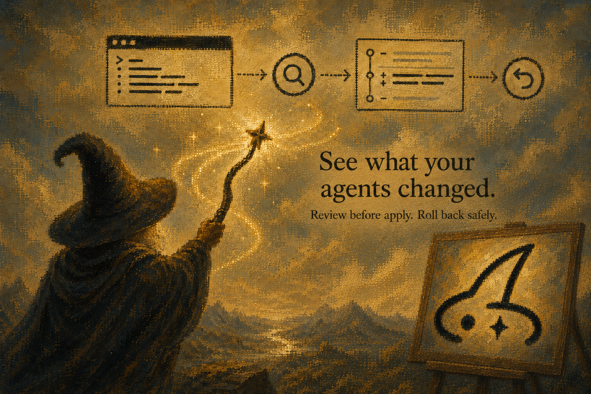

<h1 align="center">Gandalf</h1>

<p align="center">
  
</p>

<p align="center">
  <strong>See what your agents changed. Review before apply. Roll back safely.</strong>
</p>

<p align="center">
  Gandalf lets developers inspect local AI agent setup, browse agent-native marketplace/source entries,
  and apply only reviewed provider-backed changes.
</p>

<p align="center">
  <a href="https://github.com/qyinm/gandalf/actions/workflows/ci.yml"></a>
  <a href="https://github.com/qyinm/gandalf/releases"></a>
  <a href="https://github.com/qyinm/gandalf/blob/main/LICENSE"></a>
  <a href="https://github.com/qyinm/homebrew-tap/blob/main/Formula/gandalf.rb"></a>
</p>

---

## Contents

- [Why Gandalf](#why-gandalf)
- [What Gandalf Is Not](#what-gandalf-is-not)
- [Highlights](#highlights)
- [Install](#install)
- [Quick Start](#quick-start)
- [Current Support Matrix](#current-support-matrix)
- [Commands](#commands)
- [Trust Contract](#trust-contract)
- [Development](#development)

## Why Gandalf

See what your agents changed. Review before apply. Roll back safely.

Gandalf lets developers inspect local AI agent setup, browse agent-native marketplace/source entries, and apply only reviewed provider-backed changes.

Agent power users constantly change their local environment:

- add MCP servers
- install skills and plugins
- edit prompts, instructions, hooks, and permissions
- let an agent modify the setup on their behalf

Those changes usually have no clean management layer. Gandalf opens as a TUI-first setup console for skills, hooks, MCP servers, plugins, and agent-native marketplace/source entries across Codex and Claude Code. Snapshot, diff, bundle, and restore remain the safety layer behind that workflow:

```bash
gandalf
gandalf snapshot create --name baseline --agent codex --scope user --project .
gandalf snapshot create --name baseline-claude --agent claude-code --scope user --project .
gandalf diff baseline current --agent codex --scope user --project .
```

Use it before you let an agent change config, install skills, edit hooks, or rewrite setup instructions. User-global setup is the active product scope; project-local setup files are outside the current management workflow.

## What Gandalf Is Not

- **Not a sync tool.** Gandalf does not sync Claude Code with Codex or synchronize setup across machines; it gives you reviewed local control over each supported agent's user-global setup.
- **Not a marketplace.** Gandalf browses entries from agent-native sources, but it does not own, certify, or replace those catalogs.
- **Not multi-tool skill fan-out.** Gandalf does not broadcast a skill or action across agents; every available mutation is scoped, reviewed, and backed by a concrete provider.

## Highlights

- **Local control console** for installed AI agent setup capabilities.
- **Changes-first terminal workspace** with Home, Console, Changes, Timeline, and Saves; Console keeps tabs for user-global skills, hooks, MCP servers, plugins, and agent-native marketplace/source browsing.
- **Agent-native marketplace flows** with non-mutating guidance where a provider is unavailable and reviewed Claude Code plugin install plus verified rollback where it is supported.
- **Human-readable diffs** for config, skills, hooks, and MCP servers.
- **Review Changes** before restore-backed rollback or provider-backed actions write content.
- **Content-backed snapshots** for current Codex and Claude Code user-global setup.
- **Portable bundles** for exporting, verifying, inspecting, and previewing setup state on another machine.
- **Go CLI and Bubble Tea TUI** shipped as a single binary.
- **No npm distribution path**. Gandalf ships through GitHub Releases, `install.sh`, and Homebrew.

## Install

### Homebrew

```bash
brew install qyinm/tap/gandalf
gandalf --help
```

### install.sh

```bash
curl -fsSL https://raw.githubusercontent.com/qyinm/gandalf/main/install.sh | sh
gandalf --help
```

### From Source

```bash
go install github.com/qyinm/gandalf/cmd/gandalf@latest
```

Prebuilt darwin/linux binaries are published on `v*` tags with GoReleaser. The npm package path is no longer supported for this repository.

## Quick Start

Open the global setup console:

```bash
gandalf
```

Create safe baselines before changing your agent environment. The current safety path uses user-global Codex and Claude Code setup:

```bash
gandalf snapshot create --name clean-codex --agent codex --scope user --project .
gandalf snapshot create --name clean-claude --agent claude-code --scope user --project .
```

Compare the baseline with your current setup:

```bash
gandalf diff clean-codex current --agent codex --scope user --project .
gandalf diff clean-claude current --agent claude-code --scope user --project .
```

Review changes before rollback:

```bash
gandalf restore --snapshot clean-codex --dry-run --agent codex --scope user --project .
gandalf restore --snapshot clean-claude --dry-run --agent claude-code --scope user --project .
```

Apply only after Review Changes is correct:

```bash
gandalf restore --snapshot clean-codex --apply --experimental --agent codex --scope user --project .
gandalf restore --snapshot clean-claude --apply --experimental --agent claude-code --scope user --project .
```

## Current Support Matrix

| Capability | Current Codex support | Current Claude Code support | Boundary |
|---|---|---|---|
| Discovery and inventory | User-global `~/.codex/config.toml`, user hooks, user skills, managed plugin skill inventory | User-global `~/.claude/settings.json`, skills, hooks, marketplace source metadata, unsupported agent directories as observe-only | Read-only global setup discovery; project-local files are out of scope |
| Agent-native marketplace/source browsing | Browse and inspect managed plugin skill inventory and source-backed entries where discovered | Browse and inspect source metadata and installed/source-backed entries where discovered | Gandalf does not own, certify, or replace agent catalogs |
| Provider-backed actions | Available only where a concrete action provider can preview and execute the change | Available only where a concrete action provider can preview and execute the change | Unavailable actions must show reasons instead of pretending to mutate |
| Marketplace-originated Review Action | Non-mutating setup guidance where source metadata is sufficient | Reviewed install is available for eligible user-scope Claude Code marketplace plugins; unavailable actions show a reason | Update, uninstall, and source management remain unavailable without a concrete mutation provider |
| Review Changes and restore safety | Content-backed snapshot, dry-run restore, apply with explicit flags, rollback where supported | Content-backed snapshot, dry-run restore, apply with explicit flags, rollback where supported | Restore is a backing trust workflow, not the whole product identity |

Cursor, OpenCode, and Pi Agent scanners may exist as legacy parser code, but they are not current supported product surfaces. Project-local files such as repo `.mcp.json`, `AGENTS.md`, and `.env` are not part of the current product scope. Broader team sync and cloud workflows are future direction.

## Commands

### Setup History

```bash
# Discover agent environment files
gandalf scan --project .
gandalf scan --project . --explain
gandalf scan --project . --json

# Save point-in-time state
gandalf snapshot create --name baseline --agent codex --scope user --project .
gandalf snapshot create --name baseline-claude --agent claude-code --scope user --project .
gandalf snapshot create --name baseline --metadata-only --project .
gandalf snapshot list
gandalf snapshot show baseline --json

# Compare saved setup with current setup
gandalf diff baseline current --agent codex --scope user --project .
gandalf diff baseline current --agent codex --scope user --project . --json
gandalf diff baseline-claude current --agent claude-code --scope user --project .

# Restore with Review Changes
gandalf restore --snapshot baseline --dry-run --agent codex --scope user --project .
gandalf restore --snapshot baseline --apply --experimental --agent codex --scope user --project .
gandalf restore --snapshot baseline --apply --rollback --experimental --agent codex --scope user --project .
gandalf restore --snapshot baseline-claude --dry-run --agent claude-code --scope user --project .
gandalf restore --snapshot baseline-claude --apply --experimental --agent claude-code --scope user --project .
```

### Terminal Workspace

```bash
gandalf timeline list --project .
gandalf timeline show <id>
gandalf timeline undo <id> --dry-run --json
gandalf tui --project .
```

`gandalf` and `gandalf tui` open Changes-first Home. A persistent sidebar links Home, Console, Changes, Timeline, and Saves. Console uses tabs for Hooks, Plugins, Marketplace, Skills, and MCP Servers; every available write begins with Review Changes. Timeline undo remains a dry-run preview for stored history entries and reports `writesFiles=false`.

### Bundles

```bash
# Export current environment to a portable .gandalf bundle
gandalf bundle export --name baseline --out daily.gandalf --project .
gandalf bundle export --name baseline --out daily.gandalf --metadata-only --project .

# Verify and preview before importing
gandalf bundle verify daily.gandalf
gandalf bundle inspect daily.gandalf
gandalf doctor --project .
gandalf bundle import daily.gandalf --dry-run --project .

# Experimental content inspection/apply on another machine
gandalf bundle import daily.gandalf --apply-content --quarantine --experimental --project .
gandalf bundle import daily.gandalf --apply-content --experimental --project .
```

Destructive operations require either `--experimental` or `GANDALF_EXPERIMENTAL=1`. Bundle content apply refuses known sensitive prefixes and should be previewed with `--dry-run` or `--quarantine` first.

### Reports

```bash
gandalf report current --project . --out gandalf-report.md
```

Every command supports `--json` where structured output is useful.

## Trust Contract

By default Gandalf:

- reads local user-global agent configuration only
- does not execute MCP commands, hooks, scripts, plugins, or agent tools
- does not use the network unless `GANDALF_UPDATE_CHECK=1` is set
- writes to `~/.gandalf` for saves and only changes supported user-global agent setup through a reviewed provider-backed action or explicit restore apply
- omits raw secrets and does not manage project `.env` values
- does not follow symlinks
- requires explicit apply flags before restoring content
- creates rollback paths for restore operations where supported
- reports missing local tools and env keys without installing packages or restoring secret values

Update notices are off by default.

## Tech Stack

| Area | Stack |
|---|---|
| CLI | Go, Cobra |
| TUI | Bubble Tea, Bubbles, Lip Gloss |
| Engine | Go packages under `internal/gandalfcore` |
| Release | GoReleaser, GitHub Releases, Homebrew tap |

## Development

### Go

```bash
git clone git@github.com:qyinm/gandalf.git
cd gandalf
make test
make build
make restore-safety
make gate2
./bin/gandalf scan --project .
```

### Landing Site

랜딩 페이지는 별도 저장소에서 관리합니다.
랜딩 페이지의 빌드/배포/기여는 분리된 랜딩 레포에서 진행하세요.
[랜딩 레포](https://github.com/qyinm/gandalf-landing)에서 소스 관리하세요.

## Repository Layout

| Path | Purpose |
|---|---|
| `cmd/gandalf` | Go CLI entrypoint |
| `internal/cli` | Cobra command handlers |
| `internal/gandalfcore` | Canonical Go engine: scan, store, snapshot, diff, restore, bundle, timeline |
| `internal/tui` | Bubble Tea terminal workspace |
| `install.sh` | Latest GitHub Release binary installer |
| `.goreleaser.yaml` | Release assets and Homebrew tap formula generation |

## Roadmap

| Milestone | Status |
|---|---|
| Read-only scan, diff, and report | v0.1 |
| Bundle export/import (`.gandalf` format) | v0.2 experimental |
| Restore engine: dry-run, apply, rollback | v0.2 experimental |
| Changes-first terminal workspace | v0.6.0 |
| Agent-native marketplace review | v0.5.0 |
| Claude Code marketplace install and verified rollback | v0.5.1 |
| Codex and Claude Code user-global content-backed restore | current safety path |
| Local multi-profile persistence | future |
| Additional provider-backed setup actions | future |
| Background setup-change daemon | future |
| Cloud profiles and multi-machine sync | future |

## Contributing

Issues and focused pull requests are welcome. For code changes, run the checks that match the surface you touched:

```bash
make test
make restore-safety
make gate2
```

For release or installer changes, also run:

```bash
./scripts/install-smoke.sh
```

## License

MIT. See [LICENSE](LICENSE).

## Star History

<a href="https://www.star-history.com/?repos=qyinm%2Fgandalf&type=date&legend=top-left">
 <picture>
   <source media="(prefers-color-scheme: dark)" srcset="https://api.star-history.com/chart?repos=qyinm/gandalf&type=date&theme=dark&legend=top-left" />
   <source media="(prefers-color-scheme: light)" srcset="https://api.star-history.com/chart?repos=qyinm/gandalf&type=date&legend=top-left" />
   
</picture>
</a>
