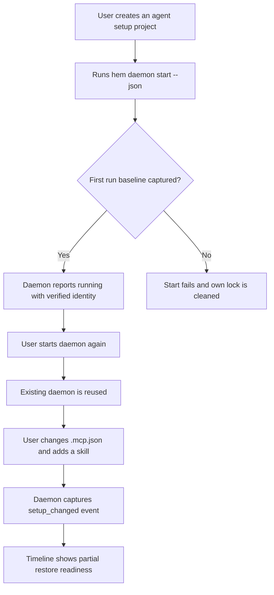
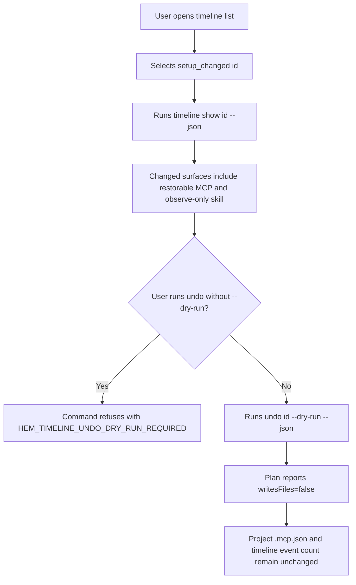
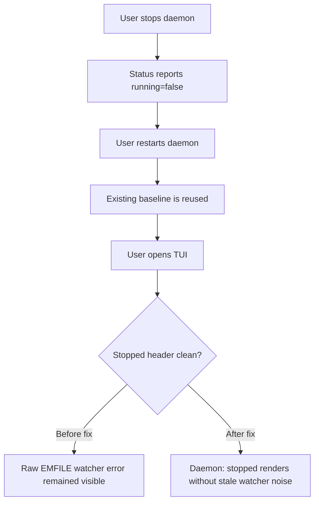
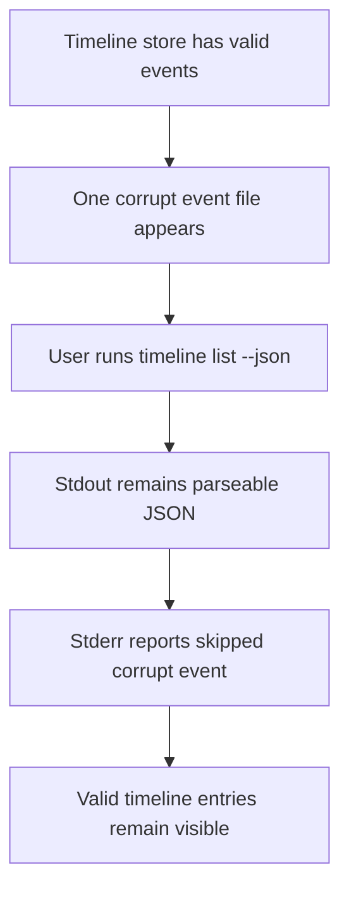

# Dogfood Report - main daemon/timeline

> CLI/TUI QA adapted from `/ce-dogfood-beta` on 2026-06-08.
> The beta browser workflow could not run literally because the checkout was `main`, `main...HEAD` had no diff, and Hem is a CLI/TUI package without a browser dev server.

## Diff Summary

- Recent daemon/timeline scope was centered on commit `f835d1c` (`fix: harden hem daemon and timeline contracts`).
- That work added `hem daemon start/status/stop`, timeline event capture, `hem timeline list/show/undo`, TUI daemon trust status, and related tests.
- Follow-up Timeline-first work opens on `History > All changes` in the left navigation and keeps the TUI `u=preview undo` action dry-run only.
- Dogfood used an isolated temporary `HOME`, `HEM_STORE`, and project so no real user setup or repo setup was mutated.
- Dogfood found one user-facing status hygiene issue: stopped TUI/status could retain a raw watcher error after safe shutdown.
- Fix committed as `b8ddd82` (`fix: clear stopped daemon runtime errors`).

## Personas

No `STRATEGY.md`, `VISION.md`, `PERSONAS.md`, or `docs/personas/` files were present. Personas are inferred from `README.md`.

- **AI coding power user** - experiments with MCP servers and skills, and needs setup history without accidentally mutating real configuration.
- **Hem maintainer** - needs daemon/timeline behavior to be deterministic, diagnosable, and covered by regression tests before release.

## Flows Tested

## Test Matrix & Results

| # | Flow | Journey / Scenario | Status | Issue | Fix | Commit |
|---|------|--------------------|--------|-------|-----|--------|
| 1 | Daemon lifecycle | `daemon start --json` on a fresh isolated project writes a baseline event and reports verified running status. | Pass | - | - | - |
| 2 | Daemon lifecycle | `daemon status --json` verifies pid, identity, watched paths, and store. | Pass | - | - | - |
| 3 | Daemon lifecycle | Duplicate `daemon start --json` reuses the existing run id and does not create a second baseline. | Pass | - | - | - |
| 4 | Daemon lifecycle | Changing project `.mcp.json` and adding a user skill produces a `setup_changed` event with `partial` restore readiness. | Pass | - | - | - |
| 5 | Timeline inspect | `timeline show <id> --json` exposes both restorable MCP and observe-only skill surfaces. | Pass | - | - | - |
| 6 | Timeline undo | `timeline undo <id> --json` without `--dry-run` is refused. | Pass | - | - | - |
| 7 | Timeline undo | `timeline undo <id> --dry-run --json` reports `writesFiles=false`, one writable MCP item, observe-only skill surfaces, and no file/event mutation. | Pass | - | - | - |
| 8 | Daemon restart | Stop and restart keeps exactly one baseline entry. | Pass | - | - | - |
| 9 | Corrupt timeline resilience | A corrupt timeline event is reported on stderr while stdout remains parseable JSON with valid entries. | Pass | - | - | - |
| 10 | TUI daemon header | TUI stopped header renders cleanly after daemon shutdown. | Fixed | Raw `EMFILE: too many open files, watch` could remain in stopped status after fallback capture worked. | Clear runtime watcher errors when a daemon is safely stopped or an owned dead daemon is cleaned up; add regression test. | `b8ddd82` |
| 11 | TUI timeline | Timeline is the first screen and starts in `All agents` project-wide history mode. | Pass | - | Add left navigation, Timeline view model, navigation tests, and PTY smoke. | - |
| 12 | TUI undo preview | Selected timeline events render `writes files: no`, MCP preview items, and observe-only surfaces. | Pass | - | Add TUI preview model tests and keep CLI dry-run contract. | - |

## What Was Fixed

### Stopped daemon retained runtime watcher noise - `b8ddd82`

- **Symptom:** TUI rendered `Daemon: stopped` but also displayed a raw `EMFILE: too many open files, watch` line after the daemon had already captured changes through interval fallback and shut down.
- **Root cause:** `stopDaemon` and worker shutdown preserved transient runtime watcher errors in the stopped status. That made a resolved fallback condition look like an active user-facing error.
- **Fix:** `src/daemon.ts` now clears runtime errors for clean stopped statuses and owned-dead daemon cleanup while preserving real start failure statuses.
- **Regression test:** `tests/daemon.test.ts` adds `clears runtime watcher errors when cleaning up an owned dead daemon`.

## Console Errors

Not applicable. Hem has no browser surface in this workflow.

## Human Verifications

None required. No OAuth, email, payment, SMS, network, or real user setup leg was involved.

## Decisions for a Human

None.

## Learnings

- The original `/ce-dogfood-beta` browser workflow should be adapted for CLI/TUI packages instead of forcing `agent-browser` when there is no local browser app.
- Daemon fallback can make functionality pass while stale status text still degrades trust. Dogfood should inspect both structured JSON and the human/TUI status surface.
- Stopped daemon status should distinguish active failures from transient runtime noise that was already covered by fallback and safe shutdown.

## Verification

- `npm run typecheck` - pass
- `npm run build` - pass
- `node --test dist/tests/daemon.test.js` - pass, 6/6
- isolated daemon/timeline CLI dogfood - pass
- PTY TUI smoke - pass, stopped header rendered without stale watcher error
- `npm test` - pass, 197/197
- `git diff --check` - pass

Follow-up Timeline-first verification adds:

- `node --test dist/tests/tui.test.js` - Timeline model, left navigation, profile/agent detail, compare, save setup, corrupt warning, and undo preview coverage
- `node --test dist/tests/cli.test.js --test-name-pattern timeline` - CLI timeline dry-run and corrupt-event contract
- PTY TUI smoke - Timeline first screen, `All agents`, daemon header, empty timeline command, and preview footer rendered

## Final Status

Ready. The adapted daemon/timeline CLI/TUI dogfood matrix is green after fix `b8ddd82`; no human decisions or external verifications remain.
