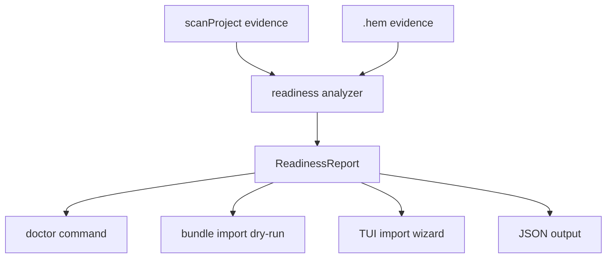
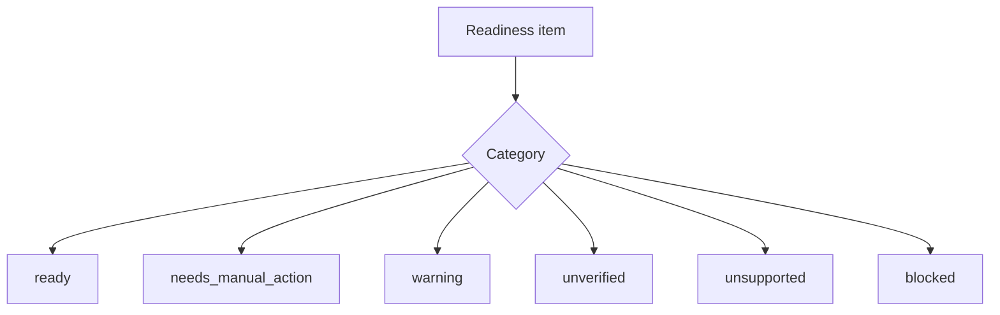

# feat: Add Mac readiness preflight

## Summary

Add a Mac-first readiness layer for hem bundle import and local setup checks. The work makes restore blockers visible before users apply content, gives manual install hints without running installers, reports missing env/secret values without storing them, and aligns docs around the current Mac-first product promise.

---

## Problem Frame

Hem already scans, bundles, imports, and checks MCP command availability during bundle dry-run, but the user experience still reads like a low-level machine diff. The next product step is not cross-OS support or a numeric score; it is a clear Mac readiness report that tells a developer what will restore, what needs manual setup, and what is unsupported before they trust the bundle.

Validation incidents show that many real reproducibility failures come from runtime state outside static config: missing env vars, sandbox/cache permissions, missing local tools, and auth/session state. This phase reports local env/tool/path readiness gaps while leaving provider-side auth and session reproduction for future work.

---

## Requirements

**Readiness contract**

- R1. `bundle import --dry-run` must return a structured Mac readiness preview with stable categories instead of relying only on warning strings.
- R2. A new `doctor` command must expose the same readiness model for the current project and machine without requiring a bundle.
- R3. Readiness output must avoid numeric scores and instead classify typed items as `ready`, `needs_manual_action`, `warning`, `unverified`, `unsupported`, or `blocked`.
- R4. Content apply must be blocked outside macOS for this Mac-first phase, while existing inspect and dry-run visibility should not be intentionally regressed.

**Manual setup guidance**

- R5. Missing MCP command binaries, package runners, and source-machine local paths must produce manual install or remediation hints without running install commands.
- R6. Remote MCP URLs must be shown as locally unverified rather than ready.
- R7. Install hints must be deterministic and local; they must not call package registries, network probes, or shell-evaluated command strings.

**Env and secret handling**

- R8. Env keys discovered in bundle evidence must be reported as required values when absent from the target environment or target project env inventory.
- R9. Hem must not bundle, print, or write raw secret values as part of this work.
- R10. Import must not create placeholder `.env` values for missing secrets.

**UX and documentation**

- R11. CLI, JSON, and TUI import preview must use the same typed readiness data.
- R12. README, PRODUCT, PLAN, and bundle-format docs must agree on content defaults, Mac-only scope, no auto-install behavior, and experimental apply gates.

---

## Key Technical Decisions

- KTD1. Use a shared readiness model: Add typed readiness result objects and have `doctor`, bundle dry-run, CLI text, JSON, and TUI render from that model. Bundle import exposes this as top-level `readiness: ReadinessReport` on `BundleImportResult`, while `machineDiff` remains for backward compatibility.
- KTD2. Keep `doctor` separate from `scan` and `audit`: `scan` remains static evidence capture, and `audit` remains risk/security analysis. Readiness is a local machine compatibility check with a different user intent.
- KTD3. Keep install hints manual: The plan may suggest commands like Homebrew/npm/uv remediation, but Hem never runs them. This preserves the current no-network and no-command-execution trust posture.
- KTD4. Report env gaps, do not repair them: Missing env keys appear as manual actions. Writing empty placeholders would create false confidence and could break projects.
- KTD5. Mac-first means apply-only platform enforcement: `inspect` and `dry-run` stay available for visibility, while `--apply-content` fails outside macOS with a stable error code.
- KTD6. Reuse existing MCP extraction and binary classification: Move or wrap the existing logic in `src/bundle.ts` rather than duplicating parser behavior in the new doctor path.

---

## High-Level Technical Design





---

## Scope Boundaries

### In Scope

- Mac readiness checks for local tool availability, MCP command availability, source-local path mismatches, env key gaps, and bundle apply blockers before writes.
- Manual install/remediation hints for missing local tools and package runners.
- CLI, JSON, and TUI rendering of the same readiness categories.
- Product documentation cleanup so current behavior and future aspirations are not mixed.

### Deferred to Follow-Up Work

- Cross-OS path remapping and Linux restore support.
- Automatic installation or package manager integration.
- Encrypted secret bundling or secret manager integrations.
- Cloud sync, team bundle registry, and CI policy enforcement.
- Numeric reproducibility score.

### Outside This Plan

- Executing MCP servers, hooks, agent tools, or package installers.
- Network reachability checks for remote MCP URLs.
- Provider-side auth/session reproduction.

---

## Implementation Units

### U1. Define the readiness contract

- **Goal:** Add the typed readiness model used by doctor, bundle import, JSON output, and TUI.
- **Requirements:** R1, R3, R11.
- **Dependencies:** None.
- **Files:** `src/types.ts`, `tests/bundle.test.ts`, `tests/doctor.test.ts`.
- **Approach:** Add `ReadinessReport`, `ReadinessItem`, category, severity, and manual action fields. Keep existing `warnings` fields for backward compatibility, but make them derived or secondary.
- **Patterns to follow:** Existing structured models in `src/types.ts`, especially `MachineDiff`, `McpBinaryReport`, and audit finding shape.
- **Test scenarios:** JSON fixtures include all categories; warning strings remain present for existing consumers; readiness item IDs stay stable across CLI and TUI renderers.
- **Verification:** Tests can assert category counts and individual item fields without parsing human output.

### U2. Extract shared Mac readiness analysis

- **Goal:** Build a reusable analyzer that converts scan or bundle evidence into readiness items.
- **Requirements:** R1, R4, R5, R6, R7, R8, R9, R10.
- **Dependencies:** U1.
- **Files:** `src/readiness.ts`, `src/bundle.ts`, `src/scan.ts`, `src/policy.ts`, `tests/bundle.test.ts`, `tests/doctor.test.ts`.
- **Approach:** Move MCP binary extraction/classification and availability checks out of `src/bundle.ts` into shared readiness logic. Use spawn APIs without shell evaluation for binary lookup. Compare bundled required env keys against a target `.env` key inventory and a `process.env` key-presence map, retaining only key names and boolean presence.
- **Execution note:** Add characterization tests around current MCP availability behavior before moving the helper.
- **Patterns to follow:** Existing `checkMcpBinaryAvailability` behavior in `src/bundle.ts`; existing env key inventory policy in `src/policy.ts`; scanner output from `src/scanners/filesystem.ts`.
- **Test scenarios:** Missing `npx` or `uvx` produces `needs_manual_action`; a source-home absolute MCP path produces a remap/manual action item; remote URL produces `unverified`; malicious command strings do not execute; missing env keys are reported by name only; non-macOS apply context produces `blocked` while existing dry-run visibility is preserved.
- **Verification:** Core tests prove readiness analysis is deterministic, non-mutating, and does not leak secret values.

### U3. Add the `doctor` command

- **Goal:** Let users run Mac readiness checks before exporting or importing a bundle.
- **Requirements:** R2, R3, R5, R8, R9, R11.
- **Dependencies:** U1, U2.
- **Files:** `src/commands/doctor.ts`, `src/cli.ts`, `src/commands/index.ts`, `src/cli-shared.ts`, `tests/cli.test.ts`, `tests/doctor.test.ts`.
- **Approach:** Register `hem doctor --project .` with `--json` support. The command should run scan evidence through the readiness analyzer and render grouped text output for manual actions, warnings, unverified items, unsupported items, and blocked items.
- **Patterns to follow:** Command modules in `src/commands/scan.ts` and `src/commands/bundle.ts`; JSON helper in `src/cli-shared.ts`; error formatting via `formatSnapError`.
- **Test scenarios:** Help lists `doctor`; plain output groups missing tools and env gaps; `--json` returns the readiness report; command remains successful when only warnings/manual actions exist; command returns failure only when blocked items exist.
- **Verification:** CLI tests show doctor is read-only and produces useful text without requiring a bundle file.

### U4. Wire readiness into bundle import preview

- **Goal:** Make bundle dry-run and apply preflight show the same readiness categories that doctor uses.
- **Requirements:** R1, R3, R4, R5, R6, R8, R11.
- **Dependencies:** U1, U2.
- **Files:** `src/bundle.ts`, `src/commands/bundle.ts`, `tests/bundle.test.ts`, `tests/cli.test.ts`.
- **Approach:** Add top-level `readiness: ReadinessReport` to `BundleImportResult`. In dry-run, return the full report. In apply mode, block non-macOS content apply and hard blockers before writes. Plain CLI output should show categories and top manual actions before legacy warnings.
- **Patterns to follow:** Existing dry-run branch in `bundleImport()`; existing `HEM_EXPERIMENTAL_REQUIRED` error style; existing bundle tests for MCP binary checks and shell-injection safety.
- **Test scenarios:** Dry-run JSON includes readiness categories; unavailable MCP binary shows both legacy warning and readiness item; remote URL is unverified; non-darwin `--apply-content` fails before writing; blocked readiness items prevent content apply.
- **Verification:** Bundle import tests assert no content files are written when blocked.

### U5. Bring TUI import preview to parity

- **Goal:** Show the same readiness summary in the interactive bundle import wizard.
- **Requirements:** R3, R5, R6, R8, R11.
- **Dependencies:** U1, U4.
- **Files:** `src/tui/wizards/bundle-import.ts`, `src/tui/components/*`, `tests/cli.test.ts`.
- **Approach:** Replace the current missing-MCP count-only note with category counts and the highest priority manual actions from the readiness report. Keep the wizard flow unchanged: inspect, dry-run, apply choice, confirm.
- **Patterns to follow:** Current Clack notes in `src/tui/wizards/bundle-import.ts`; existing summary rendering in `src/commands/bundle.ts`.
- **Test scenarios:** Wizard dry-run logic consumes readiness data; category labels match CLI labels; missing MCP and env gaps appear in the note; no prompt offers automatic installation.
- **Verification:** TUI code uses readiness report fields directly rather than recomputing counts.

### U6. Align product docs and help text

- **Goal:** Make the product contract consistent across docs, CLI help, and bundle-format references.
- **Requirements:** R12.
- **Dependencies:** U3, U4.
- **Files:** `README.md`, `PRODUCT.md`, `PLAN.md`, `ARCHITECTURE.md`, `docs/bundle-format.md`, `docs/index.html`, `tests/cli.test.ts`.
- **Approach:** Update docs to say Hem is Mac-first for this release, content bundles are included by default with `--metadata-only` opt-out if that remains current behavior, apply remains experimental, and install hints are manual. Mark cross-OS restore, automatic installation, encrypted secrets, and team/CI validation as future work.
- **Patterns to follow:** README trust contract and command examples; architecture trust-boundary language; existing CLI help assertions in `tests/cli.test.ts`.
- **Test scenarios:** CLI help includes doctor; tests no longer assert stale `--include-content` guidance; docs do not contradict content default or Mac-only scope in user-facing sections.
- **Verification:** A reader can follow README commands without encountering a different contract in PRODUCT or bundle-format docs.

---

## Acceptance Examples

- AE1. Given a bundle with MCP commands `npx`, `uvx`, a source-home absolute binary, a remote URL, and env key evidence, when the user runs `bundle import --dry-run --json` on a Mac missing `uvx`, then the JSON includes ready or manual-action categories for each local command, an unverified item for the remote URL, and env key names without values.
- AE2. Given a non-macOS target, when the user runs `bundle import --dry-run`, then the command succeeds and reports Mac-only apply limitations; when the user runs `--apply-content`, then the command fails before writing content.
- AE3. Given missing env keys, when the user imports a bundle, then hem reports required manual input and does not create placeholder secret values.
- AE4. Given a user runs `hem doctor --project .`, then the command scans local evidence and prints grouped readiness results without requiring a bundle or installing anything.

---

## System-Wide Impact

This change introduces a new compatibility layer that sits between static evidence capture and mutating restore/import operations. It should reduce unsafe apply attempts and make future team/CI validation easier without adding cloud or policy enforcement in this phase.

The main compatibility risk is JSON shape expansion for `bundle import --dry-run --json`. Keep existing fields and add readiness data as an additive contract.

---

## Risks & Dependencies

- **Docs drift risk:** Several docs currently disagree about content defaults and cross-OS aspirations. U6 should land with the feature so users do not see conflicting product promises.
- **False confidence risk:** Install hints and env reports must never imply Hem installed dependencies or restored secret values.
- **Shell safety risk:** Existing tests prove command checks avoid shell execution. Preserve that invariant when extracting shared readiness logic.
- **Platform risk:** Mac-only apply gating must not break dry-run/inspect workflows used for visibility in other environments.

---

## Documentation / Operational Notes

Update the README first-run path to show `doctor` before import/apply:

```bash
hem doctor --project .
hem bundle import my-setup.hem --dry-run --project .
hem bundle import my-setup.hem --apply-content --quarantine --experimental --project .
```

The docs should state that Hem gives manual setup guidance and never runs package-manager installs or secret prompts in this phase.

---

## Sources & Research

- `ARCHITECTURE.md` defines the trust boundary: scan paths are read-only, write paths are explicit and narrow.
- `src/bundle.ts` already contains MCP binary extraction, command classification, target availability checks, path remap reporting, and cross-OS warnings.
- `src/commands/bundle.ts` renders bundle dry-run machine differences and missing MCP counts.
- `src/tui/wizards/bundle-import.ts` performs the interactive import dry-run but currently shows only a compact missing-MCP summary.
- `src/policy.ts` defines env keys as `key_inventory_only` and MCP/hook/permission content as structured fields only.
- `docs/validation-incidents.md` identifies runtime env vars, sandbox permissions, and auth status as future doctor/live-probe gaps.
- `README.md`, `PRODUCT.md`, `PLAN.md`, and `docs/bundle-format.md` currently disagree on content default and future portability scope.
