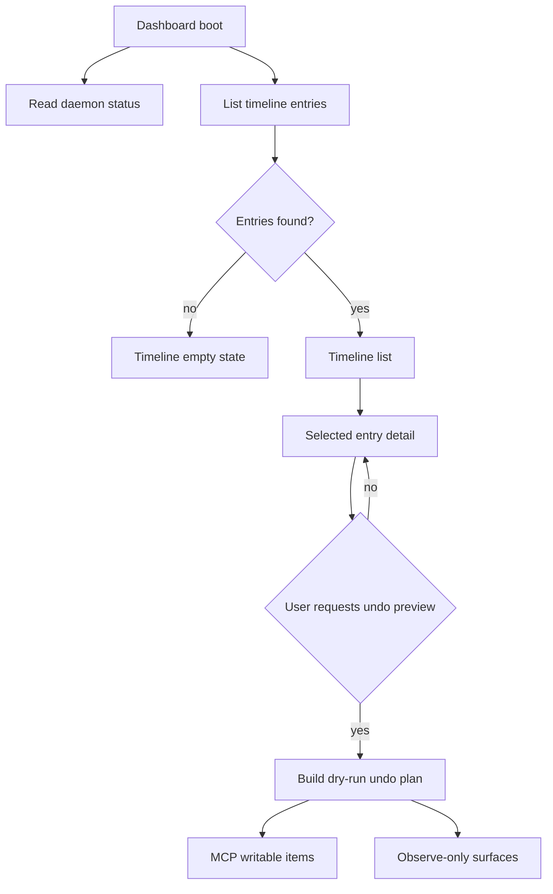
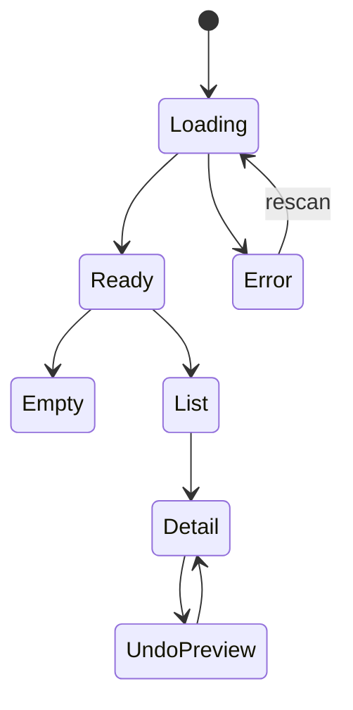

# feat: Timeline-first TUI and release prep

## Summary

Make daemon timeline history the first-class Hem TUI experience, document the daemon/timeline workflow in the public docs, and prepare the current main-ahead work for a clean release path. The plan keeps undo behavior conservative: P0 exposes MCP-only dry-run preview in TUI and CLI docs, while non-restorable surfaces remain observe-only.

Historical note: this plan predates the later v0 design-compliance refactor. References below to a `Timeline tab` should be read as the current `History > All changes` Timeline screen with Current Setup above Timeline.

---

## Problem Frame

Recent work added daemon lifecycle commands, timeline event capture, `timeline list/show/undo`, and dogfood coverage, but the primary interactive surface still centers snapshots, scan, audit, and diff. That leaves the new timeline behavior discoverable only through CLI commands and a dogfood report. The next product step is to make "what changed in my agent setup, and what can I safely preview undoing?" visible in the first screen a Hem user opens.

The repo is also `main...origin/main` ahead by three commits, so release prep needs an explicit path instead of treating `/ship` as a normal feature-branch workflow.

---

## Requirements

- R1. `hem tui` presents timeline history as a first-class tab, preferably before snapshot-focused views.
- R2. The timeline view lists daemon events with enough context to identify the setup change: id, observed time, event kind, restore readiness, agent scope, and title.
- R3. The selected timeline event has a detail view showing before/after snapshots, confidence, summary counts, highlights, and changed surfaces.
- R4. The TUI can preview `timeline undo` for a selected event without mutating files, matching the CLI contract that undo is dry-run only in P0.
- R5. MCP undo-preview items are clearly separated from observe-only skill, hook, permission, env, or unsupported surfaces.
- R6. Empty timeline, corrupt event warnings, daemon stopped, daemon stale, and no-restorable-items states render as understandable TUI states rather than blank panels.
- R7. README and command help describe the daemon/timeline workflow as a local history loop: start daemon, inspect events, show an event, preview dry-run undo.
- R8. Documentation avoids promising full restore from timeline events; P0 wording stays "dry-run MCP undo" or "undo preview."
- R9. Release prep handles the current `main`-ahead state intentionally, including untracked dogfood artifacts, version/changelog decisions, package verification, and push/PR strategy.

---

## Key Technical Decisions

- **TUI timeline view model over shared domain data:** Extract Timeline TUI list/detail/undo-preview formatting into pure helpers backed by `TimelineEntry` and `TimelineUndoPlan`. Keep CLI renderers in command code unless implementation reveals real drift; parity should come from shared domain data and tests, not a premature cross-surface presentation abstraction.
- **New Timeline tab, not overloaded Snapshots tab:** Add a dedicated `timeline` tab instead of hiding daemon events under snapshots. Timeline entries are chronological change events; snapshots are stored states.
- **Project-wide first view with agent filtering:** The initial Timeline tab should show all timeline entries for the current project with an explicit `All agents` / no-filter state. Selecting an agent filters the Timeline list instead of forcing the user back to Snapshots.
- **Dry-run only in TUI:** The TUI should only call `buildTimelineUndoPlan` and render `writesFiles=false`. It must not introduce apply behavior before the CLI supports it.
- **Observe-only surfaces are product-visible:** Skills and other non-MCP changes should appear in the preview, but as observe-only. This preserves user trust by showing the full event while not implying unsupported rollback.
- **Display-only daemon controls in P0:** The TUI should show daemon status and the next CLI command, not start or stop the daemon itself.
- **Docs before release push:** README and dogfood docs should be updated before release mechanics so users can understand the newly visible timeline flow immediately after install.
- **Release path starts from a branch if PR flow is desired:** Because the current checkout is `main` ahead of `origin/main`, a standard PR workflow should branch from current HEAD before push. Direct main push should be a deliberate alternate path, not the default assumption.

---

## High-Level Technical Design

---

## Scope Boundaries

### In Scope

- Add a Timeline TUI tab with list, selection, detail, and dry-run undo preview.
- Keep daemon status visible in the header and refresh timeline data through the existing rescan path.
- Update public docs and dogfood docs to teach daemon/timeline usage.
- Plan a release-prep path for the current ahead-of-origin state.

### Deferred to Follow-Up Work

- Applying timeline undo from the TUI.
- Full rollback support for skills, hooks, permissions, env values, or unsupported surfaces.
- Cloud sync, profile management, marketplace, or desktop UI work.
- A large Dashboard refactor beyond the extraction needed to keep timeline state testable.

---

## Implementation Units

### U1. Timeline presentation model

- **Goal:** Create a testable presentation layer for timeline list rows, detail sections, and undo-preview summaries.
- **Requirements:** R2, R3, R4, R5, R6
- **Dependencies:** None
- **Files:**
  - `src/tui/components/TimelineView.tsx`
  - `src/tui/components/TimelineViewModel.ts`
  - `tests/tui.test.tsx`
- **Approach:** Define pure helpers for row formatting, selected-entry detail data, readiness color mapping, changed-surface grouping, and undo-preview summaries. Keep data inputs as `TimelineEntry[]` and `TimelineUndoPlan` so helpers stay close to the existing domain model.
- **Patterns to follow:** `src/tui/components/SnapshotList.tsx` for simple list presentation, `src/tui/components/SimpleTable.tsx` for compact tabular output, and `daemonTrustHeaderModel` in `src/tui/components/Dashboard.tsx` for pure model helpers.
- **Test scenarios:**
  - Given no entries, the model returns an empty state with no selected entry and the command `hem daemon start --project .`.
  - Given baseline and setup-changed entries, rows include id, observed date/time, event kind, readiness, agent scope, and title.
  - Given a partial-readiness event with MCP and skill surfaces, detail grouping separates restorable MCP surfaces from observe-only surfaces.
  - Given an undo plan with one writable MCP item and one observe-only skill surface, the preview model renders `writesFiles=false`, the MCP action, and the observe-only surface.
  - Given an observe-only event, the preview model shows that there are no writable items without hiding changed surfaces.
- **Verification:** Timeline formatting is covered by focused unit tests without requiring an Ink PTY render.

### U2. Dashboard Timeline tab integration

- **Goal:** Wire the Timeline tab into `hem tui` as a first-class interactive surface.
- **Requirements:** R1, R2, R3, R4, R6
- **Dependencies:** U1
- **Files:**
  - `src/tui/components/TabBar.tsx`
  - `src/tui/components/Dashboard.tsx`
  - `src/tui/components/TimelineView.tsx`
  - `tests/tui.test.tsx`
- **Approach:** Add `timeline` to the tab model and make it the default active tab. Load all timeline entries for the current project during boot, and represent the first sidebar/filter state as `All agents` so the default Timeline is not accidentally narrowed to the first detected agent. Apply an agent filter only when the user explicitly selects an agent. Refresh entries through `r=rescan`. Maintain a timeline cursor separate from the agent sidebar cursor so `↑↓/jk` can select timeline rows when the Timeline tab is active.
- **Patterns to follow:** Existing `TAB_ORDER`, `scanScrollOffset`, sidebar cursor handling, and `reScan` refresh flow in `src/tui/components/Dashboard.tsx`.
- **Test scenarios:**
  - The tab model includes Timeline and preserves stable numeric navigation for all tabs.
  - On boot with timeline entries, the Timeline tab has a selected entry by default.
  - On boot with no timeline entries, the Timeline tab renders the empty state and does not crash.
  - Switching agents keeps the Timeline tab active and filters entries by that agent.
  - `r=rescan` refreshes daemon status and timeline entries together.
  - `↑↓/jk` changes selected timeline entry while the Timeline tab is active and still navigates agents on non-timeline tabs.
- **Verification:** TUI model tests pass, and a PTY smoke run shows Timeline as the first visible tab without layout overlap.

### U3. TUI undo-preview action

- **Goal:** Add a keyboard action that renders dry-run undo preview for the selected timeline event.
- **Requirements:** R4, R5, R6, R8
- **Dependencies:** U1, U2
- **Files:**
  - `src/tui/components/Dashboard.tsx`
  - `src/tui/components/TimelineView.tsx`
  - `src/tui/components/TimelineViewModel.ts`
  - `tests/tui.test.tsx`
- **Approach:** Add an action labeled `u=preview undo` that calls `buildTimelineUndoPlan` for the selected entry and stores the result in timeline state. Render preview inline in the Timeline tab, not as an apply flow. Errors from missing or corrupt entries should render through the existing `ErrorPage` pattern or a localized timeline error state.
- **Patterns to follow:** Existing `d=diff` action flow for loading derived data, `ErrorPage` for recoverable operation errors, and CLI `renderTimelineUndoPlan` semantics in `src/commands/timeline.ts`.
- **Test scenarios:**
  - Pressing the preview action with no selected entry is a no-op with a clear empty state.
  - Pressing the preview action for a partial event renders one writable MCP item and at least one observe-only surface.
  - Preview output states `writes files: no` and does not expose any apply command.
  - A missing event id or corrupt event warning renders a recoverable error while leaving the Timeline tab usable.
  - Preview state is cleared or refreshed when a rescan changes the selected event.
- **Verification:** Tests prove no TUI path calls mutating restore/apply code, and the PTY smoke verifies the preview is visible and readable.

### U4. Timeline CLI/TUI parity guardrails

- **Goal:** Keep CLI and TUI timeline semantics aligned without turning this into a separate CLI rewrite.
- **Requirements:** R2, R3, R4, R5, R8
- **Dependencies:** U1
- **Files:**
  - `src/tui/components/TimelineViewModel.ts`
  - `tests/cli.test.ts`
  - `tests/tui.test.tsx`
- **Approach:** Add parity tests around shared domain semantics such as writable item count, observe-only count, and dry-run wording. Do not change `src/commands/timeline.ts` unless these tests expose a real label or behavior drift. Do not move Ink concerns into command code.
- **Patterns to follow:** Thin command pattern in `src/commands/*`, domain logic in `src/*`, and presentation components in `src/tui/*`.
- **Test scenarios:**
  - CLI `timeline list --json` remains parseable when corrupt events exist.
  - CLI `timeline undo --dry-run --json` and TUI preview agree on writable item count and observe-only count for the same entry.
  - CLI human output and TUI labels both avoid promising full restore for observe-only surfaces.
- **Verification:** Existing CLI tests remain green and new parity tests pin the shared semantics.

### U5. Documentation and first-five-minutes flow

- **Goal:** Make daemon/timeline usage visible in README, help-adjacent docs, and dogfood documentation.
- **Requirements:** R7, R8
- **Dependencies:** U1, U2, U3
- **Files:**
  - `README.md`
  - `docs/dogfood.md`
  - `docs/design/ui/tui/v0/README.md`
  - `docs/dogfood-reports/2026-06-08-main-daemon-timeline-dogfood.md`
  - `src/cli.ts` if top-level help text needs to change
  - `src/commands/daemon.ts` and `src/commands/timeline.ts` if command-local help text needs to change
- **Approach:** Add a Local Timeline section to README that shows start, status, list, show, and dry-run undo. Update the roadmap entry from "Timeline-first TUI next" to reflect the planned or shipped state once implementation lands. Keep docs explicit that timeline undo is P0 dry-run and MCP-only.
- **Patterns to follow:** Current README trust-contract wording and the dogfood report's isolated `HOME` / `HEM_STORE` verification framing.
- **Test scenarios:**
  - Documentation examples use commands supported by `src/cli.ts` help.
  - Documentation describes non-mutating dry-run semantics for undo preview.
  - Dogfood docs include a CLI/TUI package path rather than a browser workflow.
- **Verification:** Docs review confirms no promise of full timeline restore or network behavior was introduced.

### U6. Release prep and branch strategy

- **Goal:** Prepare the work for release from the current `main...origin/main [ahead 3]` state without losing the existing commits.
- **Requirements:** R9
- **Dependencies:** Branch-mode decision has no dependency and should happen before implementation if PR flow is desired; final release verification depends on U1, U2, U3, U4, and U5.
- **Files:**
  - `package.json`
  - `bun.lock`
  - `README.md`
  - `CHANGELOG.md` if the release process adopts a changelog for this package
  - `VERSION` only if the project decides to introduce a separate version source of truth
  - `docs/dogfood-reports/2026-06-08-main-daemon-timeline-dogfood.md`
- **Approach:** Decide whether the project wants direct `main` push or a PR before implementation continues. For PR flow, create a feature branch from current HEAD before adding timeline/docs/release commits. Treat `.hermes/` and `dogfood-output/` as untracked artifacts to either ignore, clean, or deliberately document outside the release commit. Keep `package.json` and `bun.lock` synchronized when bumping the bun pm package version. Do not introduce `VERSION` or `CHANGELOG.md` unless that release convention is explicitly chosen.
- **Patterns to follow:** Existing package scripts in `package.json`, package publication contract via `prepack` / `prepublishOnly`, and prior dogfood verification list.
- **Test scenarios:**
  - `bun run typecheck` passes.
  - `bun run build` passes.
  - `bun run test` passes with timeline/TUI coverage included.
  - Isolated daemon/timeline CLI dogfood passes using temporary `HOME`, `HEM_STORE`, and project.
  - PTY TUI smoke confirms Timeline tab, daemon header, and undo preview render without overlapping text.
  - `bun pm pack` or package dry-run confirms the published package includes `dist/src` and README.
- **Verification:** Release branch has no unintended tracked artifacts, version metadata is synchronized, and release notes or a changelog, if adopted, cover daemon/timeline/TUI/docs changes.

---

## System-Wide Impact

This work changes Hem's primary interactive posture from snapshot-first to timeline-first. That affects onboarding, command discoverability, docs, and release messaging. It should not change scanner trust guarantees, daemon capture semantics, or restore safety boundaries.

---

## Risks & Dependencies

- **Dashboard growth:** `src/tui/components/Dashboard.tsx` already owns many states. Timeline-specific model extraction is needed to avoid making it harder to test.
- **Overpromising restore:** Users may read "undo" as mutating rollback. The UI and docs must repeat that P0 is dry-run and MCP-only.
- **Corrupt timeline handling:** CLI currently reports corrupt events on stderr while preserving JSON stdout. TUI needs an equivalent user-visible warning without blocking valid entries.
- **Timeline-first state semantics:** The existing Dashboard is agent-first and resets tabs on agent switch. The Timeline implementation should preserve the active Timeline tab and treat selected agent as a filter so the first-screen product direction stays intact.
- **Main-ahead release state:** Shipping from `main` can bypass normal PR review if not handled deliberately. Branching from current HEAD preserves existing commits while allowing normal review.
- **Untracked artifacts:** `.hermes/` and `dogfood-output/` must not be accidentally swept into a release commit.

---

## Documentation / Operational Notes

The release body should name the new flow in user terms:

1. Start daemon.
2. Let Hem observe setup changes.
3. Open TUI to inspect timeline history.
4. Preview MCP undo without writing files.

Docs should keep the trust contract near every restore-adjacent example: no MCP commands executed during scan, no network by default, no raw secret values, and no mutating undo from timeline in P0.

---

## Sources / Research

- `README.md` - current public positioning, trust contract, commands, and roadmap.
- `PLAN.md` - product direction toward local agent setup history and timeline-first TUI.
- `PRODUCT.md` - Korean product framing and trust contract.
- `src/tui/components/Dashboard.tsx` - current TUI state, daemon header, tab routing, keyboard handling.
- `src/tui/components/TabBar.tsx` - current tab model.
- `src/commands/timeline.ts` - CLI list/show/undo behavior and human renderers.
- `src/timeline-undo.ts` - dry-run MCP-only undo plan contract.
- `tests/timeline.test.ts` - timeline capture and undo-plan behavior.
- `tests/cli.test.ts` - daemon/timeline end-to-end CLI contracts.
- `tests/tui.test.tsx` - existing TUI daemon header test pattern.
- `docs/dogfood-reports/2026-06-08-main-daemon-timeline-dogfood.md` - latest dogfood results and release verification lessons.
