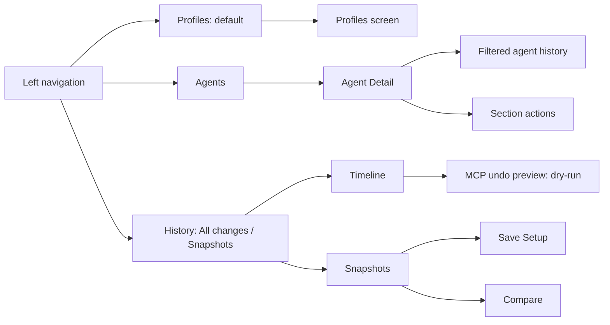
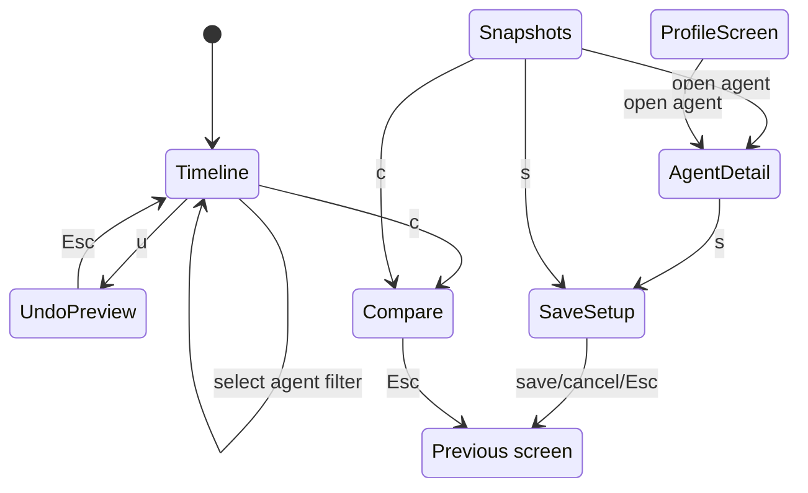

# refactor: Align TUI with v0 design

## Summary

Refactor the current Hem TUI from a tab-driven agent dashboard into the v0 design described in `docs/design/ui/tui/v0/README.md`: persistent Profiles / Agents / History navigation, Timeline-first launch, inventory-first Agent Detail, full-setup snapshots, explicit Compare, and non-mutating MCP undo preview.

## Problem Frame

The current TUI only partially follows the v0 design. It now opens on Timeline, but it still uses an agent-filter sidebar plus top tabs for Timeline / Snapshots / Scan / Audit / Diff. The design document describes a different product shape: Hem is a local Time Machine for agent setups, with profile context first, current setup inventory second, and setup history/compare/save flows using Git-like concepts without Git terminology.

This plan treats `docs/design/ui/tui/v0/README.md` as the source of truth. The work should change the implementation to match the document, not soften the document to match the current TUI.

## Requirements

- R1. The TUI uses persistent left navigation with `Profiles`, `Agents`, and `History` sections, with `default` shown as the MVP profile.
- R2. The first shipped screen is `History > All changes`, labeled `Timeline`, with `Filter: All agents`.
- R3. Selecting an agent outside the Timeline opens an inventory-first Agent Detail screen showing Current Setup counts, Skills, MCP Servers, Instructions, and filtered History.
- R4. Selecting an agent while Timeline is active filters Timeline instead of leaving the Timeline screen.
- R5. TUI snapshot save/list/compare flows operate on full setup snapshots by default; agent-scoped snapshots remain an implementation/backcompat capability, not the primary v0 UI model.
- R6. Save Setup opens a confirmation view with detected changes, deterministic generated title, and destinations for Local history and optional `.hem` export.
- R7. Compare always shows explicit From, To, and Scope, and renders a structured side-by-side comparison before any raw diff-oriented view.
- R8. Timeline undo preview remains non-mutating in P0, renders `writes files: no`, and separates writable MCP preview items from observe-only skill, hook, permission, env, and unsupported surfaces.
- R9. Keyboard behavior matches the design: `↑↓`, `Enter`, `Esc back`, `s save`, `c compare`, `u preview undo`, `r refresh`, `p profile`, `/ search`, and `q quit`.
- R10. Empty states match the design for no snapshots, no timeline events, no detected agents, and no changes since last save.
- R11. The TUI avoids large brand/dashboard framing and global Scan/Audit/Diff tabs; those capabilities may remain available through CLI or contextual/secondary surfaces.

## Key Technical Decisions

- **Replace tabs with a left-nav screen model:** The top tab bar is the main source of design drift. Use a screen/router model driven by grouped left navigation instead of keeping `TabBar` as the primary IA.
- **Keep Profiles MVP UI-only for now:** Render `default` as the active profile and route `p`/Profile navigation through that model, but do not invent persisted multi-profile storage in this refactor.
- **Use full-setup snapshots in the main TUI:** `captureCurrentState(options)` and unscoped `writeSnapshot` / `listSnapshots` / `readSnapshot` already support full setup snapshots. The TUI should stop passing `selectedAgent` for primary save/list/compare flows.
- **Preserve agent filtering without agent-scoped saved units:** Agent Detail and Timeline can filter scan evidence and history by agent, but saving/restoring/comparing should default to Full setup even when invoked from an agent screen. `This agent` can appear as a future or explicitly selected compare scope, not the default.
- **Introduce pure view models before the Dashboard refactor:** `Dashboard.tsx` is already state-heavy. Add testable helpers for navigation, inventory, snapshots, save, and compare before moving rendering and key handling.
- **Use design language in TUI labels:** Prefer `Timeline`, `Current setup`, `Save setup`, `Compare`, and `Restore preview` over CLI/internal labels like `hem timeline`, `scan`, `audit`, `diff`, `snapshot create`, or raw agent IDs.
- **Keep P0 restore boundaries visible:** Timeline undo remains a dry-run planner. Full setup restore and agent-only restore stay deferred unless covered by a later restore-audit plan.
- **Defer full text search:** The design lists `/ search`; this refactor should reserve the key and show a non-disruptive placeholder or focus affordance, but full cross-screen search is out of scope unless it falls out cheaply from the navigation model.

## High-Level Technical Design

## Scope Boundaries

### In Scope

- Rework TUI information architecture to match `docs/design/ui/tui/v0/README.md`.
- Build the Agent Detail, Profiles, Snapshots, Save Setup, Compare, and Timeline screens needed for MVP design compliance.
- Convert primary TUI snapshot actions from agent-scoped to full-setup semantics.
- Update keyboard behavior and empty states to match the design document.
- Add focused model tests and a PTY smoke checklist for the final TUI.

### Deferred

- Persisted multi-profile creation/switching beyond the single `default` profile.
- Full setup mutating restore from Timeline events.
- Agent-only restore.
- Cloud profiles, team dashboards, marketplace, security dashboard, policy enforcement, and raw file diff tabs.
- Add/remove MCP or skill apply flows beyond contextual placeholders unless the implementation already has audited handlers.

## Implementation Units

### U1. Navigation and screen state model

**Goal:** Replace tab-first state with a grouped left-navigation model that can route Profiles, Agents, and History screens.

**Requirements:** R1, R2, R4, R9, R11

**Dependencies:** None

**Files:**
- `src/tui/components/Dashboard.tsx`
- `src/tui/components/Sidebar.tsx`
- `src/tui/components/TabBar.tsx`
- `src/tui/components/TuiNavigationModel.ts`
- `tests/tui.test.tsx`

**Approach:** Create a pure navigation model with section ids, item ids, labels, selection state, and footer action hints. Render `Profiles > default`, detected `Agents`, and `History > All changes / Snapshots`. Remove `TabBar` from the primary Dashboard render path; keep or delete `TabBar` depending on whether any CLI Ink subview still imports it after the refactor. Keep Timeline as the initial selected screen.

**Patterns to follow:** `buildAgentFilterEntries` in `src/tui/components/Sidebar.tsx` for deriving agent entries, and `TimelineViewModel.ts` for testable presentation models.

**Test scenarios:**
- Given scan evidence for Claude Code and Codex, the nav model renders Profiles, Agents, and History in that order.
- Given no detected agents, the nav model still renders `Profiles > default` and `History` while the main screen can show the no-agents empty state.
- The initial selected item is `History > All changes`, not the first detected agent.
- `Enter` on an agent from non-Timeline context routes to Agent Detail.
- Selecting an agent while Timeline is active updates the Timeline filter and leaves the active screen as Timeline.
- `Esc` returns to the previous screen when a nested screen is open; `q` is the only quit key.

**Verification:** Unit tests pin the nav model and Dashboard key-state transitions without relying on snapshot text dumps.

### U2. Shared display formatting and labels

**Goal:** Centralize user-facing labels for agents, dates, setup concepts, and footer actions so every screen speaks the v0 design language.

**Requirements:** R2, R3, R7, R8, R9, R11

**Dependencies:** U1

**Files:**
- `src/tui/components/TuiFormatters.ts`
- `src/tui/components/Sidebar.tsx`
- `src/tui/components/TimelineViewModel.ts`
- `src/tui/components/Dashboard.tsx`
- `tests/tui.test.tsx`

**Approach:** Add helpers for agent display names, compact relative timestamps, truncation/padding, and action hint strings. Replace raw ids such as `claude-code` in visible labels with `Claude Code`. Keep raw ids available in detail/debug lines only when useful.

**Patterns to follow:** `agentLabelStr` in `src/tui/components/Sidebar.tsx`, then move or reuse it from a shared formatter module instead of duplicating maps.

**Test scenarios:**
- `claude-code`, `opencode`, and `pi-agent` render as `Claude Code`, `OpenCode`, and `Pi Agent`.
- Timeline filter label for no agent is `All agents`.
- ISO timestamps from today and yesterday format into compact human labels without changing sort order.
- Long titles or paths truncate without changing fixed table column widths.

**Verification:** Formatting tests cover labels used by nav, Timeline, Agent Detail, and Compare.

### U3. Timeline screen compliance

**Goal:** Adjust Timeline to match the design's Git-log-like screen while preserving existing daemon data and dry-run undo plumbing.

**Requirements:** R2, R4, R8, R10, R11

**Dependencies:** U1, U2

**Files:**
- `src/tui/components/TimelineView.tsx`
- `src/tui/components/TimelineViewModel.ts`
- `src/tui/components/Dashboard.tsx`
- `tests/tui.test.tsx`
- `tests/timeline.test.ts`

**Approach:** Render the title as `Timeline`, show `Filter: All agents` or a human agent name, keep rows in the documented columns, and restructure selected detail into `Selected`, `Changed`, and `Actions`. Keep `u preview undo` non-mutating and show `writes files: no` when a preview is rendered. Use the nav model for agent filtering instead of the current `f` filter shortcut.

**Patterns to follow:** Existing `buildTimelineViewModel`, `timelineUndoPreviewModel`, and `buildTimelineUndoPlan` contracts.

**Test scenarios:**
- Empty Timeline renders `No timeline entries yet.` and `hem daemon start --project .`.
- Timeline rows include short event id, human observed time, kind, readiness, human agent label, and title.
- Selecting an event renders `Selected`, changed surface groups, and an `Actions` section.
- `u` with a selected event renders the dry-run MCP undo preview and never exposes an apply action.
- Corrupt timeline warnings remain visible while valid rows still render.
- Agent filtering uses the selected nav agent and does not route away from Timeline.

**Verification:** `tests/tui.test.tsx` covers view model output; `tests/timeline.test.ts` remains green for daemon and undo-plan domain behavior.

### U4. Agent Detail inventory screen

**Goal:** Add the inventory-first Agent Detail screen required by the design.

**Requirements:** R3, R4, R9, R10, R11

**Dependencies:** U1, U2, U3

**Files:**
- `src/tui/components/AgentDetailView.tsx`
- `src/tui/components/AgentDetailViewModel.ts`
- `src/tui/components/Dashboard.tsx`
- `tests/tui.test.tsx`

**Approach:** Build a view model from `scan.evidence` filtered by `AgentId`. Count Skills, MCP Servers, Hooks, Permissions, and Instructions. Render Skills, MCP Servers, Instructions, and a filtered History section. Keep add/remove actions as contextual footer hints only unless audited handlers already exist.

**Patterns to follow:** `ScanView.tsx` for compact evidence presentation and `buildGraph(scan.evidence)` for normalized current setup data when evidence alone is insufficient.

**Test scenarios:**
- Given agent evidence with skills, MCP servers, permissions, hooks, and instructions, Current Setup counts match the evidence.
- MCP servers render enabled/disabled status from captured values or fall back to captured/unknown without crashing.
- Instructions include user and project instruction file paths when present.
- Agent History includes only Timeline entries for the selected agent.
- An agent with no captured evidence renders the no-supported-agent guidance rather than an empty table.

**Verification:** Agent Detail tests prove current setup inventory can be derived from scan data without changing scanner behavior.

### U5. Full-setup snapshots and Save Setup

**Goal:** Make TUI snapshot saving/listing match the design's full-setup saved unit and confirmation flow.

**Requirements:** R5, R6, R9, R10

**Dependencies:** U1, U2

**Files:**
- `src/tui/components/SaveSetupView.tsx`
- `src/tui/components/SaveSetupViewModel.ts`
- `src/tui/components/SnapshotListViewModel.ts`
- `src/tui/components/SnapshotList.tsx`
- `src/tui/components/Dashboard.tsx`
- `src/current-state.ts`
- `src/diff.ts`
- `src/store.ts`
- `tests/tui.test.tsx`
- `tests/store.test.ts`

**Approach:** Load and save primary TUI snapshots without an agent argument. Build a Save Setup preview before writing: compare latest full setup snapshot to current setup, generate a deterministic title from structured changes, and show destinations for Local history and optional `.hem` export. If no latest snapshot exists, title the save `capture baseline`. If no changes exist, show the no-changes empty state and avoid writing a duplicate unless the user makes an explicit save choice.

This unit must also remove the current agent gate from primary save/snapshot actions. Dashboard should load root snapshot names and manifests on boot and refresh, allow `s` from Timeline `All agents`, avoid `selectedAgent` guards for Save Setup, and keep agent-scoped snapshot reads only for legacy CLI/backcompat paths.

Extend the diff/title surface enough to support deterministic titles in the design priority order. If the existing `diffGraphs` output cannot identify a required title category, add a small exported title helper or expand semantic change detection rather than falling back to timestamp names.

**Patterns to follow:** `captureCurrentState`, `diffGraphs`, unscoped `writeSnapshot`, unscoped `listSnapshots`, and timeline title priority rules in `src/timeline.ts`.

**Test scenarios:**
- Pressing `s` opens Save Setup instead of immediately writing.
- Pressing `s` from Timeline with `Filter: All agents` opens Save Setup without requiring a selected agent.
- With no previous full setup snapshot, Save Setup proposes `capture baseline`.
- With MCP, skill, instruction, permission, or env changes, deterministic title priority follows the design document.
- Saving writes to the root store path through unscoped `writeSnapshot`, not an agent subdirectory.
- Boot and rescan load root snapshot metadata even when no agent is selected.
- Snapshot empty state reads `No saved setups yet.` and includes `s save setup`.
- Optional `.hem` export is presented as a destination but not required for local save.

**Verification:** Store tests confirm root snapshots still coexist with agent-scoped legacy snapshots; TUI tests confirm the primary UI lists root snapshots.

### U6. Compare screen

**Goal:** Replace the current `d diff last two selected-agent snapshots` behavior with the design's explicit Compare screen.

**Requirements:** R5, R7, R9, R10, R11

**Dependencies:** U2, U5

**Files:**
- `src/tui/components/CompareView.tsx`
- `src/tui/components/CompareViewModel.ts`
- `src/tui/components/SnapshotListViewModel.ts`
- `src/tui/components/DiffView.tsx`
- `src/tui/components/Dashboard.tsx`
- `tests/tui.test.tsx`
- `tests/cli.test.ts`

**Approach:** Default `From` to the selected snapshot or latest full setup snapshot, `To` to current setup, and `Scope` to Full setup. Build a structured summary and side-by-side sections from `diffGraphs`. Keep raw file diff as a deferred/secondary capability; do not make it the primary view. Use `c` for Compare and remove `d` from global primary hints.

Add a snapshot selection model before Compare relies on "selected" or "latest": read manifests for root snapshots, sort by `createdAt`, track a Dashboard cursor for the Snapshots screen, and pass the selected snapshot name plus manifest metadata into Compare.

**Patterns to follow:** `src/commands/diff.ts` for current/current snapshot resolution and `DiffView.tsx` for semantic/raw change rendering, but create a design-specific Compare view instead of exposing raw diff labels.

**Test scenarios:**
- Compare with one saved snapshot and current setup shows explicit From, To, and Scope.
- Latest snapshot selection is based on manifest `createdAt`, not lexicographic name order.
- Compare summary groups MCP, skill, permission, instruction, env, and file/source changes in user-facing language.
- Side-by-side output preserves stable column widths and marks additions/removals/changes clearly.
- With no saved snapshots, Compare routes to the no-snapshots empty state with `s save setup`.
- Agent context still defaults Compare to `Full setup`; `This agent` is only shown when the user explicitly chooses a scoped compare.

**Verification:** TUI compare tests pin structured rows, and CLI diff tests remain green to prove existing command behavior was not regressed.

### U7. Profiles and profile screen placeholder

**Goal:** Render the profile concept required by the design without adding a premature persistent profile subsystem.

**Requirements:** R1, R5, R9

**Dependencies:** U1, U5

**Files:**
- `src/tui/components/ProfileView.tsx`
- `src/tui/components/ProfileViewModel.ts`
- `src/tui/components/Dashboard.tsx`
- `tests/tui.test.tsx`

**Approach:** Add a Profile screen showing `default`, snapshot count, detected agents, and latest change time. Wire `p` to focus the Profiles section or cycle to `default` in MVP. Keep copy honest that additional profiles are future behavior by not rendering fake profiles unless test fixtures provide them.

**Patterns to follow:** Snapshot counts from unscoped `listSnapshots` and detected agents from `scan.evidence`.

**Test scenarios:**
- With full setup snapshots, the Profile screen shows `default`, snapshot count, detected agent names, and latest changed time.
- With no snapshots, the Profile screen still renders `default` and an empty/latest state.
- `p` focuses the profile section without changing stored data.
- The UI does not imply cloud or multi-profile persistence exists.

**Verification:** Tests prove profile rendering is deterministic and does not require new storage.

### U8. Keyboard, back stack, and empty states

**Goal:** Align Dashboard input behavior and user-facing empty states with the design document.

**Requirements:** R8, R9, R10, R11

**Dependencies:** U1, U3, U4, U5, U6, U7

**Files:**
- `src/tui/components/Dashboard.tsx`
- `src/tui/components/ErrorPage.tsx`
- `src/tui/components/TuiEmptyStates.tsx`
- `tests/tui.test.tsx`

**Approach:** Introduce a small back stack for modal/detail flows so `Esc` means back and `q` means quit. Add empty-state components for no snapshots, no timeline events, no detected agents, and no changes since last save. Reserve `/` for search with a non-disruptive placeholder or focus affordance, and keep full cross-screen search deferred.

**Patterns to follow:** Existing `ErrorPage` for structured recoverable errors and current footer hint rendering in `Dashboard.tsx`.

**Test scenarios:**
- `Esc` from Save Setup returns to the previous screen and does not quit.
- `q` remains the quit action.
- `s`, `c`, `u`, `r`, `p`, and `/` are accepted only where their action is meaningful or render a clear contextual hint.
- `/` does not claim full search results until a real search model exists.
- No snapshots, no timeline events, no detected agents, and no changes since last save render the exact design intent.
- Section-specific hints appear for Skills, MCP, and History focus without becoming global actions.

**Verification:** Model-level key handling tests cover state transitions; final PTY smoke verifies the footer does not overlap main content.

### U9. Documentation and design-drift guardrails

**Goal:** Keep the implementation, tests, and docs aligned after the UI refactor.

**Requirements:** R1, R2, R3, R5, R7, R8, R9, R10, R11

**Dependencies:** U1, U2, U3, U4, U5, U6, U7, U8

**Files:**
- `docs/design/ui/tui/v0/README.md` (reference only unless implementation reveals a real design-doc typo)
- `README.md`
- `docs/dogfood-reports/2026-06-08-main-daemon-timeline-dogfood.md`
- `tests/tui.test.tsx`
- `tests/cli.test.ts`

**Approach:** Do not rewrite the design doc to hide implementation gaps. Update public README only where the shipped TUI behavior changes user-facing commands or screenshots/copy. Add tests that make the design's core IA hard to accidentally regress: left-nav sections, Timeline-first initial state, Agent Detail inventory, full setup snapshots, Compare From/To, and dry-run undo preview.

**Patterns to follow:** Existing plan `docs/plans/2026-06-08-001-feat-timeline-first-tui-plan.md` for daemon/timeline safety wording and dogfood checklist shape.

**Test scenarios:**
- `tests/tui.test.tsx` contains at least one assertion for each MVP bullet in the design doc's `MVP Scope`.
- CLI timeline tests continue to prove undo preview is dry-run only.
- README wording does not promise full mutating Timeline restore.

**Verification:** Documentation review confirms the public docs and design doc no longer disagree about the primary TUI shape.

## System-Wide Impact

This changes Hem's primary interactive surface from a developer command dashboard to a setup-history product surface. The scanner, daemon, store, timeline, and diff domain APIs should remain compatible, but the TUI will call them with different defaults: full setup first, agent filters second.

## Risks & Dependencies

- **Dashboard state complexity:** `Dashboard.tsx` already owns boot, scan, daemon status, snapshots, timeline, diff, and keyboard state. Extracting pure models first reduces refactor risk.
- **Snapshot semantics drift:** The store supports both root and agent-scoped snapshots. The TUI must clearly use root snapshots for primary v0 flows or users will see confusing partial restores/compares.
- **Profile overbuild:** The design requires Profiles as a concept, but MVP starts with one `default` profile. Persisted profile management should not enter this refactor.
- **Restore overpromising:** The UI can show restore-adjacent language only where behavior is dry-run or already audited. Mutating full setup restore remains deferred.
- **Terminal layout:** Structured compare and inventory tables can overflow narrow terminals. View models need truncation and stable column widths.
- **Existing tests pin tabs:** Current tests assert `TABS` ordering. Those tests should be rewritten around navigation model behavior rather than preserved.

## Documentation / Operational Notes

The final implementation should be verified with:

- `npm run typecheck`
- `npm run build`
- `node --test dist/tests/tui.test.js`
- `node --test dist/tests/timeline.test.js`
- `node --test dist/tests/cli.test.js --test-name-pattern timeline`
- `npm test`
- A PTY smoke run of `hem tui` that confirms Timeline-first launch, left nav sections, Agent Detail, Save Setup preview, Compare From/To, and `u` dry-run undo preview.

## Sources / Research

- `docs/design/ui/tui/v0/README.md` - authoritative v0 TUI design.
- `docs/plans/2026-06-08-001-feat-timeline-first-tui-plan.md` - previous Timeline-first implementation plan and safety posture.
- `src/tui/components/Dashboard.tsx` - current TUI state machine, key handling, and tab rendering.
- `src/tui/components/Sidebar.tsx` - current agent-only sidebar and agent label helpers.
- `src/tui/components/TabBar.tsx` - current top-level tab model to replace.
- `src/tui/components/TimelineView.tsx` and `src/tui/components/TimelineViewModel.ts` - current timeline rendering/model pattern.
- `src/tui/components/SnapshotList.tsx` - current snapshot list and empty state.
- `src/current-state.ts` and `src/store.ts` - full setup snapshot capture and scoped/unscoped snapshot storage.
- `src/diff.ts` and `src/commands/diff.ts` - existing graph diff behavior used by Compare.
- `src/timeline.ts` and `src/timeline-undo.ts` - deterministic timeline titles and dry-run MCP undo planning.
- `tests/tui.test.tsx`, `tests/timeline.test.ts`, `tests/cli.test.ts`, and `tests/store.test.ts` - test surfaces to extend.
