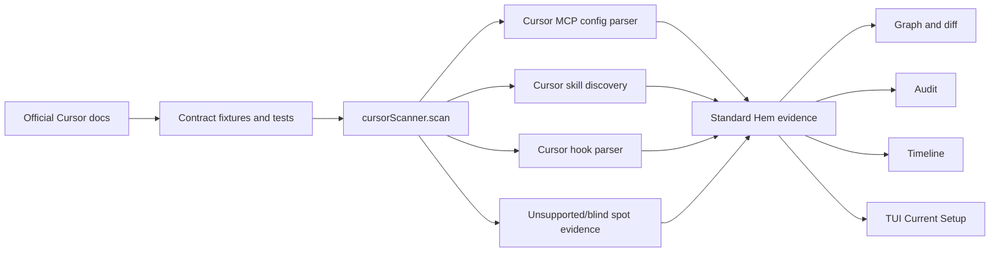

# refactor: Reimplement Cursor scanner from official docs

## Summary

Reimplement the Cursor scanner so Hem detects Cursor MCP servers, skills, and hooks from the official Cursor documentation instead of treating Cursor as only `.cursor/mcp.json`.

The scanner should remain read-only. It must not execute MCP commands, hook commands, skill scripts, Cursor CLI commands, or network checks. It should emit standard Hem evidence kinds so the existing graph, audit, timeline, snapshot, and TUI flows work without a Cursor-specific display path.

## Problem Frame

`src/scanners/cursor.ts` currently uses only two target files:

- project `.cursor/mcp.json`
- user `~/.cursor/mcp.json`

That was enough for early MCP-only support, but it is no longer aligned with Hem's product promise or the current TUI. The UI now has Current Setup tabs for `Skills`, `MCP Servers`, `Hooks`, and `Project`; Cursor should populate those tabs when Cursor-visible setup exists.

Official Cursor docs describe Cursor setup surfaces beyond the existing target-only scanner:

- MCP config: project and global Cursor MCP configuration.
- Skills: `SKILL.md`-based capabilities in Cursor-recognized roots, including shared agent skill roots.
- Hooks: scripts configured around Cursor agent lifecycle events.

The implementation should move Cursor to a custom scanner like Codex/OpenCode, with explicit parsing, source scoping, redaction, parse-failure evidence, and tests.

## Source Notes

Sources named for this plan:

- Cursor Skills: `https://cursor.com/docs/skills`
- Cursor MCP: `https://cursor.com/docs/mcp`
- Cursor Hooks: `https://cursor.com/docs/hooks`
- Cursor MCP docs mirror/index found during research: `https://cursor.com/docs/mcp.md`
- Cursor Skills docs mirror/index found during research: `https://cursor.com/docs/skills.md`
- Cursor hook context found during research: `https://cursor.com/blog/hooks-partners`
- Cursor hook reference context found during research: `https://cursor.com/docs/reference/third-party-hooks`

Local shell fetch of `cursor.com` failed with DNS resolution in the sandbox. The user supplied pasted official-doc text for Hooks, MCP, and Skills after this plan was drafted; those attachments are now treated as the working source of truth for the implementation details below. Before implementation, U1 should still pin the supplied docs content into fixtures/tests and re-open the live docs if network access is available.

Key doc facts captured from the attachments:

- Cursor hooks live in `hooks.json` files. Project path is `.cursor/hooks.json`; user path is `~/.cursor/hooks.json`; enterprise paths include macOS `/Library/Application Support/Cursor/hooks.json`, Linux/WSL `/etc/cursor/hooks.json`, and Windows `C:\ProgramData\Cursor\hooks.json`. Team hooks are dashboard/cloud distributed.
- Cursor hook priority is Enterprise -> Team -> Project -> User. All matching hooks run, and higher-priority sources take precedence when responses conflict.
- Cursor hook categories are Agent hooks, Tab hooks, and App lifecycle hooks. Supported event names include `sessionStart`, `sessionEnd`, `preToolUse`, `postToolUse`, `postToolUseFailure`, `subagentStart`, `subagentStop`, `beforeShellExecution`, `afterShellExecution`, `beforeMCPExecution`, `afterMCPExecution`, `beforeReadFile`, `afterFileEdit`, `beforeSubmitPrompt`, `preCompact`, `stop`, `afterAgentResponse`, `afterAgentThought`, `beforeTabFileRead`, `afterTabFileEdit`, and `workspaceOpen`.
- Cursor hook definitions currently support `command`, `type`, `timeout`, `loop_limit`, `failClosed`, and `matcher`. `type` is `"command"` or `"prompt"`, with `"command"` as default.
- Cloud agents load project hooks from `.cursor/hooks.json`; Enterprise cloud agents may also run team and enterprise-managed hooks. User-level `~/.cursor/hooks.json` is not available to cloud agents.
- Cursor MCP supports `stdio`, `SSE`, and `Streamable HTTP` transports. STDIO config fields include `type`, `command`, `args`, `env`, and `envFile`. Remote/OAuth config can include `url`, `headers`, and `auth` with `CLIENT_ID`, optional `CLIENT_SECRET`, and optional `scopes`.
- Cursor MCP interpolation applies to `command`, `args`, `env`, `url`, and `headers`; supported variables include `${env:NAME}`, `${userHome}`, `${workspaceFolder}`, `${workspaceFolderBasename}`, `${pathSeparator}`, and `${/}`.
- Cursor skills are loaded from `.agents/skills/`, `.cursor/skills/`, `~/.agents/skills/`, `~/.cursor/skills/`, and compatibility roots `.claude/skills/`, `.codex/skills/`, `~/.claude/skills/`, and `~/.codex/skills/`.
- Cursor recursively discovers nested `SKILL.md` files. A `.cursor/skills/` or `.agents/skills/` folder anywhere inside the repository is picked up and scoped to that directory.
- Cursor skill frontmatter requires `name` and `description`. `name` must be lowercase letters, numbers, and hyphens only, and must match the parent folder name. Optional fields include `paths`, `disable-model-invocation`, and `metadata`.

## Requirements

- R1. Cursor MCP servers are detected from the documented project and global Cursor MCP config surfaces and emitted as `mcp_server` evidence.
- R2. Cursor MCP evidence redacts raw secret values from `env`, `headers`, OAuth/auth fields, bearer tokens, API-key-like fields, and URL tokens.
- R3. Cursor skill roots from the official docs are scanned for recursive `SKILL.md` entries and emitted as `skill` evidence.
- R4. Cursor skills capture safe summary metadata, including declared `name`, `description`, source root, source path, and entrypoint status, without executing scripts or following unsafe symlinks.
- R5. Cursor hooks from the documented config surfaces are emitted as `hook` evidence with event name, matcher/scope if present, command metadata, executable flag, source path, and safe structured fields only.
- R6. Malformed Cursor MCP/hook/skill files emit parse-failure or omitted evidence instead of failing the whole scan.
- R7. Duplicate Cursor-visible skills are deduped deterministically and record duplicate sources where useful.
- R8. Project scope, user scope, and managed/built-in scope are represented consistently with existing Hem precedence semantics.
- R9. The scanner reports local blind spots for Cursor team/cloud/enterprise-managed hooks or skills that are not visible on disk.
- R10. New Cursor evidence automatically appears in Current Setup, Agent Detail, Timeline, snapshots, diffs, audit, and reports through existing evidence kinds.
- R11. Documentation updates make Cursor support accurate; it should no longer say only `.cursor/mcp.json`.
- R12. Cursor nested project skills are discovered from `.cursor/skills/` and `.agents/skills/` directories anywhere inside the repository and scoped to the directory where the skill root was found.
- R13. Cursor hook evidence distinguishes project, user, enterprise, and cloud/team blind-spot sources where possible.

## Key Technical Decisions

- **Use a custom Cursor scanner:** Replace target-only Cursor scanning with `cursorScanner.scan(context)`, following the shape of `src/scanners/codex.ts`.
- **Keep evidence standard:** Emit `mcp_server`, `skill`, `hook`, `agent_config`, `parse_failed`, `omitted`, and `unsupported` evidence as needed. Do not add Cursor-only evidence kinds.
- **Treat official docs as a test contract:** U1 should encode official examples and roots into tests before implementation. That prevents the scanner from drifting into guessed Cursor behavior.
- **Keep scans passive:** Never execute `cursor`, MCP server commands, hook commands, shell scripts, or skill scripts. Do not make network calls to verify remote MCP servers.
- **Make remote MCP explicit:** MCP entries with `url`/remote transports should set metadata such as `remote: true` and `transport`, but remain unverified.
- **Redact structured config aggressively:** Keep command names, arg shapes, env key names, URL host/path if safe, and header key names where useful; redact raw secret values.
- **Scan the documented Cursor skill roots:** Cursor loads `.agents/skills`, `.cursor/skills`, `~/.agents/skills`, `~/.cursor/skills`, and compatibility roots `.claude/skills`, `.codex/skills`, `~/.claude/skills`, and `~/.codex/skills`.
- **Walk nested project skill roots:** Cursor discovers `.cursor/skills/` and `.agents/skills/` anywhere inside a repository and scopes discovered skills to that directory. Hem should implement a bounded repository walk that avoids ignored/heavy directories and never follows symlinks.
- **Validate Cursor skill frontmatter:** `name` and `description` are required. `name` must match the parent folder and only use lowercase letters, numbers, and hyphens. Capture `paths`, `disable-model-invocation`, and `metadata` safely when present.
- **Model hook source priority:** Hook evidence should preserve source scope and priority: Enterprise, Team blind spot, Project, User. Hem should not merge hook outputs, but it should make the priority visible enough for graph/audit/reporting.
- **Support Cursor hook fields explicitly:** Capture `type`, `command`, `timeout`, `loop_limit`, `failClosed`, and `matcher`. Mark command-based hooks executable. Mark prompt-based hooks as policy/LLM-evaluated but still sensitive.
- **Do not scan Cursor Rules as skills:** `.cursor/rules` and `.cursorrules` are a separate Cursor concept. They are out of scope for this Skills/MCP/Hooks reimplementation unless a follow-up plan adds them as instruction/config evidence.
- **Prefer local helpers first:** Cursor can copy small helper patterns from Codex/OpenCode initially. Extract shared scanner helpers only if the implementation would create substantial duplicated logic.

## High-Level Technical Design

## Scope Boundaries

### In Scope

- Reimplement Cursor scanning for documented MCP, Skills, and Hooks.
- Add unit tests for official-doc-derived config shapes and scanner edge cases.
- Add redaction tests for Cursor MCP secrets and hook commands.
- Add parse-failure and omitted evidence behavior.
- Update README/support documentation and any architecture notes that describe Cursor support.
- Verify Cursor evidence appears through existing TUI/timeline models if standard evidence kinds are emitted.

### Deferred

- Cursor Rules scanning.
- Cursor CLI integration.
- Cursor marketplace or cloud/team-managed setup APIs.
- Executing or validating MCP servers.
- Executing or validating hook commands.
- Installing/removing Cursor skills, MCP servers, or hooks.
- Mutating restore support for Cursor hooks and skills beyond existing generic restore boundaries.

## Implementation Units

### U1. Official docs contract fixtures

**Goal:** Lock Cursor MCP, Skills, and Hooks schemas/roots from the supplied official-doc text into failing tests before scanner changes.

**Requirements:** R1, R3, R5, R8, R9

**Dependencies:** None

**Files:**
- `tests/scan.test.ts`
- `docs/plans/2026-06-08-003-refactor-cursor-scanner-docs-plan.md`

**Approach:** Convert the supplied Hook/MCP/Skills doc facts into tests. Re-open `https://cursor.com/docs/skills`, `https://cursor.com/docs/mcp`, and `https://cursor.com/docs/hooks` if network access is available, but do not block implementation on shell DNS if the supplied text is available. Record supported local file paths, JSON shapes, required fields, event names, transport fields, and skill frontmatter rules in fixtures.

**Test scenarios:**
- Cursor MCP `stdio`, `SSE`, and `Streamable HTTP` transport examples are represented as fixtures.
- Cursor MCP `env`, `envFile`, `headers`, `auth`, and interpolation examples are represented as fixtures.
- Cursor skill roots and compatibility roots are represented as fixtures.
- Nested repository `.cursor/skills/` and `.agents/skills/` roots are represented as fixtures.
- Required Cursor skill frontmatter and optional `paths`, `disable-model-invocation`, and `metadata` fields are represented as fixtures.
- Cursor hook event names and fields `command`, `type`, `timeout`, `loop_limit`, `failClosed`, and `matcher` are represented as fixtures.
- Project, user, enterprise, and team/cloud hook source behavior is represented in fixtures or blind-spot expectations.
- Any not-locally-readable Cursor team/cloud/enterprise surfaces are represented as `unsupported` or documented blind spots, not silently ignored.

**Verification:** Tests fail against the current scanner for missing skills/hooks while current MCP behavior remains pinned.

### U2. Cursor MCP parsing and redaction

**Goal:** Keep existing `.cursor/mcp.json` support, expand it to official Cursor MCP transport/auth shapes, and make redaction explicit.

**Requirements:** R1, R2, R6, R8, R10

**Dependencies:** U1

**Files:**
- `src/scanners/cursor.ts`
- `tests/scan.test.ts`

**Approach:** Implement `cursorScanner.scan(context)` and call existing filesystem target scanning for documented MCP config files. Ensure `mcpServers` entries with `type: "stdio"` plus `command`/`args`, and entries with `SSE` or `Streamable HTTP` remote transports plus `url`, emit stable `mcp_server` evidence. Add metadata for `transport`, `remote`, `enabled`, `envFile`, interpolation fields, auth presence, and source scope when available. Preserve parse-failure behavior for malformed JSON.

**Test scenarios:**
- Project `.cursor/mcp.json` emits `mcp_server` evidence.
- User `~/.cursor/mcp.json` emits `mcp_server` evidence.
- Stdio MCP captures command/args shape without executing it.
- SSE and Streamable HTTP MCP entries capture transport/url metadata without network verification.
- `env`, `envFile`, `headers.Authorization`, OAuth `auth.CLIENT_ID`, `auth.CLIENT_SECRET`, auth-like fields, API keys, and URL tokens do not leak raw secrets in serialized evidence.
- Interpolation syntax such as `${env:NAME}`, `${userHome}`, and `${workspaceFolder}` remains visible only as safe reference metadata, not resolved secret values.
- Malformed MCP JSON emits parse-failure evidence and scan continues.

**Verification:** `bun run typecheck`, `bun run test -- tests/scan.test.ts` or the repo-supported equivalent, and final `bun run check`.

### U3. Cursor skills discovery

**Goal:** Detect Cursor-visible `SKILL.md` skills from documented roots, including nested project roots, and emit standard `skill` evidence.

**Requirements:** R3, R4, R6, R7, R8, R10

**Dependencies:** U1

**Files:**
- `src/scanners/cursor.ts`
- `tests/scan.test.ts`

**Approach:** Add recursive `SKILL.md` discovery for `.agents/skills`, `.cursor/skills`, `~/.agents/skills`, `~/.cursor/skills`, and compatibility roots `.claude/skills`, `.codex/skills`, `~/.claude/skills`, and `~/.codex/skills`. Add a bounded repository walk to find nested project `.cursor/skills/` and `.agents/skills/` roots anywhere inside the repository, then scope discovered skills to the directory containing that nested root. Parse frontmatter for required `name` and `description`, validate `name` against the parent folder, and capture optional `paths`, `disable-model-invocation`, and `metadata`. Dedupe by effective skill name with deterministic root precedence and duplicate source metadata.

**Test scenarios:**
- Project `.cursor/skills/<skill>/SKILL.md` emits Cursor `skill` evidence.
- User `~/.cursor/skills/<skill>/SKILL.md` emits Cursor `skill` evidence.
- Shared `.agents/skills` and compatibility roots emit Cursor `skill` evidence because Cursor loads them.
- Nested repository `apps/web/.cursor/skills/<skill>/SKILL.md` emits Cursor `skill` evidence scoped to `apps/web`.
- Nested repository `packages/api/.agents/skills/<skill>/SKILL.md` emits Cursor `skill` evidence scoped to `packages/api`.
- Nested `SKILL.md` files are found within documented traversal bounds.
- Missing `name` or `description` emits omitted/unsupported evidence or is skipped according to the chosen Hem convention.
- `name` values that do not match the parent folder emit omitted/unsupported evidence or are flagged in metadata.
- `paths`, `disable-model-invocation`, and `metadata` are captured safely.
- Duplicate skill names are deduped deterministically and duplicate source metadata is retained.
- Symlinked directories/files are not followed unsafely and produce omitted evidence where existing Hem conventions require it.

**Verification:** Cursor skills appear in scan JSON as `agent: "cursor"` and `kind: "skill"`; TUI Current Setup counts increase without TUI-specific code changes.

### U4. Cursor hooks parsing

**Goal:** Detect Cursor hook configuration from documented local and enterprise config files, represent cloud/team blind spots, and emit command-safe `hook` evidence.

**Requirements:** R5, R6, R8, R9, R10

**Dependencies:** U1

**Files:**
- `src/scanners/cursor.ts`
- `tests/scan.test.ts`
- `src/scanners/filesystem.ts` only if a shared hook helper is extracted

**Approach:** Parse project `.cursor/hooks.json`, user `~/.cursor/hooks.json`, and readable enterprise config paths for the current OS. For macOS, include `/Library/Application Support/Cursor/hooks.json` as a read-only target only if sandbox/permissions allow it; otherwise emit or document an enterprise hook blind spot. Represent team/cloud-distributed hooks as a blind spot because they are dashboard/cloud synced and not reliably visible on disk. Support `version`, the `hooks` object, documented event names, and per-script fields `command`, `type`, `timeout`, `loop_limit`, `failClosed`, and `matcher`. Each command hook item should set `sensitivity: "command_config"`, `contentPolicy: "structured_safe_fields_only"`, `restorePolicy: "structured_fields_only"`, and `metadata.executable = true`. Prompt hooks should be marked sensitive and policy-affecting even though they are not local shell commands.

**Test scenarios:**
- Project hook config emits one `hook` item per configured hook command.
- User hook config emits one `hook` item per configured hook command.
- Readable enterprise hook config emits `hook` evidence with enterprise scope and higher priority metadata.
- Team/cloud-distributed hooks are represented as unsupported/blind-spot evidence rather than fake local hooks.
- Event name, type, matcher/scope, timeout, loop limit, fail-closed behavior, and command metadata are stable and safe.
- Agent, Tab, and App lifecycle hook categories are represented in metadata.
- Hook commands are never executed.
- Secret-looking command env/headers/inline values are redacted in serialized evidence.
- Malformed hook JSON emits parse-failure evidence.
- Cloud-agent support differences are not treated as local active hooks; they are recorded as metadata or blind-spot notes where useful.

**Verification:** `audit current` flags executable Cursor hooks through the existing audit model without Cursor-specific audit logic.

### U5. Evidence integration and docs

**Goal:** Make the new Cursor evidence visible and documented through existing Hem surfaces.

**Requirements:** R10, R11

**Dependencies:** U2, U3, U4

**Files:**
- `README.md`
- `ARCHITECTURE.md`
- `tests/scan.test.ts`
- `tests/tui.test.tsx` if display assumptions need pinning

**Approach:** Update the Supported Setup Surfaces table so Cursor lists MCP config, skills, and hooks. Add architecture notes only if current architecture docs describe scanner surfaces. Keep TUI code unchanged unless tests show Cursor standard evidence is not displayed in Current Setup or Agent Detail.

**Test scenarios:**
- Cursor `skill`, `mcp_server`, and `hook` evidence are counted by existing setup summaries.
- Cursor agent detail lists skills/MCP/hooks when evidence exists.
- Timeline/diff snapshots include Cursor evidence changes through standard kinds.

**Verification:** `bun run typecheck`, `bun run test`, and a TUI smoke run with a temporary Cursor fixture project.

### U6. Dogfood and release readiness

**Goal:** Validate the reimplemented scanner against realistic Cursor setup without touching the user's real Cursor config.

**Requirements:** R1 through R13

**Dependencies:** U5

**Files:**
- `docs/dogfood.md` or a new dogfood report only if the repo already expects one for this release
- no writes to the user's actual `~/.cursor`

**Approach:** Build a temporary project/home fixture under the test temp directory or `/tmp`, populate documented Cursor MCP/skills/hooks examples, and run scan/TUI/report commands against that temp environment. Do not use the user's actual home config as a required test input.

**Verification:**
- `bun run typecheck`
- `bun run build`
- `bun run test`
- `git diff --check`
- Manual JSON scan on the temp fixture confirms Cursor counts for MCP, skills, and hooks.

## Risks And Mitigations

- **Cursor docs may change.** Mitigation: U1 treats docs as the source of truth and pins exact schemas in tests before implementation.
- **Over-scanning shared roots can create false Cursor evidence.** Mitigation: only scan roots confirmed by Cursor docs, add source-root metadata, and dedupe deterministically.
- **Hook commands are executable and sensitive.** Mitigation: never execute commands, mark hook evidence as executable command config, and use structured-safe fields only.
- **Remote MCP servers may expose tokens in URLs or headers.** Mitigation: add explicit redaction tests for remote transports, auth headers, OAuth fields, and URL tokens.
- **Cloud/team-managed Cursor setup may not exist on disk.** Mitigation: report unsupported/blind-spot evidence where official docs imply such surfaces exist, and document local-scan limitations.
- **TUI counts could remain wrong if evidence names/scopes are unstable.** Mitigation: use standard evidence kinds and stable `agent + kind + name + sourcePath` identity, with small TUI model tests only if needed.

## Acceptance Criteria

- Cursor scanner has a custom `scan(context)` implementation.
- Cursor MCP, Skills, and Hooks have official-doc-derived tests.
- Cursor `.cursor/mcp.json` support remains backward compatible.
- Cursor skill evidence appears for documented `SKILL.md` roots.
- Cursor nested repository skills are discovered and scoped correctly.
- Cursor hook evidence appears for documented local hook config files.
- Cursor enterprise/team/cloud hook surfaces are represented as local evidence or blind spots according to visibility.
- Malformed Cursor config never crashes the scan.
- Raw secrets do not appear in serialized scan evidence.
- Existing audit flags executable Cursor MCP/hook config.
- README and architecture docs no longer describe Cursor as MCP-only.
- Full verification passes with no tracked unrelated changes.
