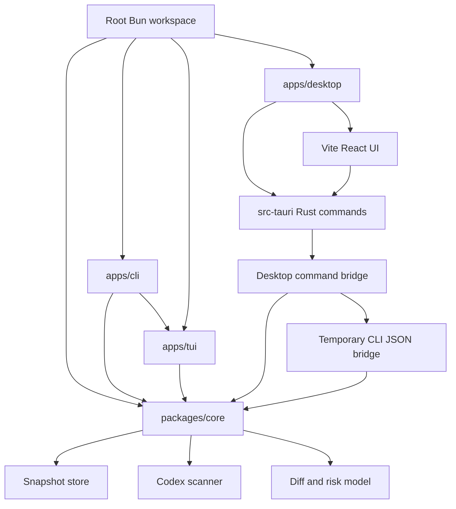

# feat: Add Tauri desktop app with separated workspaces

## Summary

Restructure Hem from a root-level mixed CLI/TUI/core package into a Bun workspace with a shared core package, dedicated CLI and TUI apps, and a new Tauri desktop app using Vite. The desktop MVP should reuse Hem's core setup model and match the existing desktop dashboard design instead of becoming a second standalone implementation.

---

## Problem Frame

Hem is moving from a CLI/TUI-only tool into a desktop product. The current `src/` tree mixes durable domain logic, CLI command adapters, and Ink/Clack TUI presentation, which makes a desktop app likely to import the wrong layer or duplicate behavior. Before adding Tauri, the repository needs package boundaries that make the intended dependency graph obvious: desktop and CLI depend on core, CLI can delegate rich terminal surfaces to TUI, and core remains independent from UI runtimes.

---

## Requirements

- R1. Move durable Hem behavior into a shared core package that has no dependency on CLI parsing, Ink, Clack, React, Tauri, or Vite.
- R2. Move the published `hem` command into its own CLI app package while preserving the current `@qxinm/hem` package name and `hem` bin behavior.
- R3. Move terminal UI code into a dedicated TUI app/package that CLI can depend on for `hem tui` and interactive flows.
- R4. Add a Tauri desktop app under the workspace using Vite, React, TypeScript, and Bun.
- R5. Keep the desktop MVP aligned with `PRODUCT.md` and `docs/design/desktop-mvp.md`: active profile first, Home/Setup/MCP/Skills/Hooks navigation, titlebar snapshot id, Home overall state, and bottom changelog.
- R6. Keep the first desktop integration read-first and conservative: scan/status/timeline/diff/snapshot preview may be exposed before restore/apply, and any write action must preserve Hem's existing preview and snapshot safety model.
- R7. Update build, test, publish, and CI workflows so the workspace layout is the default developer path.
- R8. Keep macOS first while avoiding choices that prevent a later Windows Tauri build.

---

## Key Technical Decisions

- **Use Bun workspaces with root orchestration:** The root `package.json` becomes a private workspace coordinator. Product code moves out of root so the repository shape reflects the product boundaries the desktop app needs.
- **Keep `@qxinm/hem` as the CLI package:** The existing registry package name should continue to install the `hem` command. The CLI package moves to `apps/cli`, but external users should not see a package rename.
- **Publish shared JS packages instead of relying on private workspace-only imports:** `apps/cli` should depend on versioned `@qxinm/hem-core` and `@qxinm/hem-tui` packages, or the release pipeline must bundle them. The lower-risk first plan is aligned public workspace packages with shared versioning.
- **Make core the only domain authority:** Scan, graph, diff, audit, provenance, store, timeline, readiness, restore planning, bundle, policy, parsers, and shared types belong in `packages/core`. UI packages may format or present these results but should not own domain decisions.
- **Keep TUI separate from CLI command parsing:** `apps/tui` owns Ink/Clack components and wizards. `apps/cli` owns argument parsing, command registry, help text, update checks, and command-to-core adapters.
- **Use Tauri's standard Vite shape inside `apps/desktop`:** The desktop app should use `src-tauri/` plus a Vite frontend with fixed dev server port and `frontendDist` pointing to the Vite `dist` output.
- **Prefer Rust commands over broad shell access:** The desktop MVP should expose narrow Tauri commands that call core-backed operations. If shell/sidecar execution is needed as a bridge, it should be explicitly scoped and treated as temporary.
- **Capabilities are part of the safety boundary:** Tauri permissions must be narrowly granted per window. The desktop app should not enable blanket file system or shell access just because Hem is a local setup manager.

---

## High-Level Technical Design



The dependency direction is one-way: UI surfaces depend on stable contracts, and core does not depend on UI surfaces. Tauri's Rust side owns native window integration, capabilities, notifications, and any OS-specific bridge. The Vite frontend owns dashboard composition and calls only narrow desktop commands; if the first implementation cannot call TypeScript core directly from Rust, it uses an isolated CLI JSON bridge until a cleaner app-core boundary exists.

---

## Output Structure

```text
.
|-- package.json
|-- bun.lock
|-- tsconfig.base.json
|-- packages/
|   `-- core/
|       |-- package.json
|       |-- tsconfig.json
|       |-- src/
|       `-- tests/
`-- apps/
    |-- cli/
    |   |-- package.json
    |   |-- tsconfig.json
    |   |-- src/
    |   `-- tests/
    |-- tui/
    |   |-- package.json
    |   |-- tsconfig.json
    |   |-- src/
    |   `-- tests/
    `-- desktop/
        |-- package.json
        |-- index.html
        |-- vite.config.ts
        |-- src/
        |-- src-tauri/
        |   |-- Cargo.toml
        |   |-- tauri.conf.json
        |   |-- capabilities/
        |   `-- src/
        `-- tests/
```

---

## Scope Boundaries

- In scope: workspace split, package metadata, TypeScript project references or equivalent build ordering, import rewrites, test relocation, CI updates, and a Tauri/Vite desktop scaffold.
- In scope: a desktop MVP shell that renders the dashboard navigation and uses core-backed data contracts or stable mocked adapters where implementation needs a temporary seam.
- In scope: Tauri capability setup for the main window and narrow native commands needed by the initial dashboard.
- Out of scope: repo-local setup management, Claude/Cursor desktop scope, team cloud backend implementation, E2E encryption, signing/notarization, Windows installer polish, and full restore/apply from desktop.

### Deferred to Follow-Up Work

- Extracting a long-term Rust-native core. The first desktop app can bridge to TypeScript core rather than rewriting domain logic in Rust.
- Full cloud sync and profile proposal implementation. The desktop shell should preserve UI space for these states but not invent backend behavior.
- Production updater, notarized macOS release, and Windows packaging.
- Replacing all CLI command output formatting with shared presenters. Do this only where duplication becomes painful after the package split.

---

## Acceptance Examples

- AE1. Given a fresh clone, when a developer installs dependencies from the root, then Bun installs all workspace packages and no root `src/` product code remains.
- AE2. Given the CLI package is built, when `hem --help` runs from the package bin, then the current command list and update-check behavior still work.
- AE3. Given the TUI package is built, when `hem tui` is launched from CLI, then CLI delegates to the relocated TUI package without importing Ink on non-TUI paths.
- AE4. Given the desktop app is launched in development, when the Home screen renders, then it shows the profile context, current snapshot id area, overall setup summary, and changelog area from the desktop MVP design.
- AE5. Given Tauri capabilities are reviewed, when the main window loads, then only the permissions needed for the MVP commands are granted.

---

## Implementation Units

### U1. Establish Bun Workspace and Shared Build Configuration

- **Goal:** Convert the root package into a workspace coordinator and add shared TypeScript configuration for package builds.
- **Requirements:** R1, R2, R3, R7.
- **Dependencies:** None.
- **Files:** `package.json`, `tsconfig.base.json`, `bun.lock`, `.gitignore`, `.github/workflows/ci.yml`, `.github/workflows/publish.yml`, `README.md`.
- **Approach:** Mark the root package private, define `packages/*` and `apps/*` workspaces, move root-level scripts to orchestrate package scripts, and preserve Bun as the only package manager. Decide the build order explicitly so core builds before TUI, CLI, and desktop.
- **Patterns to follow:** Current Bun script style in `package.json`; current CI use of `oven-sh/setup-bun@v2` in `.github/workflows/ci.yml`.
- **Test scenarios:**
  - Root install with the committed lockfile keeps dependency resolution stable across all workspaces.
  - Root `check` runs each package's typecheck/build/test in dependency order.
  - CI uses Bun install and workspace scripts without `npm` fallback commands.
- **Verification:** A clean checkout can run the root check path and produce package build outputs without relying on root `src/`.

### U2. Extract Hem Core Package

- **Goal:** Move domain modules into `packages/core` and expose a stable TypeScript API for CLI, TUI, and desktop.
- **Requirements:** R1, R6.
- **Dependencies:** U1.
- **Files:** `packages/core/package.json`, `packages/core/tsconfig.json`, `packages/core/src/**`, `packages/core/tests/**`, `src/audit.ts`, `src/bundle.ts`, `src/current-state.ts`, `src/diff.ts`, `src/errors.ts`, `src/graph.ts`, `src/parsers.ts`, `src/policy.ts`, `src/provenance.ts`, `src/readiness.ts`, `src/report.ts`, `src/restore.ts`, `src/scan.ts`, `src/scanners/**`, `src/store.ts`, `src/tar.ts`, `src/timeline.ts`, `src/timeline-undo.ts`, `src/types.ts`.
- **Approach:** Move the modules that currently define scanning, evidence, snapshots, diffing, audit, readiness, restore planning, bundles, and shared errors into core. Add a package export surface that avoids deep imports from app packages. Keep file-system writes behind the existing explicit restore/snapshot functions rather than introducing desktop-specific write paths.
- **Patterns to follow:** Current architecture boundary in `ARCHITECTURE.md`; current defensive JSON boundary tests in `tests/bundle.test.ts`, `tests/store.test.ts`, and `tests/restore.test.ts`.
- **Test scenarios:**
  - Existing scan, graph, diff, audit, restore, bundle, store, tar, timeline, and update-check-adjacent core tests pass from `packages/core/tests`.
  - Importing from the core package entrypoint exposes public types and functions needed by CLI/TUI without importing UI dependencies.
  - Legacy snapshot and bundle JSON tests still prove serialized shape compatibility.
- **Verification:** `packages/core` builds independently and has no dependencies on `ink`, `@clack/prompts`, Tauri, Vite, or React.

### U3. Move CLI Into `apps/cli`

- **Goal:** Preserve the published `hem` binary while relocating command parsing and command adapters out of the repository root.
- **Requirements:** R2, R7.
- **Dependencies:** U1, U2.
- **Files:** `apps/cli/package.json`, `apps/cli/tsconfig.json`, `apps/cli/src/**`, `apps/cli/tests/**`, `src/cli.ts`, `src/cli-shared.ts`, `src/commands/**`, `tests/cli.test.ts`, `tests/doctor.test.ts`, `tests/update-check.test.ts`.
- **Approach:** Move the CLI entrypoint, command registry, shared flag parsing, command handlers, and update notice into the CLI package. Replace relative imports to core modules with core package imports. Keep `@qxinm/hem` and the `hem` bin in `apps/cli/package.json`.
- **Patterns to follow:** Current thin command-handler pattern in `src/commands/*`; current CLI behavior tests in `tests/cli.test.ts`.
- **Test scenarios:**
  - `hem --help` still includes diagnosis, timeline, restore, bundle, doctor, schema, and TUI commands.
  - CLI JSON output for scan/doctor/timeline remains parseable after import rewrites.
  - Unknown command and unhandled error formatting still use the shared error contract.
  - The package bin resolves to the relocated built CLI entrypoint.
- **Verification:** The CLI package can be packed or dry-run published with the expected bin and dependencies.

### U4. Move TUI Into `apps/tui`

- **Goal:** Separate Ink/Clack TUI presentation from CLI command parsing and shared core behavior.
- **Requirements:** R3.
- **Dependencies:** U1, U2, U3.
- **Files:** `apps/tui/package.json`, `apps/tui/tsconfig.json`, `apps/tui/src/**`, `apps/tui/tests/**`, `src/tui/**`, `tests/tui.test.tsx`.
- **Approach:** Move TUI mode detection, Ink components, view models, formatters, and Clack wizards into the TUI package. Export only the render and wizard entrypoints that CLI needs. Keep view model tests close to the TUI package and keep domain-heavy fixtures imported from core.
- **Patterns to follow:** Existing split between `src/tui/components/*ViewModel.ts` and `*.tsx` views; current dynamic Ink import in `src/tui/index.ts`.
- **Test scenarios:**
  - TUI view model tests still cover timeline, agent detail, save setup, compare, profile, navigation, and formatting outputs.
  - CLI non-TUI commands do not load Ink/React modules eagerly.
  - `hem tui` delegates to the TUI package and returns the same exit-code behavior on render errors.
- **Verification:** TUI package builds independently after core and can be consumed by CLI through package exports.

### U5. Scaffold Tauri Desktop App With Vite

- **Goal:** Create `apps/desktop` using Tauri 2, Vite, React, TypeScript, and Bun.
- **Requirements:** R4, R8.
- **Dependencies:** U1.
- **Files:** `apps/desktop/package.json`, `apps/desktop/index.html`, `apps/desktop/vite.config.ts`, `apps/desktop/src/**`, `apps/desktop/src-tauri/Cargo.toml`, `apps/desktop/src-tauri/tauri.conf.json`, `apps/desktop/src-tauri/src/**`, `apps/desktop/src-tauri/capabilities/default.json`.
- **Approach:** Use the `bun create tauri-app` path to generate a Tauri app, then normalize the generated output into the workspace conventions. Configure Vite with a fixed Tauri dev port, `strictPort`, `clearScreen: false`, `src-tauri` watch ignore, and platform-aware build target. Configure Tauri `frontendDist` to the Vite `dist` output and keep `src-tauri` as the Rust project marker.
- **Patterns to follow:** Tauri 2 project structure and Vite frontend configuration from official docs; existing Bun-only package manager convention in root.
- **Test scenarios:**
  - Desktop frontend typecheck builds with React and Vite.
  - Tauri config points at the Vite dev server in dev and the Vite `dist` output in build.
  - Rust project builds enough to validate command registration and app startup.
  - Generated scaffold does not introduce npm/pnpm/yarn lockfiles.
- **Verification:** The desktop app starts in development on macOS and opens a Tauri window backed by the Vite frontend.

### U6. Add Desktop Command Boundary and Core Adapter

- **Goal:** Let the Tauri frontend request Hem setup state through narrow desktop commands instead of importing Node-specific internals into the browser context.
- **Requirements:** R1, R5, R6, R8.
- **Dependencies:** U2, U5.
- **Files:** `apps/desktop/src-tauri/src/lib.rs`, `apps/desktop/src-tauri/src/commands.rs`, `apps/desktop/src/api/**`, `apps/desktop/src/domain/**`, `packages/core/src/**`, `packages/core/tests/**`, `apps/desktop/tests/**`.
- **Approach:** Define a small command contract for Home state, setup inventory, MCP list, skills list, hooks list, timeline list, snapshot preview, and diff preview. Use core APIs where they are browser-safe through Tauri command results. If direct TypeScript core reuse from Rust is not practical in the first pass, add a documented bridge adapter that invokes the built CLI with JSON output as a temporary boundary.
- **Patterns to follow:** Current CLI JSON behavior in `apps/cli` after U3; current `DiscoveredItem` and timeline models in core; desktop design contract in `docs/design/desktop-mvp.md`.
- **Test scenarios:**
  - Home state command returns active profile name, current snapshot id, protection status placeholder, highest risk, working-change count, and sync status placeholder.
  - Setup commands return MCP, skills, hooks, permissions, env keys, unsupported items, and affected files without exposing raw secret values.
  - Command errors serialize into a frontend-safe problem/cause/fix shape.
  - Temporary CLI bridge, if used, rejects non-JSON output and surfaces a recoverable desktop error.
- **Verification:** Desktop frontend can render real or fixture-backed command responses through one API layer, and the bridge is isolated enough to replace later.

### U7. Build Desktop Dashboard Shell

- **Goal:** Implement the first desktop UI shell matching the MVP design document.
- **Requirements:** R5, R6.
- **Dependencies:** U5, U6.
- **Files:** `apps/desktop/src/App.tsx`, `apps/desktop/src/components/**`, `apps/desktop/src/screens/**`, `apps/desktop/src/styles/**`, `apps/desktop/tests/**`, `docs/design/desktop-mvp.md`.
- **Approach:** Build the custom window titlebar, profile picker, sidebar, account footer, settings-mode sidebar, Home screen, Setup screen, MCP screen, Skills screen, and Hooks screen. Use icon components for compact controls and status signals. Keep write actions behind preview states; if preview APIs are not ready, render disabled actions with accurate state rather than fake behavior.
- **Patterns to follow:** Existing ASCII screen contracts and icon policy in `docs/design/desktop-mvp.md`; existing TUI view-model concepts for current setup and timeline.
- **Test scenarios:**
  - Home renders overall state at the top and changelog/timeline at the bottom.
  - Sidebar shows profile picker at top and Home/Setup/MCP/Skills/Hooks only.
  - Account row stays at the bottom and settings icon switches to settings navigation.
  - Titlebar shows Hem on the left and the current snapshot short id on the right.
  - Risk status uses iconography and text without blocking local snapshot creation.
  - Primary actions render as icon plus text for state-changing actions.
- **Verification:** Desktop UI matches the MVP hierarchy at 1100x720 and remains usable at the minimum target size.

### U8. Wire Workspace CI, Release, and Documentation

- **Goal:** Make the new workspace layout the documented and verified developer path.
- **Requirements:** R7, R8.
- **Dependencies:** U1, U2, U3, U4, U5, U6, U7.
- **Files:** `.github/workflows/ci.yml`, `.github/workflows/publish.yml`, `.github/workflows/snaptailor-audit.yml`, `README.md`, `ARCHITECTURE.md`, `PRODUCT.md`, `docs/design/desktop-mvp.md`, `docs/index.html`, `docs/plans/**`.
- **Approach:** Update CI to check core, CLI, TUI, and desktop. Update publish to account for multi-package ordering or bundling. Document root commands, package locations, desktop development prerequisites, and what remains macOS-only. Keep existing snaptailor audit behavior but ensure it runs from the correct workspace package after the move.
- **Patterns to follow:** Current Bun CI migration; current architecture documentation style.
- **Test scenarios:**
  - CI installs with Bun and runs workspace checks.
  - Publish workflow either publishes shared packages before CLI or verifies the CLI bundle contains shared code.
  - Documentation points to the new app/package locations and does not reference root `src/` as the product code location.
  - Desktop docs identify signing/notarization and Windows packaging as deferred rather than silently unsupported.
- **Verification:** A contributor can follow README setup and run CLI, TUI, and desktop development paths from a clean clone.

---

## System-Wide Impact

This plan changes the repository's build graph, release graph, and import graph. The biggest operational impact is publishing: once core and TUI are separate packages, the existing single-package publish flow must either publish workspace dependencies first or bundle them into the CLI package. The biggest implementation impact is import churn; tests should be relocated with each package to preserve behavior while the filesystem layout changes.

---

## Risks & Dependencies

- **Publish breakage:** Splitting packages can break `bun install -g @qxinm/hem` if workspace dependencies are not published or bundled. Mitigation: decide and test the publish shape before merging the package split.
- **Desktop bridge complexity:** Rust cannot import TypeScript core directly. Mitigation: keep the Tauri command API narrow and isolate any temporary CLI JSON bridge.
- **Over-broad Tauri permissions:** Desktop access to local setup files is sensitive. Mitigation: use Tauri capabilities per window and add only permissions needed for MVP commands.
- **Import churn hiding behavior changes:** Moving files can mask regressions. Mitigation: relocate tests with packages and keep behavior tests green at each migration step.
- **Vite/Tauri dev-server drift:** Tauri expects a fixed dev URL while Vite can choose alternate ports. Mitigation: configure Vite `strictPort` and keep `devUrl` aligned with the Vite port.

---

## Documentation / Operational Notes

The README should explain the workspace roles:

- `packages/core`: domain logic and durable data contracts.
- `apps/cli`: published `hem` command.
- `apps/tui`: terminal UI used by CLI.
- `apps/desktop`: Tauri/Vite desktop app.

The architecture document should be updated so future contributors do not treat root `src/` as the default home for new code. The desktop design document remains the UI source of truth for MVP layout.

---

## Sources & Research

- `PRODUCT.md` defines the product model: global-only Codex setup, profiles as branches, snapshots as commits, desktop dashboard plus menu bar, and Git-style sync states.
- `docs/design/desktop-mvp.md` defines the desktop app shell, sidebar, profile picker, titlebar snapshot id, Home screen contract, icon policy, and settings mode.
- `ARCHITECTURE.md` describes the current CLI/core/TUI mixture and the trust boundaries that must survive the split.
- Tauri Create Project docs confirm `bun create tauri-app` and `bun tauri dev` as supported project creation and development paths: https://v2.tauri.app/start/create-project/
- Tauri Project Structure docs define the `src-tauri/` Rust project, `tauri.conf.json`, capabilities directory, icons, and frontend build relationship: https://v2.tauri.app/start/project-structure/
- Tauri Vite docs define `frontendDist`, Vite dev server alignment, fixed port, `strictPort`, `src-tauri` watch ignore, and platform-aware build targets: https://v2.tauri.app/start/frontend/vite/
- Tauri Capabilities docs define permissions as a frontend exposure boundary for windows and webviews: https://v2.tauri.app/security/capabilities/
