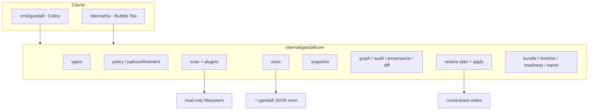
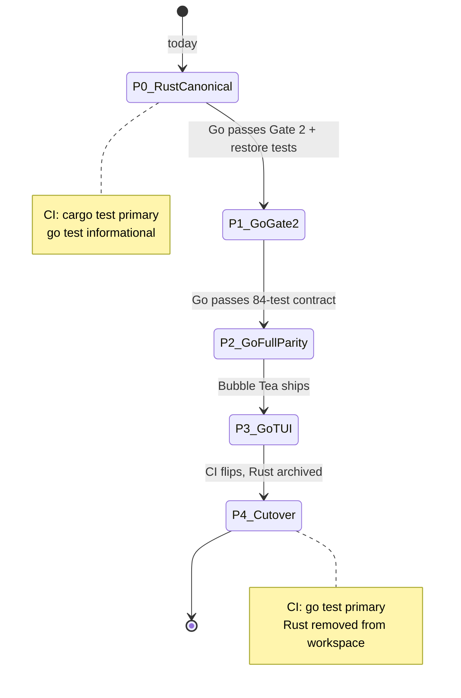

# refactor: Go full rewrite of gandalf-core and gandalf-cli

## Summary

Replace `crates/gandalf-core` and `crates/gandalf-cli` with a Go engine (`internal/gandalfcore`) and Cobra CLI (`cmd/gandalf`), using a **phased parity cutover**: Rust remains canonical until Go passes the existing Rust test contracts and Gate 2 demo. Bubble Tea + Lip Gloss + Bubbles TUI lands after engine parity. Desktop (Tauri) and npm legacy stacks stay out of v1 cutover scope.

## Problem Frame

Gandalf completed a TS → Rust engine migration (~12.6k LOC in `crates/gandalf-core`) and now targets Go for CLI/TUI velocity, single-language distribution, and Bubble Tea UX. The repo already has a minimal Go scaffold (`go.mod`, partial `internal/gandalfcore/types`). A third engine rewrite is expensive but intentional — the risk is repeating the Rust migration mistakes (restore handler gaps, missing path confinement at apply time) documented in `docs/solutions/logic-errors/rust-core-restore-handler-review-gaps.md`.

Gate 2 (`PRODUCT.md`) is unchanged: Codex user-global `snapshot → diff → restore` must not regress during the rewrite.

## Requirements

- R1. Go becomes the canonical engine and CLI after parity gate passes; until then Rust remains build-canonical in CI.
- R2. Go engine preserves the on-disk `~/.gandalf` snapshot format and JSON field naming (`camelCase` serde contract) so existing snapshots remain readable.
- R3. Gate 2 wedge passes on Go: content-backed Codex user-global snapshot, byte-exact restore of supported non-secret files, dry-run default, explicit `--apply --experimental` (or `GANDALF_EXPERIMENTAL=1`) for writes.
- R4. Trust contract preserved: read-only scan (no command execution), path confinement on all write paths, symlink refusal, secret redaction, restore policy per evidence kind.
- R5. Rust `crates/gandalf-core/tests/*` behavioral contracts are ported or wrapped as Go tests before Rust removal.
- R6. CLI command surface matches `crates/gandalf-cli` flags and subcommands (minus `tui` until Bubble Tea ships).
- R7. Bubble Tea TUI provides timeline-first setup-history workspace equivalent to deprecated `apps/tui` (post-engine parity).
- R8. Distribution path shifts from npm-first to Go binary (goreleaser or equivalent); npm shim deprecated after Go ships.
- R9. `ARCHITECTURE.md` and `README.md` updated at cutover to name Go as canonical.

## Key Technical Decisions

- KTD1. **Phased parity cutover** — Go and Rust run in parallel; Rust is removed only when Go passes Gate 2 harness + ported Rust integration tests. Rationale: user confirmed; avoids repeating TS→Rust big-bang pain.
- KTD2. **Module layout: `internal/gandalfcore` + `cmd/gandalf` + `internal/cli` + `internal/tui`** — standard Go layout; `github.com/qyinm/gandalf` module at repo root. Rationale: matches existing `go.mod`; keeps engine unexported.
- KTD3. **Characterization-first porting** — port Rust tests as Go table tests before rewriting logic; fixtures copied from `crates/gandalf-core/tests/fixtures/`. Rationale: institutional learning from restore handler gaps; 84 Rust tests are the contract.
- KTD4. **Scanner plugin interface in Go** — `ScannerPlugin` struct with `AgentID`, `Targets()`, `Scan()` mirroring `crates/gandalf-core/src/scan/plugins/mod.rs`. Rationale: extensibility without core special-cases.
- KTD5. **Bubble Tea for TUI, not engine** — TUI is presentation-only over typed engine APIs; no scan/restore logic in TUI package. Rationale: `ARCHITECTURE.md` presentation-only rule; matches Ink/Clack separation.
- KTD6. **Desktop deferred** — `apps/desktop/src-tauri` stays on Rust `gandalf-core` in-process until Go cutover; then bridge via subprocess (`gandalf … --json`) or revisit FFI. Rationale: user deprioritized menu bar/desktop; SwiftUI/Liquid Glass is a separate track.
- KTD7. **Gate 2 sequencing** — ship Go CLI with Codex-only content-backed restore before porting bundle/timeline/full scanner matrix. Rationale: `PRODUCT.md` explicit wedge; ~40% of LOC is non-Gate-2.
- KTD8. **JSON as CLI interchange** — `--json` output shapes match Rust CLI for dogfood scripts (`scripts/gate2-demo.mjs` portable to Go test). Rationale: minimizes consumer churn during transition.

## High-Level Technical Design

### Target architecture



### Cutover phases



### Port dependency order

```text
types + policy + pathconfinement + errors + parsers
  → store
  → scan/filesystem + scan/codex
  → snapshot + graph + audit + provenance + diff
  → restore/plan + restore/apply
  → cmd/gandalf (Gate 2 commands)
  → parity tests + gate2 harness
  → remaining scanners + bundle + timeline + readiness + report
  → internal/tui
  → distribution + docs + Rust removal
```

## Output Structure

```text
go.mod
cmd/gandalf/main.go
internal/cli/                    # Cobra commands
internal/gandalfcore/
  gandalfcore.go
  types/
  policy/
  pathconfinement/
  errors/
  parsers/
  store/
  scan/
    filesystem.go
    scan.go
    target.go
    plugin.go
    plugins/
      codex.go
      claude_code.go
      cursor.go
      opencode.go
      pi.go
      project.go
  snapshot/
  graph/
  audit/
  provenance/
  diff/
  restore/
  bundle/
  timeline/
  timeline_undo/
  readiness/
  report/
  tar/
internal/tui/                    # Bubble Tea (post-parity)
  app.go
  model.go
  format.go
  tui_test.go
  views/
testdata/
  fixtures/evidence/             # copied from crates/gandalf-core/tests/fixtures
internal/gandalfcore/**/*_test.go
scripts/gate2-demo.go            # or gate2-demo.sh calling Go binary
```

## Scope Boundaries

**In scope**

- Go engine port of all `gandalf-core` modules
- Cobra CLI parity with `gandalf-cli`
- Bubble Tea TUI (post engine parity)
- CI addition for `go test ./...`
- Binary distribution scaffolding (goreleaser/Homebrew)
- Documentation cutover at parity gate

**Deferred for later (product, not this rewrite)**

- Desktop SwiftUI / Liquid Glass shell
- Menu bar companion / Gandalf Protection watcher UX
- Profiles, team/cloud sync (full `PRODUCT.md` vision)

**Deferred to follow-up work (implementation sequencing)**

- Tauri desktop migration to Go backend (subprocess vs FFI decision)
- npm package removal timing (after Go binary distribution ships)
- `packages/core` / `apps/cli` / `apps/tui` deletion (after Go TUI ships)

**Outside this plan**

- Rewriting landing site (`apps/landing`)
- Changing Gate 2 product wedge scope

## System-Wide Impact

| Surface | Impact |
|---------|--------|
| CI (`.github/workflows/ci.yml`) | Add Go job; flip primary after cutover |
| Publish (`.github/workflows/publish.yml`) | Add binary release; deprecate npm |
| Desktop (`apps/desktop/src-tauri`) | Unchanged until cutover; then needs bridge |
| Gate 2 demo (`scripts/gate2-demo.mjs`) | Retarget to Go binary |
| Dogfood docs | Update install/run instructions |
| Agent/MCP consumers | `--json` contract must remain stable |

## Risks & Dependencies

| Risk | Mitigation |
|------|------------|
| Restore handler parity bugs (MCP/permission/env) | Port `restore_test.rs` first; apply path confinement at every write entrypoint from day one |
| JSON schema drift breaks desktop/scripts | Golden JSON fixtures; round-trip tests on `DiscoveredItem` |
| Go TOML parser differences vs Rust `toml` crate | Use Codex config fixtures; byte-exact restore test on `config.toml` |
| Scope creep into desktop/npm cleanup | Explicit phase gates; U10 only after U7 green |
| 12k LOC port duration | Gate 2 first (KTD7); defer bundle (1.4k LOC) and pi/cursor scanners |
| Bubble Tea PTY/daemon complexity | Defer TUI until engine stable; reuse TS TUI view-model tests as spec |

**Prerequisites:** Go 1.23+ toolchain (available); existing Rust tests as contract source.

## Alternative Approaches Considered

| Alternative | Why not chosen |
|-------------|----------------|
| Keep Rust, add ratatui TUI only | User explicitly chose Go full rewrite |
| Go shell + Rust core via FFI | Two-language maintenance; user wants single Go stack |
| Big-bang cutover (remove Rust immediately) | User chose phased parity; too risky for restore/trust layer |
| Subprocess-only desktop forever | Acceptable interim; not v1 rewrite goal |

## Implementation Units

### U1. Foundation — types, policy, trust primitives

**Goal:** Complete Go domain types and trust-layer packages with test parity on policy/path confinement/errors.

**Requirements:** R2, R4

**Dependencies:** none (extends existing `internal/gandalfcore/types`)

**Files:**
- `internal/gandalfcore/types/types.go` (extend)
- `internal/gandalfcore/policy/policy.go`
- `internal/gandalfcore/pathconfinement/pathconfinement.go`
- `internal/gandalfcore/errors/errors.go`
- `internal/gandalfcore/policy/policy_test.go`
- `internal/gandalfcore/pathconfinement/pathconfinement_test.go`
- `internal/gandalfcore/errors/errors_test.go`
- `testdata/fixtures/evidence/*.json` (copy from `crates/gandalf-core/tests/fixtures/evidence/`)

**Approach:** Port `policy.rs`, `path_confinement.rs`, `errors.rs`. Custom `AgentID` JSON unmarshaling defaults to `unknown`. `DiscoveredItem` uses `json.RawMessage` for `value`/`metadata`.

**Execution note:** Port `policy_test.rs` scenarios as table tests before implementing redaction logic.

**Patterns to follow:** `crates/gandalf-core/src/policy.rs`, `crates/gandalf-core/tests/policy_test.rs`

**Test scenarios:**
- `restore_policy_for` per evidence kind matches Rust (agent_config → full_content, mcp_server → structured_fields, env_key → key_inventory, symlink → not_supported)
- Secret-like keys (`OPENAI_API_KEY`, `github_token`) trigger redaction; `MODEL_NAME` omitted
- `redact_structured_value` expands `env` to `envKeys` array
- `ignored_directory` matches `.git`, `node_modules`; rejects `src`
- Evidence fixtures round-trip JSON with `camelCase` fields
- Invalid agent ID deserializes to `unknown`
- `format_snap_error` matches multi-line contract (code, Problem, Cause, Fix, Path)
- Path traversal `..` rejected; writes outside home/project roots rejected
- Blocked home prefixes (`.ssh`, `.bashrc`) rejected on constrained writes

**Verification:** `go test ./internal/gandalfcore/policy/... ./internal/gandalfcore/pathconfinement/... ./internal/gandalfcore/errors/...` green; fixture round-trips match Rust serialized output.

---

### U2. Parsers and store

**Goal:** Read/write `~/.gandalf` snapshot directories with atomic JSON writes and `0700` permissions.

**Requirements:** R2, R4

**Dependencies:** U1

**Files:**
- `internal/gandalfcore/parsers/parsers.go`
- `internal/gandalfcore/parsers/parsers_test.go`
- `internal/gandalfcore/store/store.go`
- `internal/gandalfcore/store/store_test.go`

**Approach:** Port `parsers.rs` (JSON/TOML key-values/markdown/dotenv) and `store.rs` (ensure_store, list_snapshots, write_snapshot, read_snapshot, agent-scoped dirs, timeline entry paths). Use atomic write-via-temp-rename pattern.

**Patterns to follow:** `crates/gandalf-core/src/store.rs`, `crates/gandalf-core/tests/store_test.rs`

**Test scenarios:**
- `ensure_store` creates `0700` directory; emits `WORLD_WRITABLE_STORE` audit finding when group/world writable
- `list_snapshots` returns sorted names; rejects unsafe snapshot names (`..`, slashes)
- `write_snapshot` + `read_snapshot` round-trip all JSON files (manifest, evidence, graph, audit-findings, provenance, checksums, redactions)
- Agent-scoped store paths (`~/.gandalf/codex/<name>/`) list correctly
- `list_agents` discovers agent subdirs with snapshot children
- Unsafe content paths under `content/` rejected
- TOML parser handles multi-line arrays and redacts secret keys in scalar parse

**Verification:** Store tests pass; written snapshot readable by Rust `gandalf-cli snapshot show` (cross-engine spot check during transition).

---

### U3. Scan pipeline and Codex scanner (Gate 2 read path)

**Goal:** `scan_project()` returns Codex user-global evidence with read-only trust metadata.

**Requirements:** R3, R4, R6

**Dependencies:** U1, U2

**Files:**
- `internal/gandalfcore/scan/scan.go`
- `internal/gandalfcore/scan/target.go`
- `internal/gandalfcore/scan/filesystem.go`
- `internal/gandalfcore/scan/plugin.go`
- `internal/gandalfcore/scan/plugins/codex.go`
- `internal/gandalfcore/scan/plugins/project.go`
- `internal/gandalfcore/scan/scan_test.go`
- `internal/gandalfcore/scan/plugins/codex_test.go`

**Approach:** Port `scan/mod.rs`, `filesystem.rs`, `plugins/codex.rs` (852 LOC — Gate 2 priority). Stub other scanners as target-only filesystem scans initially. `ScanTrust.commands_executed` always empty.

**Patterns to follow:** `crates/gandalf-core/src/scan/plugins/codex.rs`, `crates/gandalf-core/tests/scan_test.rs`

**Test scenarios:**
- `scan_project` with `--agent codex --scope user` discovers `~/.codex/config.toml`, MCP servers, skills, hooks
- Symlinks recorded as `unsupported`; never followed
- Files over `MAX_FILE_BYTES` (256KiB) marked unsupported
- Parse failure on malformed TOML yields `parse_failed` capture status
- `scan --explain` includes target paths (CLI flag wired in U6)
- Project `.env` emits key-inventory env_key evidence (project scanner)
- Codex skill scan respects budget/depth limits

**Verification:** Go scan output JSON matches Rust scan for fixed fixture home directory (golden file test).

---

### U4. Analysis pipeline — snapshot, graph, audit, provenance, diff

**Goal:** Capture current state into snapshots and compute semantic/raw diffs.

**Requirements:** R2, R3

**Dependencies:** U3

**Files:**
- `internal/gandalfcore/snapshot/snapshot.go`
- `internal/gandalfcore/graph/graph.go`
- `internal/gandalfcore/audit/audit.go`
- `internal/gandalfcore/provenance/provenance.go`
- `internal/gandalfcore/diff/diff.go`
- `internal/gandalfcore/snapshot/snapshot_test.go`
- `internal/gandalfcore/diff/diff_test.go`
- `internal/gandalfcore/analysis_test.go` (port `analysis_test.rs` integration scenarios)

**Approach:** Port `snapshot.rs`, `graph.rs`, `audit.rs`, `provenance.rs`, `diff.rs`. Content-backed capture gated to `codex` + `user` scope per Gate 2.

**Test scenarios:**
- `capture_current_state` produces manifest with `schemaVersion`, RFC3339 `createdAt`
- Content-backed capture stores files under `content/` with checksums
- `build_graph` resolves precedence overrides (user vs project)
- `audit_evidence` flags wildcard permissions, secret-like omissions
- `diff_graphs` between snapshot and current shows semantic MCP/skill changes
- Metadata-only snapshot has empty content index

**Verification:** `analysis_test.rs` equivalent passes; snapshot JSON consumable by existing store readers.

---

### U5. Restore — plan, apply, rollback (Gate 2 write path)

**Goal:** Dry-run restore plans and byte-exact Codex user-global apply with rollback.

**Requirements:** R3, R4

**Dependencies:** U4

**Files:**
- `internal/gandalfcore/restore/plan.go`
- `internal/gandalfcore/restore/apply.go`
- `internal/gandalfcore/restore/registry.go`
- `internal/gandalfcore/restore/plan_test.go`
- `internal/gandalfcore/restore/apply_test.go`

**Approach:** Port `restore/plan.rs` and `restore/apply.rs`. Register apply handlers for agent_config, skill, mcp_server, permission, env_key. **Path confinement on every apply entrypoint** (lesson from `docs/solutions/logic-errors/rust-core-restore-handler-review-gaps.md`). Default dry-run; apply requires explicit experimental flag at CLI layer.

**Execution note:** Port `restore_test.rs` Codex byte-exact test before implementing apply handlers.

**Test scenarios:**
- Covers Gate 2: `restores_codex_config_byte_for_byte_through_target_home`
- Dry-run output parseable; lists writes files: no
- Apply handler registry covers mcp_server, permission, env_key (no "missing handler" at apply)
- Permission apply writes rule shape correctly (not raw wrapper)
- Undo handler dispatches mcp/env before generic filePath
- Out-of-root write rejected at apply time
- `apply_with_rollback` reverts on failure when `--rollback` set
- MCP TOML body restore supported; MCP table mutations may be unsupported with explicit reason

**Verification:** All 15 `restore_test.rs` scenarios ported and green.

---

### U6. CLI — Cobra command surface

**Goal:** `cmd/gandalf` exposes Gate 2 commands first, then full `gandalf-cli` parity.

**Requirements:** R3, R6, R8

**Dependencies:** U5

**Files:**
- `cmd/gandalf/main.go`
- `internal/cli/root.go`
- `internal/cli/scan.go`
- `internal/cli/snapshot.go`
- `internal/cli/diff.go`
- `internal/cli/restore.go`
- `internal/cli/doctor.go`
- `internal/cli/report.go`
- `internal/cli/timeline.go`
- `internal/cli/bundle.go`
- `internal/cli/shared.go`
- `internal/cli/cli_test.go`

**Approach:** Cobra mirrors clap structure from `crates/gandalf-cli/src/commands/mod.rs`. Shared flags: `--project`, `--home`, `--store`, `--agent`, `--scope`, `--json`. Gate 2 subset wired first; bundle/timeline/report stub to "not implemented" until U8.

**Test scenarios:**
- `gandalf scan --project . --agent codex --scope user --json` exits 0 with evidence array
- `gandalf snapshot create --name test --agent codex --scope user` creates content-backed snapshot
- `gandalf diff <baseline> current --json` exits 0
- `gandalf restore --snapshot X --dry-run` default; no filesystem mutation
- `gandalf restore --apply` without `--experimental` or `GANDALF_EXPERIMENTAL=1` rejected
- Invalid agent/scope flags return exit code 1 with readable error
- `gandalf doctor` runs readiness checks (when U8 lands)

**Verification:** CLI smoke test; `scripts/gate2-demo` passes against Go binary.

---

### U7. Parity harness and CI gate

**Goal:** Automated proof that Go engine matches Rust contract; CI runs both until cutover.

**Requirements:** R1, R5

**Dependencies:** U6

**Files:**
- `scripts/gate2-demo.go` (or `.mjs` retargeted)
- `internal/gandalfcore/restore/gate2_test.go`
- `.github/workflows/ci.yml`
- `Makefile` or `scripts/test-go.sh` (optional)

**Approach:** Port `scripts/gate2-demo.mjs` flow: snapshot → corrupt config → diff → dry-run restore → apply → verify byte-exact. Add CI job `go test ./...` (informational in P1, required in P4). Cross-engine spot test: Go-written snapshot readable by Rust during transition.

**Test scenarios:**
- Gate 2 demo end-to-end green on Go binary
- All ported Rust integration tests green (`policy`, `store`, `scan`, `restore`, `analysis`, `snapshot`)
- CI fails if Go tests fail once cutover flag enabled

**Verification:** `go test ./...` green; gate2 demo documented in `README.md`.

---

### U8. Extended engine — scanners, bundle, timeline, readiness, report

**Goal:** Full feature parity beyond Gate 2 wedge.

**Requirements:** R6

**Dependencies:** U7

**Files:**
- `internal/gandalfcore/scan/plugins/claude_code.go`
- `internal/gandalfcore/scan/plugins/cursor.go`
- `internal/gandalfcore/scan/plugins/opencode.go`
- `internal/gandalfcore/scan/plugins/pi.go`
- `internal/gandalfcore/bundle/bundle.go`
- `internal/gandalfcore/tar/tar.go`
- `internal/gandalfcore/timeline/timeline.go`
- `internal/gandalfcore/timeline_undo/timeline_undo.go`
- `internal/gandalfcore/readiness/readiness.go`
- `internal/gandalfcore/report/report.go`
- Corresponding `*_test.go` files

**Approach:** Port remaining modules in LOC order: bundle (1.4k), readiness (731), timeline, remaining scanners. Port `bundle_test.rs` (20 tests) with tar safety and HMAC verification.

**Test scenarios:**
- Bundle export/import round-trip with signature verify
- Tar path traversal rejected (`validate_tar_path`)
- Timeline list/show/undo dry-run MCP preview
- Readiness checks MCP binary without shell execution
- Claude/Cursor/OpenCode/Pi scanners emit expected evidence kinds
- Report markdown renders audit findings

**Verification:** Full Rust test matrix ported; `gandalf bundle`, `gandalf timeline`, `gandalf report`, `gandalf doctor` CLI commands functional.

---

### U9. Bubble Tea TUI

**Goal:** Interactive setup-history workspace replacing deprecated Ink TUI.

**Requirements:** R7

**Dependencies:** U8

**Files:**
- `internal/tui/app.go`
- `internal/tui/model.go`
- `internal/tui/views/history.go`
- `internal/tui/views/agents.go`
- `internal/tui/views/compare.go`
- `internal/tui/views/save_setup.go`
- `internal/tui/format.go`
- `internal/tui/tui_test.go`
- `internal/cli/tui.go`

**Approach:** Bubble Tea + Lip Gloss + Bubbles. Port view models from `apps/tui/src/components/TimelineViewModel.ts` and navigation from `apps/tui/src/tui-mode.ts`. Engine calls via Go APIs directly (no subprocess). First screen: History > All changes.

**Patterns to follow:** `apps/tui/src/components/*`, `docs/plans/2026-06-08-001-feat-timeline-first-tui-plan.md`

**Test scenarios:**
- Timeline view model: rows for skills/MCP/hooks include source-root labels
- Compare view shows explicit From/To/Scope before diff
- Save Setup previews deterministic title before write
- `u` key triggers undo preview (dry-run only, no writes)
- Corrupt timeline entry shows warning, does not crash
- Agents nav lists detected agents only; project scope not listed as agent

**Verification:** `go test ./internal/tui/...` green; manual PTY smoke documented in `docs/dogfood.md`.

---

### U10. Cutover, distribution, legacy retirement

**Goal:** Flip canonical engine to Go; ship binaries; archive Rust/TS legacy.

**Requirements:** R1, R8, R9

**Dependencies:** U9 (or U7 if TUI deferred behind flag)

**Files:**
- `.github/workflows/ci.yml`
- `.github/workflows/release.yml` (new, goreleaser)
- `.goreleaser.yaml`
- `ARCHITECTURE.md`
- `README.md`
- `Cargo.toml` (remove gandalf-core/gandalf-cli from workspace or archive `crates/`)
- `apps/cli/package.json` (update description: points to Go binary)
- `apps/desktop/src-tauri/Cargo.toml` (document interim Rust dep or switch to subprocess)

**Approach:** goreleaser for macOS/linux/windows binaries + Homebrew tap. CI primary flips to `go test`. Mark `crates/gandalf-core` archived; stop extending. npm publish emits thin installer script downloading Go binary. Desktop remains on Rust until separate bridge plan.

**Test scenarios:**
- Release workflow produces signed macOS arm64 binary
- `brew install` path documented
- `ARCHITECTURE.md` names Go as canonical with updated system diagram
- Fresh install via binary passes gate2 demo

**Verification:** Tag release produces assets; README install instructions updated; no regression in Gate 2.

---

## Sources & Research

- `ARCHITECTURE.md` — current Rust-canonical shape, trust boundaries, store layout
- `PRODUCT.md` — Gate 2 wedge scope (Codex user-global rollback)
- `crates/gandalf-core/` — source of truth (~12.6k LOC, 84 tests)
- `crates/gandalf-cli/src/commands/mod.rs` — CLI contract
- `docs/solutions/logic-errors/rust-core-restore-handler-review-gaps.md` — restore/path confinement lessons
- `scripts/gate2-demo.mjs` — acceptance harness
- `internal/gandalfcore/types/types.go` — existing Go scaffold
- Conversation 2026-06-26 — Go rewrite decision, Bubble Tea TUI, phased cutover, desktop deferred

## Open Questions

- **Desktop bridge at cutover:** subprocess-only vs cgo/FFI to Go engine — decide in U10 based on latency measurements (deferred to implementation).
- **goreleaser vs cargo-dist pattern:** Go ecosystem favors goreleaser; confirm macOS codesign/notarize owner (deferred to U10).
- **TUI in Gate 2 or post-parity:** Plan defaults post-parity (U9 after U8); can parallelize if engine API stable after U6.