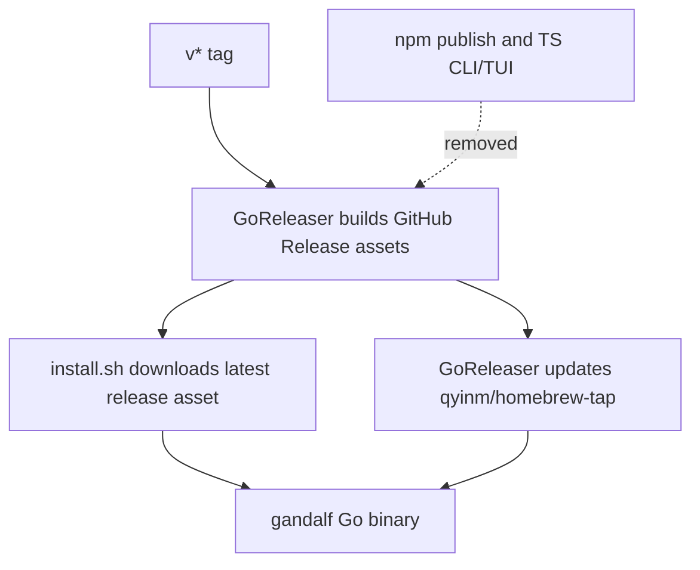

# refactor: Move distribution to Go install.sh and Homebrew tap

## Summary

Move Gandalf's supported CLI distribution to Go release artifacts installed through `install.sh` and a personal Homebrew tap, and remove the remaining npm/TypeScript CLI and TUI distribution surface. CI should validate the Go binary path as the release path and stop relying on deprecated TypeScript CLI/TUI packages.

---

## Problem Frame

The canonical runtime is now the Go CLI and Bubble Tea TUI, but the repository still exposes npm as the public install path and keeps deprecated TypeScript CLI/TUI packages in the workspace. That creates a split-brain release story: users can install an older Node-based command while the product and architecture say the Go binary is canonical.

---

## Requirements

### Distribution

- R1. Users can install the latest stable Go binary through a one-line `install.sh` command backed by GitHub Release assets.
- R2. macOS users can install Gandalf through the personal Homebrew tap command `brew install qyinm/tap/gandalf`.
- R3. GitHub Release artifacts remain the source of truth for installable binaries.

### npm and TypeScript Removal

- R4. Public docs, landing content, demos, scripts, and package metadata stop presenting npm as an install path.
- R5. The repository no longer builds, tests, packages, or publishes `apps/cli`, `apps/tui`, or TypeScript core packages as supported CLI/TUI paths.
- R6. npm package deletion is treated as a user-owned external registry action, not an in-repo compatibility path.

### CI and Verification

- R7. CI treats Go build/test and release-install smoke checks as required, not continue-on-error.
- R8. Existing product smoke coverage continues to exercise the Go binary.
- R9. CI no longer runs npm package smoke tests for removed CLI/TUI packages.

---

## Key Technical Decisions

- KTD1. **Supported channels are install.sh and a personal Homebrew tap:** This matches the static-binary product promise and avoids a Node runtime dependency or npm postinstall downloader.
- KTD2. **install.sh installs latest stable by default:** The first shell installer should be minimal and reliable; version pinning can be added later if users need reproducible historical installs.
- KTD3. **Release assets remain canonical:** GoReleaser already builds darwin/linux amd64/arm64 archives, so installers should consume those assets instead of introducing a second binary build path.
- KTD4. **Remove TypeScript CLI/TUI from the workspace graph:** Keeping deprecated packages in CI preserves the old distribution surface and makes failures harder to interpret.
- KTD5. **Desktop Rust stays out of this cutover:** The request removes TypeScript CLI/TUI, not the Tauri desktop transition path that still depends on Rust crates.

---

## High-Level Technical Design

---

## Implementation Units

### U1. Add latest-release shell installer

- **Goal:** Provide the supported one-line install path for latest stable Go binaries.
- **Requirements:** R1, R3
- **Dependencies:** None
- **Files:** `install.sh`, `README.md`, `apps/landing/src/components/InstallTabs.tsx`, `apps/landing/src/components/Install.astro`
- **Approach:** Add a POSIX-compatible installer that detects OS and architecture, resolves the latest GitHub Release, downloads the matching archive, verifies that the archive contains `gandalf`, and installs it into a user-writable binary directory. Keep failure messages actionable and never fall back to npm.
- **Patterns to follow:** Existing GoReleaser archive naming in `.goreleaser.yaml`; existing landing install tab component shape in `apps/landing/src/components/InstallTabs.tsx`.
- **Test scenarios:**
  - Given a macOS arm64 machine, the installer maps the platform to the darwin arm64 release archive name.
  - Given a Linux x64 machine, the installer maps the platform to the linux amd64 release archive name.
  - Given an unsupported OS or architecture, the installer exits non-zero with a manual download hint.
  - Given the archive download fails, the installer exits non-zero without writing a partial `gandalf` binary.

### U2. Add personal Homebrew tap distribution support

- **Goal:** Make the personal tap the managed macOS install path.
- **Requirements:** R2, R3
- **Dependencies:** U1
- **Files:** `.goreleaser.yaml`, `README.md`, `apps/landing/src/components/InstallTabs.tsx`, `apps/landing/src/components/Install.astro`
- **Approach:** Configure GoReleaser to update `qyinm/homebrew-tap` with a `gandalf` formula that installs release artifacts. Document the public command as `brew install qyinm/tap/gandalf`.
- **Patterns to follow:** Existing `.goreleaser.yaml` release asset configuration; current landing copy that already describes Gandalf as a single static binary.
- **Test scenarios:**
  - Release configuration validates with GoReleaser's config checker when available.
  - Documentation shows `brew install qyinm/tap/gandalf` as the Homebrew path.
  - The Homebrew path points at GitHub Release artifacts rather than a source build.

### U3. Remove npm publish and TypeScript CLI/TUI workspace surface

- **Goal:** Remove the old Node-based CLI/TUI from the repo's supported build and release graph.
- **Requirements:** R4, R5, R6, R9
- **Dependencies:** U1
- **Files:** `package.json`, `bun.lock`, `apps/cli`, `apps/tui`, `packages/core`, `.github/workflows/publish.yml`, `scripts/package-smoke.mjs`, `scripts/cross-machine-dogfood.mjs`, `scripts/gate2-video-fixture.mjs`, `README.md`, `ARCHITECTURE.md`, `PRODUCT.md`
- **Approach:** Delete deprecated TypeScript CLI/TUI/core packages and remove scripts, workflows, and docs that reference npm publishing or package smoke tests. Preserve unrelated landing and desktop workspace code only where still needed.
- **Patterns to follow:** Architecture language that marks TypeScript stacks deprecated; existing Go canonical sections in `README.md`.
- **Test scenarios:**
  - Repository search for `@qxinm/gandalf`, `apps/cli`, and `apps/tui` has no active install or CI references after removal, except historical docs if deliberately preserved.
  - `bun install` is not required for CLI release validation.
  - Removed package paths are not referenced by workspace metadata.

### U4. Make CI Go-first and release-aware

- **Goal:** Ensure automated checks match the new supported distribution path.
- **Requirements:** R7, R8, R9
- **Dependencies:** U1, U3
- **Files:** `.github/workflows/ci.yml`, `.github/workflows/release.yml`, `.goreleaser.yaml`, `Makefile`, `scripts/gate2-demo.mjs`
- **Approach:** Make Go tests, Go build, and Gate 2 demo required. Add an install-script smoke path that exercises platform mapping and download/install behavior without publishing npm artifacts. Remove the TypeScript CLI package smoke from CI.
- **Patterns to follow:** Existing `make build`, `make test`, and `make gate2` targets; current Go binary dogfood path in `scripts/gate2-demo.mjs`.
- **Test scenarios:**
  - CI fails if `go test ./...` fails.
  - CI fails if `go build -o bin/gandalf ./cmd/gandalf` fails.
  - CI fails if the Go binary Gate 2 demo fails.
  - CI no longer invokes the removed npm package smoke script.

### U5. Clean documentation and release messaging

- **Goal:** Make every user-facing install surface tell the same install.sh/Homebrew tap story.
- **Requirements:** R1, R2, R4, R6
- **Dependencies:** U1, U2, U3
- **Files:** `README.md`, `PRODUCT.md`, `ARCHITECTURE.md`, `apps/landing/src/components/Hero.astro`, `apps/landing/src/components/InstallTabs.tsx`, `apps/landing/src/components/Footer.astro`, `docs/dogfood.md`, `docs/internal/dogfood.md`
- **Approach:** Replace npm-first copy with install.sh and the personal Homebrew tap. Keep source-build instructions for contributors, not as the primary user install path. Update product docs to say npm is no longer a supported distribution channel and registry deletion is handled outside the repo.
- **Patterns to follow:** Existing "single static binary" landing language; existing Trust Contract language that avoids automatic package-manager installs inside Gandalf itself.
- **Test scenarios:**
  - Public README first install command is install.sh or Homebrew, not npm.
  - Landing install tabs show install.sh and Homebrew.
  - Product and architecture docs agree that Go is canonical and npm is not supported.
  - Demo fixture install text matches the documented install path.

---

## Scope Boundaries

### Deferred to Follow-Up Work

- Version-pinned `install.sh` installs are deferred until users need historical binary installs.
- Windows release artifacts and installers are deferred; the current release matrix is darwin/linux.
- Package manager signing, notarization, and tap credential automation can follow after the install paths are green.

### Outside This Work

- Deleting the external npm registry package is user-owned and not implemented in this repository.
- Reworking the Tauri desktop's Rust bridge is not part of TypeScript CLI/TUI removal.

---

## System-Wide Impact

This changes the release graph, CI expectations, public install commands, landing page install UI, and repository workspace shape. It should reduce distribution ambiguity but will break any contributor workflow that still depends on the removed TypeScript CLI/TUI packages.

---

## Risks & Dependencies

- **Homebrew tap ownership:** This pass assumes `qyinm/homebrew-tap` will exist and `GORELEASER_GITHUB_TOKEN` will have write access to it.
- **Release asset naming drift:** Installer logic depends on GoReleaser archive names; CI should catch mapping drift.
- **Historical docs noise:** Old plans and private docs may mention npm. Active public docs and scripts should be cleaned; historical plans do not need rewriting unless they confuse current docs.
- **Bun workspace collateral:** Landing and desktop may still use Bun. The removal target is TypeScript CLI/TUI distribution, not every JavaScript frontend tool.

---

## Acceptance Examples

- AE1. Given a new user opens the README, when they follow the first install path, then they install the Go `gandalf` binary without npm.
- AE2. Given a macOS user wants a managed package, when they run `brew install qyinm/tap/gandalf`, then Homebrew installs Gandalf from the personal tap formula.
- AE3. Given CI runs on a pull request, when TypeScript CLI/TUI packages have been removed, then CI validates Go build/test and Gate 2 without package-smoke npm publishing checks.
- AE4. Given a release tag is pushed, when GoReleaser runs, then the produced artifacts are consumed by install.sh and the Homebrew tap formula.

---

## Sources & Research

- `ARCHITECTURE.md` names `internal/gandalfcore` and `cmd/gandalf` as canonical and marks TypeScript CLI/TUI stacks deprecated.
- `.goreleaser.yaml` already builds `gandalf` archives for darwin/linux amd64/arm64.
- `.github/workflows/release.yml` already runs GoReleaser on `v*` tags.
- `.github/workflows/publish.yml` still publishes npm packages and should be removed with the npm channel.
- `README.md`, `apps/landing/src/components/InstallTabs.tsx`, and `scripts/gate2-video-fixture.mjs` still present npm install commands and need cleanup.
