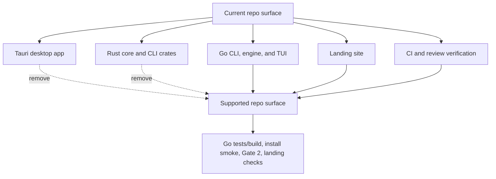

# refactor: Remove desktop and Rust stack

## Summary

Remove Gandalf's active desktop app and all Rust workspace code from the current repository. The supported implementation path becomes Go CLI, Go engine, Bubble Tea TUI, installer/release tooling, and the landing site.

---

## Problem Frame

The origin requirements demote desktop from the current MVP path and remove the active Tauri desktop surface. During planning, scope expanded from "remove desktop-driven Rust" to "remove Rust entirely" because a future desktop surface may not use Tauri or Rust. Keeping deprecated Rust crates, Cargo workspace metadata, and cargo-based verification would preserve a false transition path and continue charging maintenance cost against the CLI/TUI focus.

---

## Requirements

**Repository surface**

- R1. The active desktop app and Tauri runtime are removed from the repository.
- R2. Rust engine and CLI crates are removed rather than retained as reference or transition implementations.
- R3. Root workspace metadata no longer exposes Cargo workspace members or Rust toolchain configuration.
- R4. Root package scripts no longer build, typecheck, test, develop, or package desktop or Rust surfaces.

**Validation and CI**

- R5. CI no longer installs Rust or Tauri dependencies and no longer runs cargo checks.
- R6. Local review verification no longer depends on `target/debug/gandalf`, `gandalf-core`, `gandalf-cli`, or `gandalf-desktop`.
- R7. Supported verification remains anchored on Go tests/build, install smoke, Gate 2 acceptance, and landing-site checks.

**Documentation**

- R8. Current architecture docs describe Go CLI, Go engine, and Bubble Tea TUI as the active runtime without Rust or desktop transition paths.
- R9. Current contributor docs omit desktop and Rust development workflows.
- R10. Product docs demote desktop to future/deferred territory without implying Tauri or Rust as the future implementation path.
- R11. Historical brainstorms, plans, solution notes, and dogfood reports may keep old Rust/Tauri references when clearly historical.

---

## Key Technical Decisions

- **Full Rust removal, not Rust preservation:** Remove `crates/gandalf-core`, `crates/gandalf-cli`, root Cargo files, and Rust toolchain config because keeping them implies a supported implementation path that no longer exists.
- **Desktop deletion, not archive-in-place:** Delete the Tauri app tree instead of leaving a dormant scaffold because workspace discovery, lockfiles, and scripts would continue to treat it as active.
- **Go-first verification replacement:** Rewrite validation surfaces around the Go binary and existing acceptance scripts, preserving restore/store trust checks without cargo.
- **Historical docs stay historical:** Do not rewrite old plans or solution notes solely to erase references; only current docs and active workflows should stop steering contributors toward Rust or desktop.

---

## High-Level Technical Design

The implementation removes unsupported surfaces first, then updates automation and docs so no active workflow points back at removed code.

---

## Implementation Units

### U1. Delete desktop and Rust source surfaces

- **Goal:** Remove the active Tauri desktop app and all Rust code from the repository.
- **Requirements:** R1, R2, R3
- **Dependencies:** None
- **Files:** `apps/desktop`, `crates`, `Cargo.toml`, `Cargo.lock`, `rust-toolchain.toml`
- **Approach:** Delete the desktop app tree, Rust crate tree, root Cargo workspace files, lockfile, and Rust toolchain pin. Treat this as source-surface removal rather than migration; future desktop work should start from a new plan.
- **Patterns to follow:** `docs/brainstorms/2026-06-26-remove-desktop-app-requirements.md` scope boundaries; current `ARCHITECTURE.md` statement that Go CLI and TUI are canonical.
- **Test scenarios:** Test expectation: none -- this unit removes unsupported source/configuration rather than adding runtime behavior.
- **Verification:** Repository search no longer finds active `apps/desktop`, Tauri, Cargo workspace, or Rust crate paths outside historical docs and the new plan artifacts.

### U2. Simplify package and lockfile metadata

- **Goal:** Keep the Node/Bun workspace focused on the landing site and non-desktop scripts.
- **Requirements:** R4, R7
- **Dependencies:** U1
- **Files:** `package.json`, `bun.lock`, `apps/landing/package.json`, `apps/landing/tsconfig.json`
- **Approach:** Narrow root workspace scripts to landing-site build/typecheck plus Go/install/dogfood scripts that remain current. Refresh the Bun lockfile so removed desktop workspace packages and Tauri dependencies disappear.
- **Patterns to follow:** Existing `apps/landing` scripts for Astro build and typecheck; existing root `go:test`, `go:build`, `install:smoke`, and dogfood scripts.
- **Test scenarios:**
  - Covers AE1. Given root package scripts run, when build/typecheck/check execute, then they do not enter the removed desktop workspace.
  - Given the lockfile is searched, when workspace package entries are inspected, then no removed desktop package or Tauri dependency remains.
- **Verification:** Root package metadata contains no desktop or Rust scripts, and Bun workspace resolution succeeds with only active frontend workspace dependencies.

### U3. Remove Rust and desktop from CI and review verification

- **Goal:** Make automated validation match the supported Go/TUI and landing-site product path.
- **Requirements:** R5, R6, R7
- **Dependencies:** U1, U2
- **Files:** `.github/workflows/ci.yml`, `scripts/verify-review-patches.sh`, `scripts/gate2-acceptance.mjs`, `scripts/install-smoke.sh`
- **Approach:** Delete the Rust CI job and Tauri Linux dependency installation. Rewrite review verification to build/use the Go binary and keep restore, bundle, and Gate 2 evidence without cargo artifacts or desktop home-state checks.
- **Patterns to follow:** Existing Go CI job in `.github/workflows/ci.yml`; existing Go binary path in `Makefile`; trust-contract regression guidance in `docs/solutions/logic-errors/go-restore-store-trust-contract-gaps.md`.
- **Test scenarios:**
  - Covers AE2. Given CI runs on a pull request, when desktop and Rust code are absent, then CI still validates the supported Go and landing paths.
  - Given review verification runs, when it captures restore and bundle evidence, then it uses the Go binary rather than cargo-built binaries.
  - Given review verification checks artifacts, when desktop evidence is absent, then the script does not fail for missing desktop-specific files.
- **Verification:** Active CI and review scripts contain no cargo, Rust toolchain, Tauri dependency, `target/debug/gandalf`, or `gandalf-desktop` dependency.

### U4. Update current architecture and contributor docs

- **Goal:** Make current docs describe the repository as Go CLI/TUI plus landing site, with no active Rust or desktop workflow.
- **Requirements:** R8, R9, R11
- **Dependencies:** U1, U2, U3
- **Files:** `README.md`, `ARCHITECTURE.md`, `CONCEPTS.md`, `docs/brainstorms/2026-06-26-remove-desktop-app-requirements.md`
- **Approach:** Remove desktop and Rust from the current tech stack, development instructions, repository layout, architecture diagrams, and active runtime prose. Update the origin requirements doc to record that the final scoped plan removes Rust entirely.
- **Patterns to follow:** Current README Go development section; architecture wording that already treats `cmd/gandalf`, `internal/gandalfcore`, and `internal/tui` as canonical.
- **Test scenarios:**
  - Covers AE3. Given a new contributor reads current docs, when they look for supported runtime and repo layout, then they see Go CLI, Go engine, Bubble Tea TUI, and landing site.
  - Given docs are searched for Rust and desktop terms, when matches appear in current docs, then they are future/deferred, historical, or trust-contract language rather than active workflow instructions.
- **Verification:** Current docs no longer direct contributors to cargo, Rust crates, desktop commands, or Tauri workspace paths.

### U5. Demote product desktop language without picking a future implementation

- **Goal:** Preserve future desktop thinking while removing current MVP ownership and Tauri/Rust implications.
- **Requirements:** R10, R11
- **Dependencies:** U4
- **Files:** `PRODUCT.md`, `DESIGN.md`, `docs/design/desktop-mvp.md`
- **Approach:** Reframe current product language so CLI/TUI are the near-term focus and desktop is deferred. Keep detailed desktop design material only as future/reference material, and remove claims that current MVP team flows belong in the desktop app.
- **Patterns to follow:** Origin requirement that product docs demote rather than erase desktop; user's clarification that future desktop may not use Tauri.
- **Test scenarios:**
  - Covers AE4. Given a future planner reads product docs, when desktop is mentioned, then it is framed as deferred or historical rather than current MVP ownership.
  - Given future desktop implementation is discussed, when the docs describe it, then they do not imply Tauri or Rust as predetermined.
- **Verification:** Product docs no longer make desktop the active MVP owner for local apply, proposal review, or sequencing decisions.

### U6. Final active-reference sweep

- **Goal:** Catch leftover active references that would break implementation after deletion.
- **Requirements:** R1, R3, R4, R5, R6, R8, R9, R10
- **Dependencies:** U1, U2, U3, U4, U5
- **Files:** `README.md`, `ARCHITECTURE.md`, `PRODUCT.md`, `package.json`, `.github/workflows/ci.yml`, `scripts/verify-review-patches.sh`, `bun.lock`
- **Approach:** Run a targeted active-reference audit for desktop, Tauri, Rust, Cargo, and deleted paths. Classify each hit as active, historical, future/deferred, or generated/lockfile noise; remove or rewrite active hits.
- **Patterns to follow:** Existing repository search used in `docs/brainstorms/2026-06-26-remove-desktop-app-requirements.md` success criteria.
- **Test scenarios:**
  - Given active docs and automation are searched, when removed path names appear, then no active workflow depends on them.
  - Given historical docs are searched, when old desktop/Rust references appear, then they remain in historical artifacts only.
- **Verification:** The final search result set has no active build, CI, contributor, or current product dependency on removed desktop or Rust surfaces.

---

## Scope Boundaries

### In Scope

- Deleting `apps/desktop`, `crates`, root Cargo files, and Rust toolchain config.
- Removing desktop, Tauri, Rust, and cargo references from active workspace metadata, CI, scripts, README, architecture docs, product docs, and concepts.
- Updating the origin requirements doc to reflect the expanded Rust-removal scope.
- Preserving Go CLI/TUI, landing site, release/install, Gate 2, and trust-contract verification.

### Deferred to Follow-Up Work

- Designing any future desktop app surface.
- Choosing a future desktop implementation stack.
- Removing the landing site or replacing Bun for landing-site tooling.

### Outside This Work

- Rewriting historical plans, solution notes, dogfood reports, and design references purely to erase old desktop or Rust mentions.
- Changing Go CLI/TUI product behavior except where active verification scripts need to stop depending on removed Rust artifacts.
- Removing trust-contract restore/store coverage.

---

## System-Wide Impact

This cut changes repository shape, CI topology, contributor workflows, validation evidence, and product documentation. It reduces maintenance load and ambiguity, but it will break any local workflow that still uses cargo, the Rust crates, or the Tauri desktop app as a reference implementation.

---

## Risks & Dependencies

- **Verification regression:** The old review script currently exercises restore/bundle behavior through cargo-built binaries. The replacement must preserve Go restore/store trust evidence.
- **Lockfile drift:** Removing the desktop workspace should remove Tauri packages from `bun.lock` without disturbing landing dependencies.
- **Historical-doc noise:** Searches will continue to find Rust and desktop references in old plans and solution notes. The implementer must distinguish historical references from active workflow dependencies.
- **Product-doc overcorrection:** Erasing all desktop thinking would lose useful future context. The intended change is demotion and de-coupling from Tauri/Rust, not deletion of every desktop idea.

---

## Documentation / Operational Notes

After implementation, contributor-facing setup should be explainable without Rust installed. CI should not install Rust or Tauri dependencies. Any remaining desktop/Rust references in historical docs should be left alone unless they create current-workflow confusion.

---

## Sources & Research

- `docs/brainstorms/2026-06-26-remove-desktop-app-requirements.md` defines desktop removal, CLI/TUI focus, and active-doc cleanup.
- `README.md` currently lists desktop and legacy Rust development workflows.
- `ARCHITECTURE.md` currently retains Rust crates and the Tauri desktop transition path.
- `Cargo.toml`, `Cargo.lock`, and `rust-toolchain.toml` currently keep Rust workspace metadata active.
- `package.json` and `bun.lock` currently include desktop/Tauri workspace metadata.
- `.github/workflows/ci.yml` currently installs Rust/Tauri dependencies and runs cargo checks.
- `scripts/verify-review-patches.sh` currently depends on cargo-built binaries and desktop evidence.
- `docs/solutions/logic-errors/go-restore-store-trust-contract-gaps.md` records restore/store trust-contract checks that must remain covered through Go verification.
