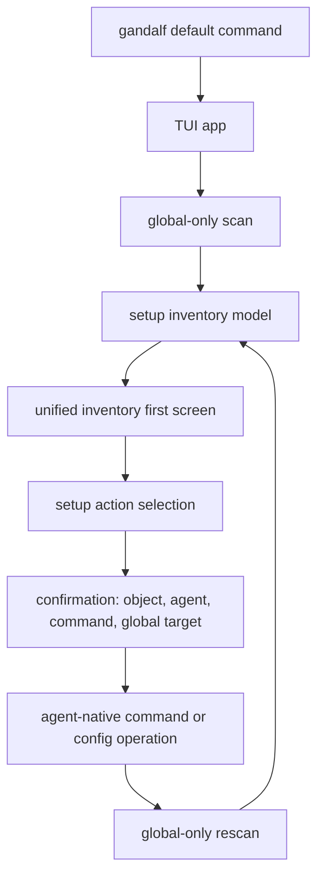

# Global Agent Setup Manager - Plan

## Goal Capsule

- **Objective:** Reframe Gandalf as a TUI-first global agent setup manager for skills, hooks, MCP servers, and plugins.
- **Product authority:** The user explicitly chose global-only scope, unified inventory as the first screen, direct apply after short confirmation, agent-native installer execution, and post-action rescan.
- **Open blockers:** None for requirements planning.
- **Execution profile:** Code implementation with repo-local tests and docs alignment.
- **Stop conditions:** Do not add project-local setup management, a Gandalf-owned marketplace/catalog, or Gandalf-specific risk scoring to satisfy this plan.
- **Tail ownership:** Implementation is complete only when the default TUI path, scan defaults, setup actions, and docs all describe the same global-only product.

---

## Product Contract

### Summary

Gandalf will manage user-global agent setup objects from a unified TUI inventory.
Users should see skills, hooks, MCP servers, and plugins across supported agents in one place, choose an item, and add, remove, or edit it through the agent's native setup mechanisms.
Snapshot and restore behavior remains a safety layer behind the management workflow, not the primary mental model.

### Problem Frame

The current product posture mixes a Git-like setup history story with broader project-local scanning.
That creates product confusion and pushes the TUI toward history-first workflows instead of setup management.
The intended product is closer to an agent setup workspace: a place where a user can inspect and change the extensions that make each agent useful.

### Key Decisions

- **Global-only product boundary:** Gandalf tracks user-global agent setup, not project-local setup files.
- **TUI-first interaction model:** The default user experience starts from the terminal workspace rather than subcommand-first history commands.
- **Unified inventory first screen:** The TUI opens on one cross-agent list of setup objects, with agent icons or labels on each row.
- **Agent-native installation:** Gandalf does not own a marketplace or catalog; it executes the setup path each agent already supports.
- **Direct apply with short confirmation:** Add, remove, and edit actions apply after a confirmation screen instead of forcing every change through a dry-run review.
- **Post-action rescan:** After a setup action runs, Gandalf refreshes the global inventory so the screen reflects the actual current state.
- **No Gandalf risk scoring:** Gandalf shows the actual command and changed global config target before running an agent-native installer, but it does not maintain a separate risk model.

### Actors

- A1. **Agent power user:** Manages local AI agent extensions and wants quick setup changes without editing config files directly.
- A2. **Supported agent:** Provides global setup surfaces and, where available, native install or configuration flows for skills, hooks, MCP servers, or plugins.
- A3. **Gandalf TUI:** Presents the inventory, confirms actions, invokes the agent-native setup path, and refreshes state.

### Requirements

**Product scope**

- R1. Gandalf must treat user-global setup as the current product scope.
- R2. Gandalf must exclude project-local setup surfaces from the current product scope.
- R3. Gandalf must support multiple agents within the user-global scope rather than narrowing the product to Codex only.

**Inventory experience**

- R4. The TUI must open on a unified inventory of global skills, hooks, MCP servers, and plugins.
- R5. Each inventory item must show the agent it belongs to through a compact icon, label, or equivalent visual marker.
- R6. The inventory must make unsupported or unavailable actions clear for agents that do not support a given setup object type.
- R7. Users must be able to choose an inventory item and start add, remove, or edit actions from the TUI.

**Action model**

- R8. Add flows must prioritize local discovery and import before agent-native install flows and manual creation.
- R9. Agent-native install flows must use the agent's existing plugin, skill, or setup mechanism rather than a Gandalf-owned catalog.
- R10. Manual creation remains a fallback for setup objects that cannot be installed or imported through an agent-native path.
- R11. Before applying an action, Gandalf must show the target setup object, the agent, the command or operation to be run, and the global config target expected to change.
- R12. Gandalf must not require a dry-run preview for every add, remove, or edit action.
- R13. After an action completes, Gandalf must rescan user-global setup and update the inventory from the observed state.

**Safety posture**

- R14. Snapshot and restore remain available as a rollback safety layer behind setup management.
- R15. Gandalf must not present itself as a separate marketplace, catalog authority, or risk scoring system.
- R16. Gandalf must avoid executing project-local setup changes as part of this product direction.

### Key Flows

- F1. **Inspect global setup**
  - **Trigger:** The user opens `gandalf`.
  - **Actors:** A1, A3
  - **Steps:** Gandalf scans user-global setup, groups discovered objects by object type and agent marker, then renders the unified inventory.
  - **Outcome:** The user can see installed skills, hooks, MCP servers, and plugins without choosing an agent first.
  - **Covers:** R1, R3, R4, R5

- F2. **Apply an item action**
  - **Trigger:** The user selects a setup object and chooses add, remove, or edit.
  - **Actors:** A1, A2, A3
  - **Steps:** Gandalf shows a short confirmation with the target, agent, command or operation, and expected global config target; after confirmation it runs the action and rescans user-global setup.
  - **Outcome:** The inventory reflects the post-action state.
  - **Covers:** R7, R9, R11, R12, R13

- F3. **Add a new setup object**
  - **Trigger:** The user starts an add flow.
  - **Actors:** A1, A2, A3
  - **Steps:** Gandalf first offers locally discoverable/importable items, then agent-native install paths, then manual creation when neither applies.
  - **Outcome:** The user can add useful setup without Gandalf owning a catalog.
  - **Covers:** R8, R9, R10, R15

### Acceptance Examples

- AE1. **Covers R2, R16.** Given the user opens the default TUI, when the inventory loads, then repo-local `.mcp.json`, `.env`, `AGENTS.md`, and similar project-local files are not presented as managed setup objects.
- AE2. **Covers R4, R5.** Given global setup exists for more than one agent, when the inventory renders, then items from different agents appear in one list with visible agent markers.
- AE3. **Covers R9, R11.** Given the user chooses to install an agent plugin, when the confirmation screen appears, then it shows the agent-native command or operation rather than a Gandalf catalog entry.
- AE4. **Covers R12, R13.** Given the user confirms a remove action, when the action finishes, then Gandalf rescans and the removed item no longer appears if the global setup no longer contains it.
- AE5. **Covers R6.** Given an agent does not support hooks, when a hook-related action would otherwise appear, then the UI marks it unavailable or omits the action rather than implying support.

### Success Criteria

- A new reader understands Gandalf as a global setup manager before thinking of it as a Git-style history tool.
- The default TUI can be evaluated from the inventory workflow without reading CLI command documentation first.
- Planning can remove or demote project-local behavior without inventing new product scope.
- Future install work can integrate agent-native ecosystems without creating a Gandalf-owned marketplace.

### Scope Boundaries

**Outside current product scope**

- Project-local setup management, including repo `.mcp.json`, `.env`, and agent instruction files.
- A Gandalf-owned catalog, registry, or marketplace for setup templates.
- Gandalf-specific risk scoring for agent-native installer behavior.
- Cloud sync, team sharing, and remote management workflows.

**Still part of the product, but secondary**

- Snapshot, diff, restore, and bundle flows as safety and portability features.
- CLI subcommands for scripting and advanced use.
- Change summaries after actions, beyond the required post-action rescan.

### Dependencies / Assumptions

- Supported agents expose discoverable user-global setup surfaces for skills, hooks, MCP servers, or plugins.
- Agent-native install and removal paths exist for at least some supported setup object types.
- The TUI can represent agent identity compactly enough that an agent picker is not required as the first screen.

### Sources / Research

- `README.md` currently names Codex user-global setup as the launch path while also listing project-local surfaces.
- `ARCHITECTURE.md` currently includes project-local agent files in the scan model.
- `CONCEPTS.md` currently defines snapshots and trust boundaries around both project and user-global evidence.
- `internal/gandalfcore/scan/plugins/project.go` currently contains a project scanner for `.env` key inventory.

---

## Planning Contract

### Product Contract Preservation

The Product Contract above is the source of truth for behavior.
Implementation may refine names, files, and internal boundaries, but must not reintroduce project-local setup management, a Gandalf-owned catalog, or a risk-scoring layer.

### Key Technical Decisions

- KTD1. **Make global-only the active scan contract.** Default product scans must ignore repo-local setup surfaces such as `.mcp.json`, `.env`, `AGENTS.md`, `.claude/settings.json`, and project skill directories. Legacy type names can remain temporarily if removing them creates unnecessary churn, but the default user path must not surface project-local items.
- KTD2. **Introduce a setup inventory model instead of driving the first screen from history.** The TUI should render a normalized inventory of setup objects: skill, hook, MCP server, and plugin/extension, with agent identity attached to each row.
- KTD3. **Keep setup actions separate from restore apply.** Existing restore code mutates files from snapshots and has path-confinement semantics. Add/import/remove/edit setup actions need their own action planning and execution layer with injectable command execution for tests.
- KTD4. **Use agent-native mechanisms as action providers.** Gandalf can present and run the command or operation for a supported agent, but does not maintain its own catalog of available plugins or skills.
- KTD5. **Confirmation is factual, not advisory.** The confirmation screen must show the setup object, agent, operation/command, and expected global config target. It must not invent a Gandalf risk score.
- KTD6. **Rescan after every successful action.** The post-action inventory is authoritative only after a fresh user-global scan. Do not update the screen by optimistic local mutation alone.
- KTD7. **History and snapshots remain secondary.** Timeline, diff, restore, and bundle flows stay available, but the first-run mental model moves to inventory management.

### High-Level Technical Design



### Implementation Constraints

- Keep root `gandalf` as the TUI entrypoint.
- Prefer repo-local models and scanners over adding external services.
- Keep action execution injectable so tests do not run real agent installers.
- Keep UI rows compact enough for a terminal list: agent marker, object type, object name, source, and available actions.
- Do not make project-local evidence visible through the default inventory even if low-level scan helpers still know how to parse it.

### Sequencing

1. Lock the scan/product boundary first so later UI work cannot accidentally depend on project-local rows.
2. Add the setup inventory model before changing the TUI first screen.
3. Add action planning/execution before wiring confirmation and rescan.
4. Update docs after behavior is in place so the docs reflect the implemented workflow.

### Deferred Questions

- Which exact agent-native install/remove commands should be supported first for every agent is deferred to implementation of each action provider. Unsupported actions must be represented as unavailable rather than guessed.
- Whether to physically delete all project-scope enum values and legacy scan helpers is deferred. The required behavior is that the active product path is global-only.

---

## Implementation Units

### U1. Enforce Global-Only Default Scanning

- **Goal:** Make the active scan path used by the TUI and product docs user-global only.
- **Requirements:** R1, R2, R3, R16; AE1
- **Files:** `internal/gandalfcore/scan/scan.go`, `internal/gandalfcore/scan/plugins/init.go`, `internal/gandalfcore/scan/plugins/*.go`, `internal/gandalfcore/scan/scan_test.go`
- **Approach:** Remove project scanners from the default plugin set or gate them out of the default scan path. Ensure agent scanners do not add project target specs for the default user-global scan. Keep user-global config, skill, hook, MCP, and extension discovery intact.
- **Test Scenarios:** Project `.mcp.json`, `.env`, `AGENTS.md`, `.claude/settings.json`, and project skill directories are absent from default results. User-global Codex, Claude, Cursor, OpenCode, and Pi evidence still appears where fixtures exist.
- **Verification:** `go test ./internal/gandalfcore/scan/...`

### U2. Add Setup Inventory Domain Model

- **Goal:** Normalize scanned evidence into the objects the product manages: skills, hooks, MCP servers, and plugins/extensions.
- **Requirements:** R3, R4, R5, R6; AE2, AE5
- **Files:** `internal/gandalfcore/setup/inventory.go`, `internal/gandalfcore/setup/inventory_test.go`, `internal/gandalfcore/types/types.go`
- **Approach:** Create an inventory item model with stable ID, agent, object kind, display name, source, scope, and action availability. Map existing discovered item kinds into this model. Exclude project-scope and `AgentProject` items from inventory construction.
- **Test Scenarios:** Mixed-agent global evidence becomes one inventory list with agent markers. Unsupported actions are explicit. Project-scope input rows are ignored even if passed to the inventory builder.
- **Verification:** `go test ./internal/gandalfcore/setup/...`

### U3. Add Setup Action Planning and Execution

- **Goal:** Build a factual action layer for add, remove, and edit flows without reusing snapshot restore mutation code.
- **Requirements:** R7, R8, R9, R10, R11, R12, R15; AE3
- **Files:** `internal/gandalfcore/setup/actions.go`, `internal/gandalfcore/setup/actions_test.go`, optional agent-specific files under `internal/gandalfcore/setup/`
- **Approach:** Define action plans that include operation, agent, object kind, target name, command or config operation, expected global target, and support status. Add an executor interface so tests use a fake runner. Start with action providers that can truthfully expose supported operations; mark unsupported combinations unavailable.
- **Test Scenarios:** Confirmation data contains command/operation and global target. Fake command runner is invoked for supported actions. Unsupported actions return a typed unavailable result. No project-local target can be planned.
- **Verification:** `go test ./internal/gandalfcore/setup/...`

### U4. Make Unified Inventory the TUI First Screen

- **Goal:** Open `gandalf` on the global setup inventory instead of the history/timeline screen.
- **Requirements:** R4, R5, R6, R7; AE2, AE5
- **Files:** `internal/tui/model.go`, `internal/tui/app.go`, `internal/tui/view_adapters.go`, `internal/tui/views/inventory.go`, `internal/tui/tui_test.go`
- **Approach:** Add a setup inventory screen and make it the initial screen. Render rows with compact agent marker, object kind, name, source, and available action affordances. Keep History, Profiles, Agents, snapshots, and compare screens reachable but secondary.
- **Test Scenarios:** `NewApp` starts on inventory. Inventory rows include visible agent markers. Project-local rows are absent. Navigation can still reach history and existing safety flows.
- **Verification:** `go test ./internal/tui/...`

### U5. Wire TUI Confirmation, Execution, and Rescan

- **Goal:** Let the user select an inventory item, confirm a supported action, execute it, then refresh from observed global state.
- **Requirements:** R7, R11, R12, R13, R14; AE3, AE4
- **Files:** `internal/tui/model.go`, `internal/tui/app.go`, `internal/tui/views/inventory.go`, `internal/tui/tui_test.go`
- **Approach:** Add selection and confirmation states. Show target object, agent, command/operation, and global target. After success, run the existing scan path again and rebuild inventory. On failure, keep the user in context with the captured error and do not claim the inventory changed.
- **Test Scenarios:** Selecting a supported action opens confirmation. Confirming with a fake executor triggers one execution and one rescan. Failed execution shows an error and avoids success notices. Snapshot/restore entry points remain reachable as rollback safety.
- **Verification:** `go test ./internal/tui/...`

### U6. Align Documentation and Concepts

- **Goal:** Make repo docs describe Gandalf as a global setup manager with TUI-first inventory, not a project-local scanner or history-first tool.
- **Requirements:** R1, R2, R4, R8, R9, R14, R15, R16
- **Files:** `README.md`, `ARCHITECTURE.md`, `CONCEPTS.md`, `docs/design/ui/tui/v0/README.md`
- **Approach:** Update product framing, architecture diagrams or prose, concept definitions, and TUI design docs. Demote project-local references to historical/legacy notes only if they remain in code. Remove claims that the active product manages repo-local setup files.
- **Test Scenarios:** `rg` for project-local claims no longer finds active-product language. Docs consistently state that default `gandalf` opens the global inventory TUI.
- **Verification:** `rg -n "project-local|repo-local|\\.mcp\\.json|AGENTS\\.md|\\.env" README.md ARCHITECTURE.md CONCEPTS.md docs/design/ui/tui/v0/README.md`

---

## Verification Contract

Run these checks before marking implementation complete:

```bash
go test ./...
go build -o bin/gandalf ./cmd/gandalf
```

Manual verification:

- Launch `bin/gandalf` and confirm the first screen is the unified setup inventory.
- Confirm inventory rows show agent identity and object type.
- Confirm repo-local setup files in the current project do not appear as managed inventory objects.
- Use a fake or clearly harmless supported action path to verify confirmation shows command/operation and global target, then rescans after success.

Documentation verification:

```bash
rg -n "project-local|repo-local|\\.mcp\\.json|AGENTS\\.md|\\.env" README.md ARCHITECTURE.md CONCEPTS.md docs/design/ui/tui/v0/README.md
```

Remaining matches must either be historical/deferred notes or explicit non-goals.

---

## Definition of Done

- The default `gandalf` command opens a TUI-first unified inventory of user-global setup objects.
- The active scan path and inventory exclude project-local setup surfaces.
- Skills, hooks, MCP servers, and plugins/extensions are represented in one inventory model with agent identity per item.
- Supported actions show a short factual confirmation before execution.
- Action execution uses agent-native mechanisms or marks the action unavailable; no Gandalf-owned catalog or risk score is introduced.
- Successful actions trigger a fresh global scan and inventory refresh.
- History, snapshot, diff, restore, and bundle workflows remain available as secondary safety workflows.
- Product docs and concepts align with the global-only setup manager direction.
- `go test ./...` and `go build -o bin/gandalf ./cmd/gandalf` pass.
- Abandoned experimental code, stale project-local UI copy, and unused scaffolding introduced during implementation are removed.
