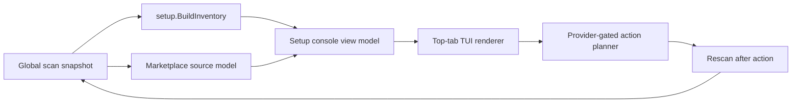
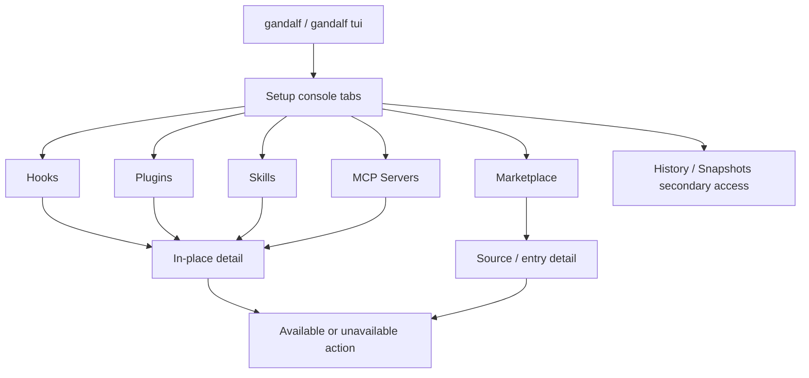

# Setup Console TUI - Plan

## Goal Capsule

- **Objective:** Reframe the default Gandalf TUI as a top-tab setup console for global agent setup management.
- **Product authority:** The user selected a hybrid of the grok build-agent dashboard and Gandalf's cross-agent inventory: top tabs, no left nav, object-type views, unified cross-agent rows, and an agent-source marketplace browser.
- **Open blockers:** None for requirements planning.

---

## Product Contract

### Summary

Gandalf's default TUI will become a top-tab setup console for global agent skills, hooks, MCP servers, plugins, and marketplace sources.
Each tab scopes the list by object type, while the rows keep compact agent identity so users can compare setup across supported agents without choosing an agent first.

### Problem Frame

The current TUI presents the global setup inventory as a flat cross-agent table inside a sidebar workspace.
That proves the data model, but it does not feel like a setup manager.
The grok build-agent dashboard shows the stronger interaction shape: object-type tabs, search, expandable rows, installed status, source grouping, and action hints that match the selected object type.
Gandalf should keep its cross-agent product identity while adopting that console shape.

### Key Decisions

- **Top tabs replace the default left nav.** The primary setup surface should expose `Hooks`, `Plugins`, `Marketplace`, `Skills`, and `MCP Servers` across the top.
- **Tabs are object-type filters, not separate products.** The selected tab narrows what the user is managing, but all tabs remain part of one global setup workspace.
- **Rows stay cross-agent.** Items inside a tab are not split into separate agent screens; each row carries an agent marker such as `CC`, `CX`, `CU`, or `PI`.
- **The selected item expands in place.** Details such as source, status, action support, command preview, and config target appear below the selected row or in a bottom detail pane.
- **Marketplace means agent-source marketplace.** The Marketplace tab browses official, installed, and user-added plugin sources exposed by agent ecosystems; Gandalf does not become a separate catalog authority.

### Actors

- A1. **Agent power user:** Wants to inspect, install, update, remove, or edit setup objects without hand-editing multiple global config locations.
- A2. **Supported agent ecosystem:** Provides skills, hooks, MCP servers, plugins, or marketplace/source metadata.
- A3. **Gandalf setup console:** Normalizes discovered global setup and presents type-specific actions without hiding agent ownership.

### Requirements

**Console structure**

- R1. The default TUI must open on a top-tab setup console instead of a persistent left-navigation workspace.
- R2. The primary tabs must include `Hooks`, `Plugins`, `Marketplace`, `Skills`, and `MCP Servers`.
- R3. The console must provide search and filter controls near the top of the active tab.
- R4. The console must show tab-specific key hints in the footer so actions match the selected object type.

**Cross-agent inventory**

- R5. Each non-marketplace tab must list setup items from all supported agents in one unified list.
- R6. Each row must show compact agent identity, object name, source or target, status, and available actions.
- R7. The list must make unsupported actions visible without implying they can run.
- R8. Selecting or expanding a row must reveal detail in place rather than navigating to a separate agent screen.
- R9. Detail must show source, scope, status, action availability, and any command or config target Gandalf can truthfully report.

**Marketplace tab**

- R10. The Marketplace tab must group plugin marketplace entries by source, such as official sources, installed plugin sources, and user-added sources.
- R11. Marketplace entries must show installed state when Gandalf can observe it.
- R12. Marketplace entries must expose detail such as description, author, category, version, provided capabilities, and source path when available.
- R13. Marketplace actions must support install, update, uninstall, add source, and remove source only when an agent-native path or source-management provider exists.
- R14. The Marketplace tab must not present Gandalf as owning, ranking, certifying, or independently hosting marketplace entries.

**History and secondary workflows**

- R15. Removing the default left nav must not remove access to History, Snapshots, or rollback safety workflows.
- R16. History and Snapshots should be secondary access points rather than first-screen navigation chrome.

### Key Flows

- F1. **Inspect hooks across agents**
  - **Trigger:** The user opens Gandalf and selects `Hooks`.
  - **Actors:** A1, A3
  - **Steps:** Gandalf shows hook rows from all supported agents with agent markers, trigger names, source targets, status, and action support.
  - **Outcome:** The user can compare hook setup across agents without changing screens.
  - **Covers:** R1, R2, R5, R6, R7

- F2. **Inspect one setup item**
  - **Trigger:** The user expands or selects a row.
  - **Actors:** A1, A3
  - **Steps:** Gandalf opens in-place detail showing source, scope, status, action availability, and any command or config target known for that item.
  - **Outcome:** The user understands what the item is and what can be done next.
  - **Covers:** R8, R9

- F3. **Browse marketplace sources**
  - **Trigger:** The user selects `Marketplace`.
  - **Actors:** A1, A2, A3
  - **Steps:** Gandalf groups entries by agent marketplace/source, marks installed items, and expands entries to show metadata and capabilities.
  - **Outcome:** The user can discover and manage agent-native plugins without Gandalf becoming its own marketplace.
  - **Covers:** R10, R11, R12, R14

- F4. **Run a marketplace action**
  - **Trigger:** The user invokes install, update, uninstall, add source, or remove source.
  - **Actors:** A1, A2, A3
  - **Steps:** Gandalf offers the action only when a provider exists, shows the target and expected agent-native operation, then refreshes observed setup after completion.
  - **Outcome:** The marketplace tab reflects the actual post-action state.
  - **Covers:** R13, R14

### Acceptance Examples

- AE1. **Covers R1, R2.** Given the user runs `gandalf`, when the TUI loads, then the first screen shows setup tabs across the top instead of a persistent left nav.
- AE2. **Covers R5, R6.** Given hooks exist for more than one agent, when the user opens `Hooks`, then rows from those agents appear in one list with visible agent markers.
- AE3. **Covers R8, R9.** Given the user expands a setup row, when detail appears, then it remains on the same tab and includes source, status, and action availability.
- AE4. **Covers R10, R11.** Given marketplace sources include installed and uninstalled entries, when the user opens `Marketplace`, then entries are grouped by source and installed entries are marked.
- AE5. **Covers R13.** Given no action provider exists for a marketplace entry, when the entry is selected, then install/update/uninstall actions are unavailable rather than silently failing.
- AE6. **Covers R15, R16.** Given the user needs rollback history, when they use the secondary access path, then History and Snapshots remain reachable outside the primary setup tabs.

### Success Criteria

- The first screen reads as a setup management console rather than a scan report.
- Users can answer "what hooks/plugins/skills/MCP servers do I have across agents?" from one tabbed workspace.
- Marketplace browsing feels like the provided agent ecosystem view, not a Gandalf-owned registry.
- Planning can evolve the TUI without reintroducing a default left navigation model.

### Scope Boundaries

- Do not include a persistent left nav in the default setup console.
- Do not turn Gandalf into a marketplace host, ranking system, or certification authority.
- Do not make project-local setup files part of the default setup console.
- Do not require visual polish beyond a clear terminal information structure that supports the implementation-ready scope.

### Dependencies / Assumptions

- Supported agents expose enough metadata to identify setup object type, agent ownership, source, and status.
- Marketplace quality depends on each agent ecosystem's available marketplace or plugin source metadata.
- Some actions will remain unavailable until setup action providers exist for the relevant agent and object type.

### Sources / Research

- Prior product scope: `docs/plans/2026-06-27-001-feat-global-agent-setup-manager-plan.md`
- Current TUI design note: `docs/design/ui/tui/v0/README.md`
- Current TUI model and renderer: `internal/tui/model.go`, `internal/tui/views/inventory.go`, `internal/tui/app.go`
- Current setup inventory model: `internal/gandalfcore/setup/inventory.go`

---

## Planning Contract

### Summary

Implement the confirmed Product Contract in one executable plan: Gandalf's default TUI becomes a top-tab setup console, the setup rows remain global and cross-agent, Marketplace behaves as an agent ecosystem source browser, and History/Snapshots stay available through secondary routes instead of persistent left navigation.

The Product Contract above is preserved as the authority for behavior. Implementation may change internal naming and exact layout details, but it must not reintroduce a default left nav, project-local scope, or Gandalf-owned marketplace semantics.

### Key Technical Decisions

- **KTD1. Replace the default shell, not the setup engine.** Move the first-screen TUI structure from sidebar workspace to setup console tabs while continuing to build data from `setup.BuildInventory` and the existing scan snapshot.
- **KTD2. Treat tabs as view filters over one setup inventory.** `Hooks`, `Plugins`, `Skills`, and `MCP Servers` use a shared view model filtered by setup object kind, with per-tab counts, cursor state, search text, and selected detail.
- **KTD3. Model Marketplace separately from installed inventory.** Marketplace rows need source grouping, install state, provider status, and richer metadata; they should be derived from observed agent/plugin metadata first and not be forced into `setup.InventoryItem`.
- **KTD4. Keep action truthfulness provider-gated.** Existing setup actions already distinguish available from unavailable actions; Marketplace must follow the same rule and show unavailable actions without fabricating executability.
- **KTD5. Use Bubbles for interaction primitives and Lip Gloss for layout polish.** Use Bubbles where stateful terminal widgets help: search input, help/footer, viewport/scroll behavior, and optionally list/table delegates. Keep domain rows as Gandalf view models so the setup/action boundary stays testable.
- **KTD6. Preserve rollback workflows outside primary setup tabs.** History and Snapshots remain reachable, but no longer appear as always-visible navigation chrome on the default setup console.

### Data Flow



### Interaction Flow



### Assumptions

- Bubble Tea remains the TUI runtime; the repo already has Bubble Tea, Bubbles, and Lip Gloss in `go.mod`, so this plan should not require a dependency upgrade unless implementation discovers a missing API.
- Marketplace source quality will vary by agent. The v1 implementation should show partial metadata clearly rather than blocking the tab until every ecosystem has complete catalog metadata.
- Marketplace install/update/remove support is not required for every row. It is correct for entries to show action hints as unavailable when no provider exists.
- This plan is a UI and setup-console change, not a release workflow change. Version bump, PR creation, and publishing are outside this plan unless the user requests them during execution.

### Sequencing

Implement from the data boundary upward: first console view models, then the app shell/key handling, then rendering, then Marketplace source modeling, then Marketplace actions and docs. This keeps the setup/action boundary testable before visual polish is added.

---

## Implementation Units

### U1. Build the setup console view model

**Goal:** Introduce a top-tab console model that can represent the selected tab, per-tab counts, filtered rows, search state, selected row detail, and tab-specific footer actions without changing setup scanning.

**Primary files:**

- `internal/tui/model.go`
- `internal/tui/view_adapters.go`
- `internal/tui/format.go`
- `internal/tui/tui_test.go`

**Implementation notes:**

- Add a `SetupConsoleTab` enum or equivalent stable type for `hooks`, `plugins`, `marketplace`, `skills`, and `mcp_servers`.
- Build a `SetupConsoleViewModel` from existing app state plus scan result. Non-marketplace tabs should filter `setup.InventoryItem` by object kind.
- Keep row identity stable enough for cursor restoration after rescan or tab changes.
- Preserve compact agent markers through `FormatAgentMarker`.
- Represent unavailable actions with reason-capable labels instead of dropping them from the row.
- Include a detail model for the selected row with source path, scope, status, action availability, and command/config target when known.

**Requirement coverage:** R2, R5, R6, R7, R8, R9

**Test scenarios:**

- Building the console model groups counts by tab from mixed-agent inventory.
- Hooks, Skills, Plugins, and MCP tabs each filter only their object kind.
- Cross-agent rows retain compact agent markers.
- Search narrows rows without changing the underlying inventory.
- Selected detail includes source, scope, and unavailable action labels.

### U2. Replace the default sidebar shell with top-tab navigation

**Goal:** Make `gandalf` and `gandalf tui` open to the top-tab setup console with no persistent left nav, while keeping History and Snapshots reachable through secondary routes.

**Primary files:**

- `internal/tui/app.go`
- `internal/tui/app_test.go`
- `internal/tui/model.go`
- `internal/tui/views/history.go`

**Implementation notes:**

- Change setup inventory rendering from horizontal sidebar/content layout to a single full-width console layout.
- Track active setup tab and per-tab cursor/search state in `App`.
- Map tab switching to `tab`/`shift+tab` or equivalent existing terminal-friendly keys.
- Keep `r` for rescan and preserve existing action confirmation/cancel behavior.
- Replace sidebar focus behavior with row/search/detail focus only if needed; do not keep a hidden dependency on `navCursor` for the default console.
- Route History and Snapshots through explicit secondary keys or command-like screen transitions, with footer hints.

**Requirement coverage:** R1, R2, R3, R4, R15, R16

**Test scenarios:**

- `NewApp` defaults to the setup console and the rendered first screen contains top tabs.
- The first screen does not render the persistent sidebar sections.
- Tab navigation changes the active tab and preserves row selection where possible.
- Existing setup action confirmation still opens and cancels correctly.
- History and Snapshots remain reachable without the left nav.

### U3. Implement the Bubbles/Lip Gloss console renderer

**Goal:** Replace the current flat inventory table with a polished terminal console using top tabs, search, scrollable rows, in-place detail, and tab-specific footer help.

**Primary files:**

- `internal/tui/views/setup_console.go`
- `internal/tui/views/inventory.go`
- `internal/tui/views/history.go`
- `internal/tui/view_adapters.go`

**Implementation notes:**

- Introduce a dedicated setup-console renderer rather than overloading the old inventory renderer.
- Use Lip Gloss styles for tab bar, selected rows, secondary metadata, status badges, unavailable actions, and detail blocks.
- Use Bubbles `textinput` for search and `help` for footer hints.
- Use Bubbles `viewport` for scrollable list/detail behavior when terminal height is constrained.
- Keep row rendering width-aware with existing truncation helpers so long source paths and action labels do not corrupt layout.
- Render selected detail in-place below the selected row or in a stable bottom pane; avoid navigating to a separate agent page for detail.

**Requirement coverage:** R1, R3, R4, R6, R8, R9

**Test scenarios:**

- Rendered output includes top tabs and active-tab styling.
- Search prompt renders above the row list.
- Footer hints differ between setup inventory tabs and Marketplace.
- Long names/source paths are truncated instead of wrapping into adjacent columns.
- Small terminal dimensions still render a usable tab bar, row list, and footer.

### U4. Add Marketplace source modeling

**Goal:** Create a Marketplace model that groups agent ecosystem entries by source and marks observed installed entries without making Gandalf a catalog authority.

**Primary files:**

- `internal/gandalfcore/setup/marketplace.go`
- `internal/gandalfcore/setup/marketplace_test.go`

**As-needed metadata sources:**

- `internal/gandalfcore/scan/plugins/codex.go`
- `internal/gandalfcore/scan/plugins/pi.go`
- `internal/gandalfcore/scan/plugins/cursor.go`
- `internal/gandalfcore/scan/plugins/opencode.go`

**Implementation notes:**

- Add setup-layer types for marketplace sources and entries, separate from `InventoryItem`.
- Derive v1 Marketplace data from observed global/user/managed evidence metadata: plugin-backed skills/hooks, Pi extensions, and any existing scanner metadata that identifies source, author, description, version, category, provided capabilities, or source root.
- Only update scanner metadata when the Marketplace model cannot truthfully populate a required field from already captured evidence.
- Group entries by source label and agent ownership.
- Mark installed state only when current evidence proves presence.
- Treat absent or partial metadata as `unknown`/empty display fields rather than failed rows.
- Do not introduce ranking, certification, security scoring, or Gandalf-owned marketplace IDs.

**Requirement coverage:** R10, R11, R12, R14

**Test scenarios:**

- Marketplace sources group entries from multiple observed agent ecosystems.
- Installed entries are marked when matching evidence exists.
- Entries with partial metadata still render with stable name/source fields.
- Gandalf-owned ranking/certification fields are absent.
- Project-local evidence is excluded from Marketplace source rows.

### U5. Wire Marketplace tab actions and provider gating

**Goal:** Make Marketplace rows inspectable and action-aware, with install/update/uninstall/add-source/remove-source shown only as available when a concrete provider exists.

**Primary files:**

- `internal/gandalfcore/setup/actions.go`
- `internal/gandalfcore/setup/actions_test.go`
- `internal/gandalfcore/setup/marketplace.go`
- `internal/tui/app.go`
- `internal/tui/model.go`
- `internal/tui/app_test.go`

**Implementation notes:**

- Extend action planning only through concrete provider seams; do not create placeholder commands that would fail at runtime.
- Marketplace action availability should mirror existing setup action semantics: visible, labeled, and unavailable when not executable.
- Add source-management actions for add/remove source only if an agent-native source provider exists; otherwise show them unavailable.
- After a successful action, rescan and rebuild the active Marketplace model.
- Keep action confirmations explicit about target source, entry, and agent-native operation.

**Requirement coverage:** R4, R7, R13, R14

**Test scenarios:**

- Entries without providers show install/update/uninstall as unavailable.
- Entries with a fake test provider produce an action plan and confirmation model.
- Successful marketplace action execution triggers rescan/rebuild.
- Unavailable actions do not call the runner.
- Add/remove source actions are provider-gated separately from entry install actions.

### U6. Align product docs and design notes

**Goal:** Update public and internal docs so the new setup console behavior is the documented default and the old sidebar-first design no longer contradicts implementation.

**Primary files:**

- `README.md`
- `ARCHITECTURE.md`
- `CONCEPTS.md`
- `docs/design/ui/tui/v0/README.md`
- `docs/plans/2026-06-27-002-feat-setup-console-tui-plan.md`

**Implementation notes:**

- Update the TUI design note from sidebar workspace to top-tab setup console.
- Clarify that Marketplace is an agent ecosystem source browser.
- Keep docs aligned with global-only setup scope.
- If implementation introduces durable patterns for marketplace source modeling or provider gating, add them to `CONCEPTS.md` and the relevant solution docs.

**Requirement coverage:** R1, R10, R14, R15, R16

**Test scenarios:**

- Documentation references the default top-tab setup console.
- Documentation does not describe Gandalf as a marketplace host or certifier.
- Design docs no longer claim persistent left nav as the default setup UI.

---

## Verification Contract

### Automated Gates

Run these from the repo root after implementation:

```sh
go test ./internal/gandalfcore/setup/...
go test ./internal/tui/...
go test ./...
go build -o bin/gandalf ./cmd/gandalf
```

### Manual Acceptance Checks

- Run `./bin/gandalf` and confirm the first screen shows the top-tab setup console, not a left nav.
- Open each tab and confirm rows are global/cross-agent with compact agent identity.
- Expand a non-marketplace row and confirm detail appears in place with truthful action availability.
- Open Marketplace and confirm entries group by source and installed state is visible when observed.
- Select a Marketplace entry without a provider and confirm actions are visible but unavailable.
- Use the secondary route for History or Snapshots and confirm rollback workflows remain reachable.

### Regression Checks

- Project-local setup files must remain excluded from the default setup console.
- Existing setup action confirmation and cancellation behavior must continue to work.
- Rescan must refresh the active tab without corrupting cursor/search state.
- Small terminal sizes must not produce overlapping tab/search/footer text.

---

## Definition of Done

- `gandalf` and `gandalf tui` open to a top-tab setup console by default.
- No persistent left nav appears on the default setup console.
- `Hooks`, `Plugins`, `Marketplace`, `Skills`, and `MCP Servers` are present as primary tabs.
- Non-marketplace tabs show cross-agent global/user setup rows with compact agent identity.
- Selecting an item reveals in-place detail with source, scope, status, and truthful action availability.
- Marketplace groups entries by agent ecosystem/source, marks installed state when observable, and does not present Gandalf as a catalog authority.
- Marketplace actions are provider-gated and never create fake executable plans.
- History and Snapshots remain reachable through secondary access.
- Automated gates in the Verification Contract pass.
- README, architecture, concepts, and TUI design docs are consistent with the implemented console.
