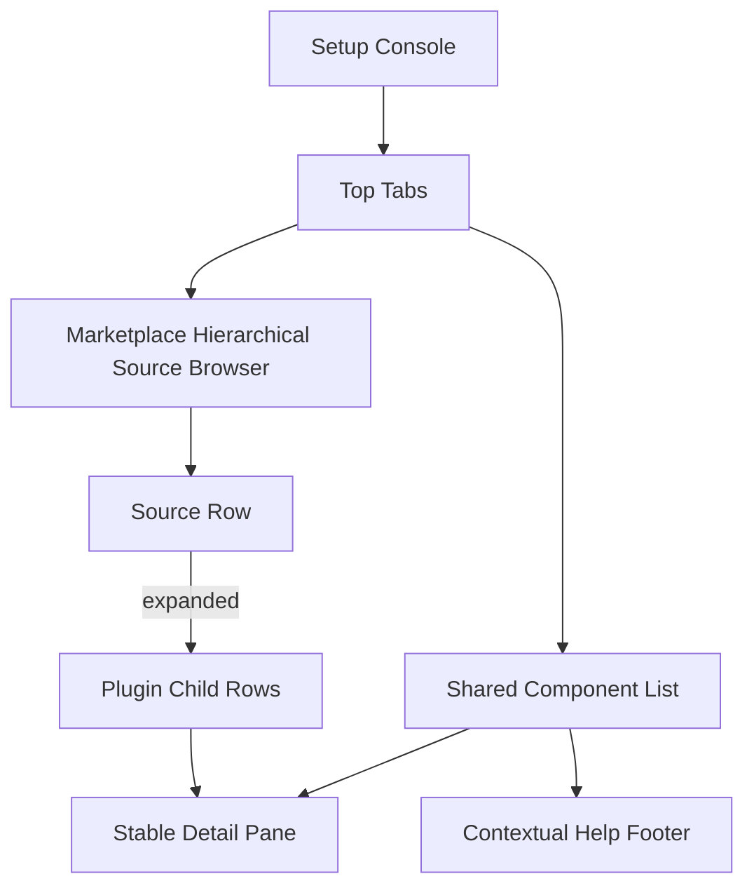
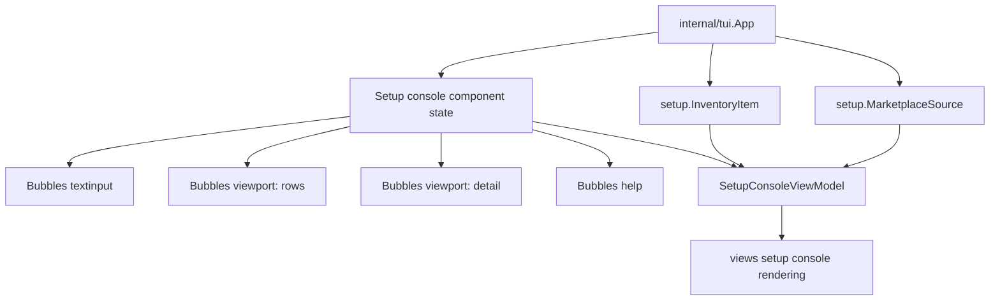

# Setup Console Bubble Components - Plan

## Goal Capsule

- **Objective:** Rework the Setup Console into a fully componentized Bubble Tea surface with consistent list, search, scroll, detail, and help behavior across every setup tab.
- **Product authority:** The user wants the TUI to actively use Bubble Tea, Bubbles, and Lip Gloss instead of remaining a manually-rendered table; Marketplace must become a source browser with expandable source groups.
- **Open blockers:** None for requirements; planning must decide exact component boundaries and whether to use Bubbles `list` directly or a custom hierarchical list model.

---

## Product Contract

### Summary

Gandalf's Setup Console will become a stateful terminal UI surface built around shared component behavior rather than ad hoc string tables.
Every setup tab will share the same focus, search, scrolling, detail, footer, and action patterns, while Marketplace will add source-level expand and collapse behavior for browsing plugin catalogs.

### Problem Frame

The current Setup Console proves the cross-agent inventory model, but it does not yet behave like a mature TUI.
Rows are mostly rendered as formatted strings, selection and scroll behavior are handled narrowly, and Marketplace source structure is flattened into a list.
That makes future setup actions, richer detail panes, and source browsing harder to extend without each tab growing its own interaction rules.

The existing product contract already calls for top tabs, cross-agent rows, truthful action availability, and Marketplace source grouping.
This refactor preserves those product decisions while making the terminal interaction model strong enough to support them.

### Key Decisions

- **Fully componentize the Setup Console.** The refactor covers Hooks, Plugins, Marketplace, Skills, and MCP Servers, not only Marketplace.
- **Keep one shared console grammar.** Tabs should differ by row type and available actions, but not by unrelated focus, scrolling, search, or footer behavior.
- **Make Marketplace hierarchical.** Marketplace sources are the primary rows; plugin entries appear below a source only when the source is expanded or when search requires visibility.
- **Use Bubble ecosystem components for behavior.** Bubble Tea remains the app runtime, Bubbles should own stateful UI primitives where they fit, and Lip Gloss should express focus, hierarchy, and status.
- **Keep domain and action contracts separate from rendering.** The component layer must consume view models and action availability; it must not make install, edit, or remove actions look executable without providers.
- **Label extensions truthfully.** Pi Agent extensions should read as extensions in the Setup Console instead of being hidden behind generic plugin wording.

### Actors

- A1. **Agent power user:** Navigates global setup objects by keyboard and expects dense, predictable terminal interactions.
- A2. **Marketplace browser user:** Inspects Claude marketplace sources, expands source groups, and distinguishes installed plugins from available plugins.
- A3. **Gandalf setup console:** Presents normalized setup inventory and marketplace data without claiming ownership of agent-native catalogs.
- A4. **Future setup action provider:** Supplies executable add, edit, remove, install, update, or uninstall actions after the UI has made row identity and action state clear.

### Requirements

**Shared console behavior**

- R1. The Setup Console must use one shared interaction grammar for tab switching, row movement, search focus, detail display, footer help, and action confirmation.
- R2. Each tab must preserve enough state that switching away and back does not unnecessarily lose cursor position, search text, or expanded source state.
- R3. Row navigation must remain usable with large inventories and constrained terminal heights.
- R4. Search must feel like a focused component, with clear focused and unfocused states.
- R5. Footer help must reflect the active tab, focused component, selected row type, and pending confirmation state.

**Row and detail presentation**

- R6. Rows must present stable columns or equivalent aligned regions for agent marker, object kind, name, status, source, and available actions.
- R7. Long names, source paths, descriptions, and action labels must truncate or scroll without corrupting adjacent content.
- R8. Selected row detail must remain in the same console surface and must not require navigating to an agent detail screen.
- R9. Detail must expose source, scope, status, metadata, action availability, and provider-gated reasons when known.
- R10. Disabled or unavailable actions must be visually distinct from available actions without disappearing from the user model.

**Marketplace source browser**

- R11. Marketplace must show source rows as the default unit of browsing.
- R12. Source rows must support expand and collapse.
- R13. Expanded sources must show plugin entries as indented child rows.
- R14. Source rows must show plugin count and enough summary state to distinguish empty, available-only, and installed-containing sources.
- R15. Plugin rows must show installed or available state when Gandalf can observe it.
- R16. Search must keep matching marketplace sources and matching child plugins visible in a way that does not produce header-only results.
- R17. Marketplace key hints must distinguish expand or collapse from provider-gated install, update, uninstall, add-source, and remove-source actions.
- R18. Marketplace must remain an agent-native source browser and must not present Gandalf as owning, ranking, certifying, or hosting plugin catalogs.

**Tabs and object semantics**

- R19. Hooks, Skills, Plugins, and MCP Servers must continue to show global and managed setup rows across supported agents.
- R20. The Plugins tab must label Pi Agent extensions as extensions when the underlying evidence kind is an extension.
- R21. The Marketplace tab must include real marketplace sources and exclude non-marketplace plugin roots or extension sources unless a supported agent exposes them as marketplace catalogs.
- R22. History and Snapshots must remain reachable through secondary routes from the Setup Console.

**Implementation-facing product constraints**

- R23. Componentization must not collapse the inventory boundary, marketplace boundary, and action provider boundary.
- R24. The refactor must preserve the ability to unit-test view models separately from terminal rendering.
- R25. The first planned implementation should improve visible Marketplace browsing while leaving room to migrate other tabs through the same shared component model.

### Key Flows

- F1. **Browse setup inventory**
  - **Trigger:** The user opens Gandalf and lands on the Setup Console.
  - **Actors:** A1, A3
  - **Steps:** The user switches tabs, moves through rows, searches, and reads selected detail without leaving the console.
  - **Outcome:** The user can inspect global setup objects with consistent keyboard and visual behavior across tabs.
  - **Covers:** R1, R3, R4, R5, R6, R8, R19

- F2. **Expand a marketplace source**
  - **Trigger:** The user opens Marketplace and selects a source row.
  - **Actors:** A2, A3
  - **Steps:** The user expands the source, scans child plugin rows, selects a plugin, and reads metadata and action availability.
  - **Outcome:** Marketplace reads as a source browser rather than a flat inventory table.
  - **Covers:** R11, R12, R13, R14, R15, R17

- F3. **Search Marketplace**
  - **Trigger:** The user focuses search and enters a source or plugin query.
  - **Actors:** A2, A3
  - **Steps:** The console shows matching sources and matching child rows while preserving enough hierarchy to explain where entries came from.
  - **Outcome:** Search results remain useful for source-backed install decisions.
  - **Covers:** R2, R4, R16

- F4. **Inspect unavailable actions**
  - **Trigger:** The user selects a row whose action provider is missing.
  - **Actors:** A1, A2, A3, A4
  - **Steps:** The console shows the action as unavailable, explains why in detail, and avoids presenting a fake executable confirmation.
  - **Outcome:** The UI remains truthful while still teaching the user what action would become possible later.
  - **Covers:** R9, R10, R17, R18, R23

### Acceptance Examples

- AE1. **Covers R1, R5.** Given the user is on any Setup Console tab, when the focused region changes, then footer help changes to match the current interaction state.
- AE2. **Covers R2.** Given the user has expanded a Marketplace source, when they switch to another tab and return, then the source expansion state is preserved unless a rescan invalidates it.
- AE3. **Covers R7.** Given a row has a long source path or action reason, when the terminal is narrow, then adjacent columns remain readable and no row wraps into the next row.
- AE4. **Covers R12, R13.** Given a Marketplace source is collapsed, when the user invokes expand, then child plugin rows appear indented below that source.
- AE5. **Covers R16.** Given search matches a plugin inside a collapsed source, when results render, then the source context and matching plugin are both visible.
- AE6. **Covers R20.** Given Pi Agent extension evidence exists, when the user opens Plugins, then the row label identifies it as an extension.
- AE7. **Covers R23.** Given no action provider exists for a selected action, when the user invokes the action key, then the console explains the unavailable provider and does not create a fake command confirmation.

### Success Criteria

- The Setup Console feels like one coherent terminal application rather than five manually-rendered tables.
- Marketplace browsing supports source-level scanning, expand/collapse, plugin inspection, and truthful action hints.
- Large setup inventories remain navigable without visual overlap or row corruption.
- Future setup action providers can attach to selected rows without redesigning focus, detail, or footer behavior.
- Unit tests can validate console state, marketplace hierarchy, search behavior, and provider-gated action semantics without relying only on PTY snapshots.

### Scope Boundaries

- This refactor does not implement real install, update, uninstall, add-source, remove-source, edit, or remove providers.
- This refactor does not turn Gandalf into a marketplace host, recommender, ranker, or certification authority.
- This refactor does not make project-local setup part of the default Setup Console.
- This refactor does not redesign History, Snapshots, Timeline, or Restore beyond preserving their secondary access from the Setup Console.
- This refactor does not require visual branding work beyond terminal information hierarchy and interaction clarity.

### Dependencies / Assumptions

- Bubble Tea remains the TUI runtime.
- Bubbles and Lip Gloss are already available in the Go module and can be used without changing the product contract.
- Marketplace source quality depends on each supported agent's observable registry or catalog metadata.
- Some terminal environments will be narrow, so the design must degrade before it decorates.

### Outstanding Questions

**Deferred to Planning**

- Which Bubbles primitives should be used directly, and where should Gandalf keep custom models for hierarchical rows?
- Should selected detail render below the list, beside it on wide terminals, or use one adaptive layout?
- Should Marketplace source rows default collapsed or remember the last state across app launches?

### Sources / Research

- `CONCEPTS.md`
- `docs/design/ui/tui/v0/README.md`
- `docs/plans/2026-06-27-002-feat-setup-console-tui-plan.md`
- `docs/solutions/architecture-patterns/global-setup-inventory-action-boundary.md`
- `internal/tui/app.go`
- `internal/tui/model.go`
- `internal/tui/views/setup_console.go`
- `go.mod`

---

## Planning Contract

### Product Contract Preservation

Product Contract unchanged.

### Key Technical Decisions

- KTD1. Keep the domain/view/action boundaries intact. `internal/gandalfcore/setup` continues to define inventory, marketplace, and action availability; `internal/tui/model.go` shapes those into view models; Bubble components consume those models without inventing provider capability.
- KTD2. Introduce a Setup Console component boundary inside `internal/tui` instead of pushing state into `views`. The root `App` remains the Bubble Tea root model, but setup-specific tab state, search state, list selection, viewport state, and Marketplace expansion state should be owned by a setup-console component/model that exposes `Update`, `View`, and selected-row/action helpers.
- KTD3. Use Bubbles where their state model maps cleanly. `textinput` remains the search component, `viewport` should become persistent list/detail scrolling state rather than a per-render temporary, and `help` should render contextual bindings. A custom list row model is still appropriate because Marketplace is hierarchical and rows map to setup action semantics, not generic item titles.
- KTD4. Treat Marketplace as a hierarchical source browser. Source rows are stable parent rows keyed by marketplace source ID; child rows are visible only when the source is expanded or when search reveals matching children with source context.
- KTD5. Preserve per-tab interaction state in memory. Each setup tab gets its own cursor, search text/input value, and list viewport position; Marketplace additionally gets expanded source IDs. Rescan may clamp cursors and drop expansion IDs that no longer exist, but should not reset valid state.
- KTD6. Keep selected detail adaptive but same-surface. The first implementation keeps detail below the list for narrow compatibility, with sizing controlled by component height calculations; a later wide split can be added without changing view-model semantics.
- KTD7. Align documentation with explicit source semantics. Marketplace examples should describe real marketplace sources, primarily Claude marketplace sources today, and avoid showing Pi Agent extension files as Marketplace source rows unless Pi exposes an actual marketplace catalog.

### High-Level Technical Design

The refactor should move interaction state before rendering: key handling updates the setup component, the component asks `BuildSetupConsoleViewModel` for visible rows with tab/search/expansion inputs, and rendering becomes a deterministic projection of component state plus model data.

### Implementation Constraints

- Keep all file references and generated docs repo-relative.
- Do not implement real marketplace install/update/uninstall or source management providers in this refactor.
- Do not reclassify non-marketplace plugin roots or Pi Agent extension files as Marketplace rows to make the accordion look populated.
- Keep `views` package data-only from the domain perspective; it may know row presentation metadata, but it must not call scanners, stores, or setup action executors.
- Prefer focused characterization tests in `internal/tui` and `internal/tui/views` before broad PTY-style snapshots.

### Sequencing

Implement tab/component state first, then hierarchical Marketplace row projection, then rendering/help polish, then docs and end-to-end smoke verification.
This order reduces churn because key handling and rendering both need stable row IDs and selected-row semantics.

---

## Implementation Units

### U1. Setup Console Component State

- **Goal:** Introduce a dedicated setup-console interaction model that owns active tab state, per-tab cursor/search state, focused search input, persistent row/detail viewport state, and selected row identity.
- **Requirements:** R1, R2, R3, R4, R5, R23, R24
- **Files:** `internal/tui/app.go`, `internal/tui/model.go`, `internal/tui/app_test.go`
- **Approach:** Add a setup-console state struct under `internal/tui` and route setup-screen key handling through it. Preserve the existing root `App` responsibility for loading data, actions, history, snapshots, and notices. Replace the single `inventoryCursor` and global `setupSearch` with tab-scoped state while keeping compatibility helpers for current tests where useful.
- **Test Scenarios:** Switching tabs preserves each tab's cursor and search value; search focus consumes text keys and blurs on Enter/Esc; rescan clamps an out-of-range cursor without resetting valid tab state; History and Snapshots key routes still work from the Setup Console.
- **Verification:** `go test ./internal/tui -run 'TestSetupConsole|TestInventoryKeyboard|TestMarketplace'`

### U2. Hierarchical Marketplace Row Projection

- **Goal:** Make Marketplace rows source-first and expandable while preserving source context during search.
- **Requirements:** R11, R12, R13, R14, R15, R16, R17, R18, R21, R23, R24, R25
- **Files:** `internal/tui/model.go`, `internal/gandalfcore/setup/marketplace.go`, `internal/tui/tui_test.go`, `internal/gandalfcore/setup/marketplace_test.go`
- **Approach:** Extend `BuildSetupConsoleViewModelInput` with expanded Marketplace source IDs and, if needed, active row identity. Extend `SetupConsoleRowModel` with row kind, depth, expanded/collapsed marker, parent source ID, and action intent metadata. Marketplace projection should emit source rows by default, emit children for expanded sources, and emit matching children plus their source context under search.
- **Test Scenarios:** Marketplace without search renders only source rows when all sources are collapsed; toggling one source shows indented child plugin rows; searching a child plugin shows the parent source and matching child; child rows expose installed/available status; non-marketplace plugin roots remain excluded from Marketplace.
- **Verification:** `go test ./internal/tui ./internal/gandalfcore/setup`

### U3. Component-Aware Rendering and Layout

- **Goal:** Replace manually assembled table behavior with component-aware rendering that uses persistent Bubbles state, Lip Gloss hierarchy, and stable list/detail sizing.
- **Requirements:** R1, R3, R5, R6, R7, R8, R9, R10, R12, R13, R14, R15
- **Files:** `internal/tui/views/setup_console.go`, `internal/tui/view_adapters.go`, `internal/tui/views/setup_console_test.go`
- **Approach:** Update view structs to carry row depth, row kind, expansion state, and contextual help state. Use Lip Gloss styles for selected, muted, expanded, child, unavailable, and status markers. Keep detail in the same console surface and make row/detail truncation use display-width-safe helpers. Avoid creating a fresh viewport only inside render; viewport content and offsets should come from component state.
- **Test Scenarios:** Styled tab truncation still keeps `MCP Servers` visible; long row names and source paths do not overlap at narrow widths; expanded Marketplace children are visibly indented; unavailable actions appear in detail with reasons; footer help changes for Marketplace source rows versus child/plugin rows.
- **Verification:** `go test ./internal/tui/views`

### U4. Marketplace Expand/Action Key Handling

- **Goal:** Wire keyboard behavior so source rows expand/collapse and action attempts remain provider-gated and truthful.
- **Requirements:** R5, R10, R12, R13, R17, R18, R22, R23
- **Files:** `internal/tui/app.go`, `internal/tui/app_test.go`, `internal/tui/model.go`
- **Approach:** On Marketplace source rows, `enter` or `space` toggles expansion instead of opening a fake action. On Marketplace child rows, action invocation should report provider-gated unavailability unless a future provider supplies an available action. Footer bindings must reflect expand/collapse for source rows and provider-gated action for child rows.
- **Test Scenarios:** Enter toggles a selected Marketplace source; Space toggles the same source when no search input is focused; Enter on a Marketplace child row returns a provider unavailable message and no command; pending action confirmation behavior for non-marketplace rows remains unchanged.
- **Verification:** `go test ./internal/tui -run 'TestMarketplace|TestInventoryEnter|TestInventoryKeyboard'`

### U5. Object Semantics and Documentation Alignment

- **Goal:** Keep tab naming and examples aligned with agent-native concepts after the refactor.
- **Requirements:** R18, R19, R20, R21, R22
- **Files:** `internal/tui/model.go`, `docs/design/ui/tui/v0/README.md`, `docs/plans/2026-06-28-001-refactor-setup-console-bubble-components-plan.md`
- **Approach:** Ensure Plugins rows can label Pi Agent extension evidence as `extension` where the evidence says extension, while Marketplace continues to show only real marketplace sources. Update design docs so Marketplace examples no longer imply Pi Agent extension files are marketplace catalogs.
- **Test Scenarios:** A Pi Agent extension evidence row appears in Plugins as `extension`; Marketplace count does not include Pi extension/package sources unless source kind is marketplace; docs describe Marketplace as source-backed and provider-gated.
- **Verification:** `go test ./internal/tui -run 'TestSetupConsole|TestMarketplace|TestPi'`

### U6. End-to-End Verification and Cleanup

- **Goal:** Prove the componentized console works as an integrated app and remove abandoned refactor scaffolding.
- **Requirements:** R1-R25
- **Files:** `cmd/gandalf`, `internal/tui`, `internal/tui/views`, `docs/solutions/`
- **Approach:** Run package and full-repo tests, build the CLI, and smoke-run the TUI against the current user setup. Add a durable learning under `docs/solutions/` only if the implementation resolves a reusable pattern or repeated failure mode.
- **Test Scenarios:** The app opens to Setup Console; Marketplace shows source rows and supports expand/collapse; search reveals matching children with source context; non-marketplace tabs still navigate and show detail; narrow terminal output remains readable.
- **Verification:** `go test ./...` and `go build ./cmd/gandalf`

---

## Verification Contract

| Gate | Command | Proves |
|---|---|---|
| Setup model and key handling | `GOCACHE=/tmp/gandalf-go-cache go test ./internal/tui` | Tab state, search, Marketplace expand/action behavior, non-marketplace action confirmation |
| Rendering | `GOCACHE=/tmp/gandalf-go-cache go test ./internal/tui/views` | Layout, truncation, contextual help, row/detail presentation |
| Setup domain safety | `GOCACHE=/tmp/gandalf-go-cache go test ./internal/gandalfcore/setup` | Marketplace/source/action boundary remains intact |
| Full regression | `GOCACHE=/tmp/gandalf-go-cache go test ./...` | Cross-package behavior still compiles and tests pass |
| Build | `GOCACHE=/tmp/gandalf-go-cache go build -o /tmp/gandalf-setup-console ./cmd/gandalf` | CLI builds after the refactor |
| Manual TUI smoke | `/tmp/gandalf-setup-console` | Real terminal behavior: Marketplace source rows, expand/collapse, search, detail, and narrow-height usability |

Manual smoke checks:

- Marketplace opens with source rows as the default unit.
- Expanding a source reveals indented child plugin rows.
- Searching for a child plugin keeps the source context visible.
- Enter on a Marketplace source toggles expansion; Enter on provider-gated plugin action does not create a fake confirmation.
- Plugins tab labels Pi Agent extension evidence as extension when such evidence exists.
- History and Snapshots remain reachable with their existing key hints.

---

## Definition of Done

- U1-U6 are implemented with the files and boundaries named above, or any deviation is explained in the final implementation notes.
- Product requirements R1-R25 are either covered by tests, covered by manual smoke verification, or explicitly deferred with rationale.
- The Setup Console uses persistent component state for search, list/detail scrolling, contextual help, and Marketplace expansion rather than recreating all interaction behavior inside string rendering.
- Marketplace shows only real marketplace sources in the Marketplace tab and remains provider-gated for install/update/uninstall/source-management actions.
- Unit tests cover tab state preservation, Marketplace collapsed/expanded/search behavior, unavailable provider actions, Pi Agent extension labeling, and narrow-width rendering.
- `go test ./...` passes.
- `go build -o /tmp/gandalf-setup-console ./cmd/gandalf` passes.
- Abandoned experimental code, unused helpers, and stale doc examples introduced during the refactor are removed before completion.
