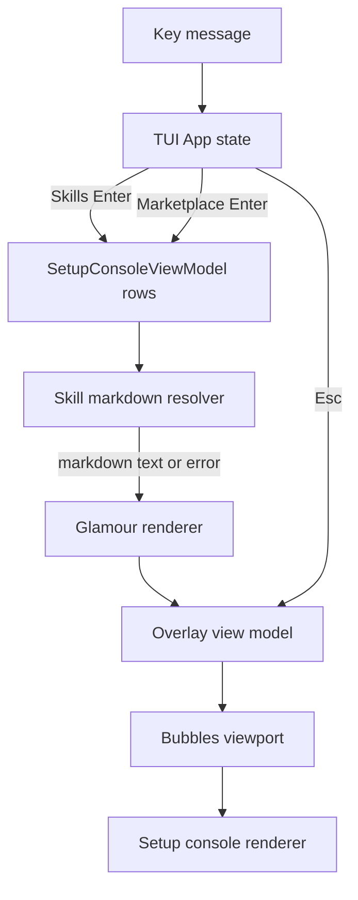

# Skill Markdown Overlay Viewer - Plan

## Goal Capsule

- **Objective:** Make `Enter` on a selected Skill row open a read-only markdown overlay that renders the skill's `SKILL.md` with Glamour, while preserving explicit mutation keys such as add and remove.
- **Product authority:** The user wants a Grok Build-like overlay for skill markdown inspection; `Enter` should mean open or inspect, not mutate setup state.
- **Execution profile:** Standard TUI feature work with focused model, key handling, renderer, dependency, and tests.
- **Stop conditions:** Stop before implementing add, edit, remove, install, update, or uninstall providers; those remain provider-gated setup actions.

---

## Product Contract

### Summary

Gandalf's Setup Console should treat the selected Skill row as something the user can read immediately.
Pressing `Enter` on Skills opens a centered read-only overlay showing `SKILL.md` rendered as terminal markdown.
The underlying Skills list remains visible behind the overlay, `Esc` closes it, and footer help changes to overlay navigation.

### Problem Frame

The Setup Console currently makes `Enter` flow toward action planning or action confirmation.
That is a poor default for skills because most visible skill rows have no executable provider and the user's primary intent is often to understand the skill before changing it.
Gandalf already separates visible setup inventory from executable setup actions; the TUI should reflect that by making inspection the primary `Enter` behavior and keeping mutations behind explicit keys.

### Requirements

**Open behavior**

- R1. Pressing `Enter` on a selected Skill row opens a read-only markdown overlay instead of opening setup action confirmation.
- R2. Pressing `Esc` while the overlay is open closes the overlay and restores the previous list cursor, search, tab, and scroll state.
- R3. Pressing `Enter` while search is focused continues to accept or blur search rather than opening a viewer.
- R4. Marketplace source rows keep their current `Enter` expand or collapse behavior.
- R5. Explicit mutation affordances such as add and remove remain visible when supported by the surrounding Setup Console design, but they do not become the default `Enter` action.

**Markdown rendering**

- R6. The overlay renders the selected skill's `SKILL.md` with Glamour using a word wrap width derived from the overlay content width.
- R7. The overlay shows compact metadata for skill name, agent, object kind, status, and resolved source path above the rendered markdown.
- R8. Missing, unreadable, symlink-refused, or unsupported entrypoints render a clear read-only error state inside the overlay instead of falling back to a setup action.
- R9. The viewer never executes skill code, hook commands, or agent-native provider commands while resolving or rendering markdown.

**Layout and keyboard states**

- R10. The overlay appears as a centered modal on roomy terminals and degrades to a near full-screen sheet on narrow terminals.
- R11. The overlay body is scrollable independently from the underlying setup list.
- R12. Footer help reflects the current state: normal Skills rows show `Enter open`; overlay state shows scroll keys and `Esc close`.
- R13. The overlay must not corrupt row alignment, truncate unrelated UI incoherently, or leave stale rendered content after switching rows or rescanning.

### Key Flows

- F1. **Open a skill**
  - **Trigger:** The user selects a Skill row and presses `Enter`.
  - **Actors:** Agent power user, Gandalf setup console.
  - **Steps:** Gandalf resolves the row to a local `SKILL.md`, renders it with Glamour, and opens the overlay without mutating setup files.
  - **Outcome:** The user can read the skill instructions in place.
  - **Covers:** R1, R6, R7, R9, R12

- F2. **Close the overlay**
  - **Trigger:** The overlay is open and the user presses `Esc`.
  - **Actors:** Agent power user, Gandalf setup console.
  - **Steps:** Gandalf closes the overlay and returns focus to the same Skills list position.
  - **Outcome:** The user resumes browsing without losing context.
  - **Covers:** R2, R11, R12

- F3. **Unavailable markdown**
  - **Trigger:** The user opens a Skill row whose entrypoint cannot be resolved or read.
  - **Actors:** Agent power user, Gandalf setup console.
  - **Steps:** Gandalf opens the overlay with metadata and an error state.
  - **Outcome:** The user understands why markdown is unavailable without accidentally invoking an action.
  - **Covers:** R8, R9

### Acceptance Examples

- AE1. Given a user-scoped Codex skill whose `SKILL.md` exists, when the user presses `Enter` on the row, then the overlay opens with rendered markdown and no pending setup action is created.
- AE2. Given a Skill row has no readable entrypoint, when the user presses `Enter`, then the overlay opens with a missing or unreadable message and no provider-gated action message appears.
- AE3. Given the search field is focused on the Skills tab, when the user presses `Enter`, then search blurs and no overlay opens.
- AE4. Given the overlay is open, when the user presses `Esc`, then the overlay closes and the selected Skills row remains selected.
- AE5. Given a Marketplace source row is selected, when the user presses `Enter`, then the row still expands or collapses rather than opening the markdown viewer.
- AE6. Given the terminal is narrow, when the overlay opens, then it uses a near full-screen sheet and the rendered body remains scrollable.

### Scope Boundaries

- This plan does not implement add, edit, remove, install, update, uninstall, add-source, or remove-source providers.
- This plan does not make project-local setup part of the default Setup Console.
- This plan does not add editing, copying, search-inside-viewer, or link-opening behavior to the markdown overlay.
- This plan does not change scan security policy; it reads local skill markdown only through resolved user/global setup paths already inside configured allowed roots.

### Sources / Research

- `CONCEPTS.md`
- `docs/solutions/architecture-patterns/setup-console-component-state-boundary.md`
- `docs/solutions/architecture-patterns/global-setup-inventory-action-boundary.md`
- `docs/plans/2026-06-28-001-refactor-setup-console-bubble-components-plan.md`
- `internal/tui/app.go`
- `internal/tui/model.go`
- `internal/tui/views/setup_console.go`
- `internal/gandalfcore/setup/inventory.go`
- `internal/gandalfcore/scan/plugins/codex.go`
- `internal/gandalfcore/scan/plugins/pi.go`
- `go.mod`
- Charmbracelet Glamour documentation for `charm.land/glamour/v2`, `NewTermRenderer`, and `WithWordWrap`.

---

## Planning Contract

### Key Technical Decisions

- **KTD1. Make open/inspect the primary `Enter` behavior for Skills.** Setup mutations stay behind explicit keys and providers; this preserves the inventory/action boundary while making the common read path fast.
- **KTD2. Add a viewer state to the Setup Console root flow.** The root Bubble Tea app should own overlay open/close orchestration because it already owns keyboard routing, dimensions, and workspace state.
- **KTD3. Resolve skill markdown from inventory evidence, not from display strings alone.** Skill rows currently expose source paths but not all metadata; the implementation should carry enough row detail to resolve `entrypoint: SKILL.md` safely.
- **KTD4. Use Glamour as a renderer, not as a viewport.** Glamour renders markdown to ANSI text; Bubbles viewport owns scrolling and sizing inside the overlay.
- **KTD5. Keep overlay rendering in the view layer with explicit view models.** The renderer should receive title, metadata, rendered body, error state, dimensions, and footer help rather than reading files or resolving paths.
- **KTD6. Preserve Marketplace semantics.** Marketplace source rows already use `Enter` for expand and collapse; the Skills overlay must not regress that row-kind behavior.

### High-Level Technical Design

### Assumptions

- Glamour v2 is acceptable as a new dependency even though current Charmbracelet imports use the `github.com/charmbracelet/*` module paths.
- Skill source paths can be resolved against `RuntimeOptions.HomeDir` or another already-allowed global setup root without reading outside configured roots.
- Overlay styling can use existing Lip Gloss styles and does not need a new visual design system.

### Risks & Dependencies

- **Dependency path mismatch:** Glamour v2 uses `charm.land/glamour/v2` and examples use `charm.land/lipgloss/v2`, while this repo currently imports `github.com/charmbracelet/lipgloss`. The implementation should verify compatible module versions before committing to import paths.
- **Path safety:** Skill source paths may be display-normalized with `~` or may represent managed/plugin roots. The resolver must fail closed when it cannot map a display path to a local readable file under an allowed global setup root.
- **Terminal sizing:** Glamour output includes ANSI styling; overlay width and viewport height must be tested with narrow and roomy terminals to avoid visual corruption.

### Deferred to Follow-Up Work

- Add full setup action providers for add, edit, remove, install, update, or uninstall.
- Add markdown viewer enhancements such as search inside the viewer, copy path/content, link opening, or syntax theme selection.
- Generalize `Enter=open` overlays for Hooks, MCP Servers, and Plugins after the Skills viewer establishes the pattern.

---

## Implementation Units

### U1. Carry Skill Entrypoint Context Through Inventory Rows

- **Goal:** Ensure the TUI has enough structured information to resolve a selected Skill row to its markdown entrypoint.
- **Requirements:** R1, R6, R7, R8, R9
- **Dependencies:** None
- **Files:** `internal/gandalfcore/setup/inventory.go`, `internal/gandalfcore/setup/inventory_test.go`, `internal/tui/model.go`, `internal/tui/tui_test.go`
- **Approach:** Extend setup inventory or TUI view models to carry relevant skill metadata such as evidence ID, evidence kind, source path, entrypoint, and entrypoint status. Prefer passing structured metadata from discovered evidence into inventory rather than reparsing display strings in the view layer.
- **Patterns to follow:** `setup.BuildInventory` for global inventory shaping; `setupConsoleDetailFromInventory` for selected-row detail construction; scanner metadata fields already emitted by Codex and Pi skill scanners.
- **Test scenarios:**
  - Given a Codex skill evidence item with `entrypoint: SKILL.md`, building inventory preserves enough detail for the TUI to resolve that entrypoint.
  - Given a skill evidence item with no entrypoint metadata, the TUI model still builds a valid row and marks markdown availability as unknown rather than panicking.
  - Given managed or user-scoped skills, tab counts and existing row sorting remain unchanged.
- **Verification:** Inventory and TUI model tests prove metadata propagation without changing which rows appear in the Skills tab.

### U2. Add Safe Skill Markdown Resolution

- **Goal:** Convert a selected Skill row into either readable markdown content or a displayable unavailable state.
- **Requirements:** R1, R6, R7, R8, R9
- **Dependencies:** U1
- **Files:** `internal/tui/app.go`, `internal/tui/app_test.go`
- **Approach:** Add a small resolver owned near the TUI app boundary that maps `~` paths through `RuntimeOptions.HomeDir`, maps already-allowed managed/plugin roots through the same safety boundary, and resolves directory source paths through their `SKILL.md` entrypoint. Reject unresolved, missing, symlink-unsafe, unreadable, or out-of-root paths with an overlay error model.
- **Execution note:** Add characterization tests around existing `Enter` behavior before replacing Skills behavior.
- **Patterns to follow:** Existing `RuntimeOptions` use in `fetchWorkspaceData`; path-confinement principles documented in `CONCEPTS.md`; scanner entrypoint status metadata.
- **Test scenarios:**
  - Given `~/.codex/skills/review` and a readable `SKILL.md` in the test home, resolving returns markdown content and the resolved display path.
  - Given a missing `SKILL.md`, resolving returns an unavailable viewer state and does not create `pendingAction`.
  - Given an out-of-root or unresolved source path, resolving fails closed with an unavailable viewer state.
  - Given a symlink entrypoint, resolving respects the scanner safety posture and does not follow unsafe content.
- **Verification:** App-level tests cover readable, missing, and unsafe paths without touching the user's real home directory.

### U3. Render Markdown Overlay With Glamour and Viewport State

- **Goal:** Render the opened skill markdown as a centered overlay with scrollable content and compact metadata.
- **Requirements:** R6, R7, R8, R10, R11, R12, R13
- **Dependencies:** U2
- **Files:** `go.mod`, `go.sum`, `internal/tui/app.go`, `internal/tui/views/setup_console.go`, `internal/tui/views/setup_console_test.go`
- **Approach:** Add Glamour as the markdown renderer and render into a Bubbles viewport-sized body. The overlay view model should carry title, source path, metadata, rendered markdown, unavailable message, viewport offset, and active help text. Use centered modal dimensions on wider terminals and near full-screen dimensions on narrow terminals.
- **Patterns to follow:** Existing `rowsViewport` lifecycle in `App`; `RenderSetupConsole` as the single setup-console rendering entrypoint; existing view tests using ANSI stripping.
- **Test scenarios:**
  - Given rendered markdown content, the setup console view contains the overlay title, source path, and rendered body text.
  - Given an unavailable state, the overlay contains the error message and still shows metadata.
  - Given a narrow width, the overlay renderer uses the sheet layout and does not hide the close/help affordance.
  - Given long markdown content, viewport offset determines which body lines are visible.
- **Verification:** View tests assert overlay content and footer help after ANSI stripping; dependency additions are minimal and compatible with the existing Go module.

### U4. Rewire Keyboard Semantics Around Open, Scroll, and Close

- **Goal:** Make Skills `Enter` open the overlay, overlay keys control viewer state, and other setup-console key semantics remain intact.
- **Requirements:** R1, R2, R3, R4, R5, R11, R12
- **Dependencies:** U2, U3
- **Files:** `internal/tui/app.go`, `internal/tui/app_test.go`, `internal/tui/views/setup_console.go`, `internal/tui/views/setup_console_test.go`
- **Approach:** Add explicit viewer-open state to the app. While open, route `Esc` to close and scroll keys to the overlay viewport before normal setup-console key handling. In normal Skills state, route `Enter` to open; keep search-focused `Enter` and Marketplace source `Enter` behavior ahead of the Skills open path.
- **Patterns to follow:** `handleSetupSearchKey` precedence; `handleMarketplaceEnter`; existing pending action confirmation handling.
- **Test scenarios:**
  - Covers AE1. Given a selected Skill row with readable markdown, pressing `Enter` opens the viewer and leaves `pendingAction` nil.
  - Covers AE3. Given search is focused, pressing `Enter` blurs search and does not open the viewer.
  - Covers AE4. Given the viewer is open, pressing `Esc` closes it and preserves the selected row.
  - Covers AE5. Given Marketplace source selection, pressing `Enter` still toggles expansion.
  - Given a pending action confirmation exists, `Enter` continues to confirm that pending action rather than opening a new viewer.
- **Verification:** App keyboard tests prove the precedence chain for search, overlay, marketplace, pending action, and skills open behavior.

### U5. Update Help Text and Documentation Breadcrumbs

- **Goal:** Make the visible key hints match the new interaction grammar and leave durable documentation for the UX decision.
- **Requirements:** R5, R12, R13
- **Dependencies:** U3, U4
- **Files:** `internal/tui/views/setup_console.go`, `internal/tui/views/setup_console_test.go`, `docs/solutions/architecture-patterns/setup-console-component-state-boundary.md`, `CONCEPTS.md`
- **Approach:** Change normal Skills help from `enter action` to `enter open`, keep Marketplace expand/collapse labels, and render overlay help as scroll plus close. Add a concise learning only if implementation reveals a reusable boundary beyond this plan; otherwise keep docs limited to the existing component-state guidance.
- **Patterns to follow:** Existing `renderSetupConsoleHelp` contextual binding logic; AGENTS.md instruction to add durable learnings with `ce-compound` when a reusable project pattern is resolved.
- **Test scenarios:**
  - Given Skills is active with no overlay, footer help includes `enter open`.
  - Given Marketplace source is selected, footer help still includes expand or collapse.
  - Given the overlay is open, footer help includes scroll and close actions rather than setup mutation actions.
- **Verification:** View tests cover contextual help for normal Skills, Marketplace, and overlay states.

---

## Verification Contract

| Gate | Scope | Done Signal |
|---|---|---|
| TUI unit tests | `go test ./internal/tui` | Keyboard, view model, overlay rendering, and footer help tests pass. |
| Setup inventory tests | `go test ./internal/gandalfcore/setup` | Inventory metadata propagation preserves row inclusion, sorting, and counts. |
| Full Go tests | `go test ./...` | New dependency and TUI changes do not regress CLI, scan, setup, restore, or timeline packages. |
| Manual TUI smoke | `gandalf tui` or built binary against a temp fixture | Skills `Enter` opens markdown overlay, `Esc` closes it, Marketplace `Enter` still expands, and narrow terminal layout remains readable. |

---

## Definition of Done

- Skills `Enter` opens a read-only markdown overlay for readable `SKILL.md` files.
- Missing or unsafe skill markdown opens a clear unavailable overlay state.
- Search-focused `Enter`, Marketplace expand/collapse, pending action confirmation, tab switching, reload, add, and remove affordances retain their intended precedence.
- Glamour-rendered markdown wraps to overlay width and scrolls without corrupting surrounding Setup Console layout.
- Unit tests cover metadata propagation, path resolution, keyboard precedence, overlay rendering, footer help, and narrow layout behavior.
- The final diff contains no abandoned alternate viewer implementations or dead helper code.
