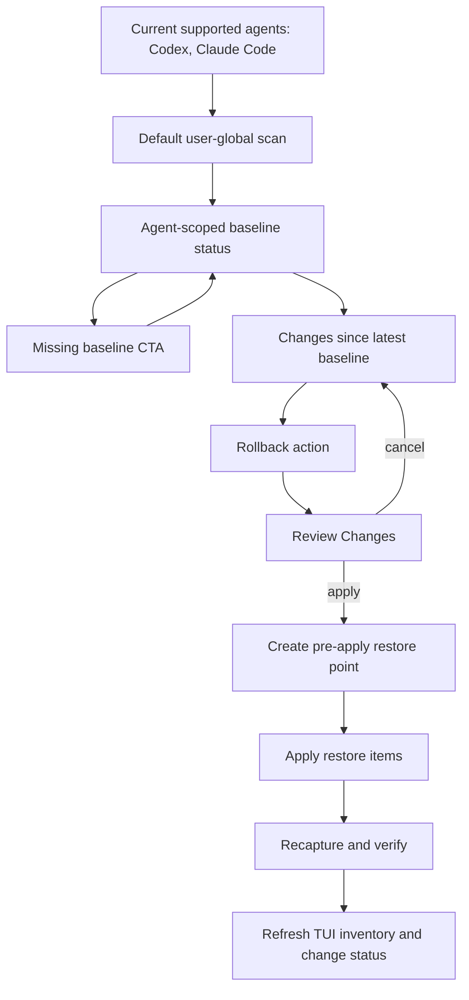

# Codex Claude Safe Action Loop - Plan

## Goal Capsule

- **Objective:** Narrow Gandalf's current product-visible agent support to Codex and Claude Code, then make both agents participate in the same safe loop: baseline, changes since baseline, Review Changes, Apply, Verify, and Rollback where supported.
- **Product authority:** The user chose action-centered product language. "Plan" should not be a top-level user concept; risky mutations should appear as actions with a Review Changes preview before apply.
- **Open blockers:** None for planning. Implementation must keep unsupported Claude Code surfaces explicit instead of pretending they are rollbackable.
- **Execution profile:** Go CLI/TUI implementation with repo-local tests, docs alignment, and acceptance coverage.
- **Stop conditions:** Do not add Cursor, OpenCode, Pi Agent, project-local setup management, Docker MCP install wizards, Packs/Profile workflows, or a Gandalf-owned marketplace install provider to satisfy this plan.
- **Tail ownership:** The plan is complete only when CLI, default scan behavior, TUI copy, rollback behavior, docs, and acceptance tests all describe the same Codex plus Claude Code product boundary.

## Product Contract

### Summary

Gandalf currently needs a smaller and more honest product loop.
The current supported agent set is Codex and Claude Code only.
For those agents, Gandalf should help the user capture user-global baselines, inspect changes since the baseline, and run rollback actions through Review Changes before any user-global setup file is written.

The user should see:

```text
Action
  Review Changes
  Apply
  Verify
  Rollback if needed
```

Internally, restore planning can still use `RestorePlan` and setup code can still use action preview objects.
Product language should emphasize actions, concrete changes, restore points, and rollback availability.

### Problem Frame

Gandalf has accumulated three mismatched stories:

- Product docs still describe a Codex-only Gate 2 rollback wedge in places.
- Setup Console docs and code mention a broader multi-agent inventory that includes Cursor, OpenCode, and Pi Agent.
- The desired product direction now asks for Codex and Claude Code together, with every risky action passing through a visible preview before apply.

This mismatch makes the product hard to promote because users cannot tell which agents are really supported, which actions are safe to run, and which surfaces are only observable.
The next implementation should reduce the supported set, make Codex and Claude Code equal first-class surfaces for the baseline/change/rollback loop, and keep unsupported items visible without turning them into fake actions.

### Key Decisions

- **Current supported agents are exactly Codex and Claude Code.** Legacy scanners, type constants, or store directories can remain for compatibility, but default product behavior must only present Codex and Claude Code.
- **Use agent-scoped baselines.** Gandalf should create and compare separate user-scope snapshots for Codex and Claude Code instead of mixing both agents into one ambiguous snapshot.
- **Use Review Changes as the user-facing preview.** `RestorePlan` remains an internal object, but TUI copy should say Review Changes, Changes, Apply, Verify, and Rollback.
- **Every user-global restore apply creates a restore point first.** If Gandalf cannot create the pre-apply snapshot for the same agent and scope, it must fail closed before writing the target setup.
- **Claude Code support is explicit and narrow.** `~/.claude/settings.json` and content-backed user-global Claude Code skills are eligible for rollback. `~/.claude.json`, marketplace source metadata, unsupported agent directories, secret-like content, and project-local Claude files remain observe-only or out of scope.
- **Inventory is not executability.** Visible setup rows can still have unavailable actions. A row must not claim that rollback or mutation is available unless the preview and apply path can execute it.
- **Verification follows apply.** After applying a rollback action, Gandalf must rescan or recapture and report whether the selected baseline now matches supported restore targets.

### Actors

- A1. **Agent power user:** Wants to let Codex or Claude Code change local setup without losing a known-good configuration.
- A2. **Gandalf TUI:** Presents current setup, baseline status, changes, action previews, apply state, and verification state.
- A3. **Gandalf CLI:** Provides scriptable snapshot, diff, and restore behavior for the same two supported agents.
- A4. **Supported agent surface:** User-global Codex and Claude Code setup files and directories that Gandalf can scan without executing tools.

### Requirements

**Supported agent boundary**

- R1. Gandalf's current supported agent set must be Codex and Claude Code.
- R2. CLI validation, TUI labels, default scanner registration, docs, and error messages must not present Cursor, OpenCode, Pi Agent, Project, or Unknown as current supported agents.
- R3. Legacy agent constants, scanner implementations, or store directory support may remain only as internal compatibility surfaces; they must not appear in the current default product path.
- R4. Default product scanning must stay user-global or managed and must exclude project-local setup surfaces.

**Baselines and changes**

- R5. Gandalf must be able to create content-backed user-scope baselines for both Codex and Claude Code.
- R6. Baselines must be agent-scoped so a Codex rollback cannot accidentally use a Claude Code snapshot, and vice versa.
- R7. The TUI must show whether each supported agent has a baseline and how many supported changes exist since the latest baseline.
- R8. Secret-like content must not be stored. Omitted content must be visible as omitted or unsupported, not silently treated as rollbackable.
- R9. If no baseline exists for one or both supported agents, the TUI must provide an explicit create-baseline path for the missing agents.

**Review Changes and apply**

- R10. Every mutating user-global restore action must show Review Changes before apply.
- R11. Review Changes must list update, delete, and unsupported items with agent, source path, target file, and rollback availability.
- R12. Review Changes must show that a pre-apply restore point will be created before any write.
- R13. Apply must be explicit from Review Changes; cancel must leave the filesystem unchanged.
- R14. Apply must fail before writing if the pre-apply restore point cannot be created.
- R15. After apply, Gandalf must verify by recapturing or rescanning the same agent and scope and reporting success, partial success, or stale verification failure.

**Claude Code support**

- R16. Claude Code `~/.claude/settings.json` must be content-backed and eligible for byte-exact rollback when it is captured without secret-like content.
- R17. Claude Code user-global skills under `~/.claude/skills` must be rollbackable where the existing skill restore semantics can safely target the `SKILL.md` entrypoint.
- R18. Claude Code `~/.claude.json` must remain metadata-only and not become content-backed rollback material.
- R19. Claude Code marketplace sources, marketplace plugins, and unsupported agent directories must remain inspectable but unsupported for apply.

**Trust contract**

- R20. Gandalf must not execute MCP commands, hooks, scripts, plugins, or agent tools while scanning, previewing, or applying this loop.
- R21. Restore apply must keep path confinement, symlink refusal, and validated-destination semantics.
- R22. Project-local files such as repo `.mcp.json`, `AGENTS.md`, `CLAUDE.md`, repo `.claude/settings.json`, and `.env` are outside this plan.

### Key Flows

- F1. **First run baseline**
  - **Trigger:** The user opens `gandalf` and no supported-agent baseline exists.
  - **Steps:** Gandalf scans Codex and Claude Code user-global setup, shows missing baseline state, and lets the user create content-backed baselines for the missing agents.
  - **Outcome:** The store contains separate agent-scoped baselines for Codex and Claude Code.
  - **Covers:** R1, R5, R6, R7, R9

- F2. **Inspect changes since baseline**
  - **Trigger:** The user opens the Setup Console after changing Codex or Claude Code setup.
  - **Steps:** Gandalf reads the latest agent-scoped baseline for each supported agent, captures current state, and shows change counts and summaries.
  - **Outcome:** The user can see which supported agent changed and whether unsupported or omitted items are involved.
  - **Covers:** R6, R7, R8, R18, R19

- F3. **Rollback Codex setup**
  - **Trigger:** The user selects a Codex baseline or change summary and chooses rollback.
  - **Steps:** Gandalf builds a restore preview, renders Review Changes, creates a pre-apply Codex restore point, applies the restore, and verifies against the baseline.
  - **Outcome:** Supported Codex user-global files match the selected baseline or the UI reports why they do not.
  - **Covers:** R10, R11, R12, R13, R14, R15, R21

- F4. **Rollback Claude Code setup**
  - **Trigger:** The user selects a Claude Code baseline or change summary and chooses rollback.
  - **Steps:** Gandalf previews supported settings and skill changes, marks unsupported Claude Code metadata as unsupported, creates a pre-apply Claude Code restore point, applies supported items, and verifies.
  - **Outcome:** Supported Claude Code user-global files match the selected baseline; unsupported metadata remains untouched and visible.
  - **Covers:** R10, R11, R16, R17, R18, R19, R21

- F5. **Unsupported agent or surface**
  - **Trigger:** The user passes `--agent cursor`, or a default scan finds legacy agent files on disk.
  - **Steps:** CLI rejects the unsupported agent, and the default TUI does not surface legacy agent rows.
  - **Outcome:** The product boundary remains clear without deleting compatibility code prematurely.
  - **Covers:** R1, R2, R3

### Acceptance Examples

- AE1. **Covers R1, R2.** Given the user runs a CLI command with `--agent cursor`, when validation runs, then the command fails with valid agents listed as `claude-code, codex`.
- AE2. **Covers R1, R2, R3.** Given Cursor, OpenCode, and Pi Agent user-global files exist in the test home, when the default scan runs, then default evidence contains Codex and Claude Code items only.
- AE3. **Covers R5, R16.** Given `~/.claude/settings.json` exists and contains no secret-like assignment, when `gandalf snapshot create --agent claude-code --scope user` runs without `--metadata-only`, then the snapshot is content-backed and stores the settings content.
- AE4. **Covers R8, R18.** Given `~/.claude.json` exists, when a Claude Code content-backed snapshot is created, then `~/.claude.json` is metadata-only and not included in content entries.
- AE5. **Covers R7, R9.** Given no baselines exist, when the TUI opens, then Codex and Claude Code both show missing baseline state and a create-baseline action.
- AE6. **Covers R10, R11, R13.** Given a Codex or Claude Code baseline differs from current setup, when the user chooses rollback, then the UI shows Review Changes and does not write until Apply is confirmed.
- AE7. **Covers R12, R14.** Given pre-apply snapshot creation fails, when the user confirms Apply, then no setup files are written and the UI reports the restore point failure.
- AE8. **Covers R15, R21.** Given apply succeeds, when Gandalf verifies the same agent and scope, then it reports success only if supported restore targets match the selected baseline.
- AE9. **Covers R19.** Given Claude Code marketplace source metadata exists, when Review Changes renders a Claude Code rollback, then marketplace entries appear as unsupported or observe-only and are not applied.

### Success Criteria

- A new user understands that Gandalf currently supports Codex and Claude Code, not a broad agent matrix.
- Both supported agents have the same user-visible safety loop: baseline, changes, Review Changes, Apply, Verify, and Rollback.
- Claude Code support is credible because rollbackable surfaces and unsupported surfaces are separated.
- Existing restore trust guarantees remain intact.
- Docs no longer describe one place as Codex-only and another as broad multi-agent support.

### Scope Boundaries

In scope:

- Codex and Claude Code user-global baselines.
- Changes since latest agent-scoped baseline.
- TUI Review Changes for restore-backed rollback actions.
- CLI parity for content-backed Claude Code user snapshots.
- Docs and acceptance tests that reflect the narrowed current supported agent set.

Out of scope:

- Cursor, OpenCode, Pi Agent current support.
- Project-local setup management.
- Docker MCP install wizard.
- Packs/Profile workflows.
- Marketplace install, update, uninstall, add-source, or remove-source providers.
- Secret restoration or raw secret storage.
- Executing any agent-native command during scan or preview.

### Sources / Research

- `CONCEPTS.md`
- `README.md`
- `PRODUCT.md`
- `ARCHITECTURE.md`
- `docs/plans/2026-06-26-001-refactor-go-full-rewrite-plan.md`
- `docs/plans/2026-06-27-001-feat-global-agent-setup-manager-plan.md`
- `docs/plans/2026-06-27-002-feat-setup-console-tui-plan.md`
- `docs/plans/2026-06-28-001-refactor-setup-console-bubble-components-plan.md`
- `docs/solutions/architecture-patterns/global-setup-inventory-action-boundary.md`
- `docs/solutions/logic-errors/go-restore-store-trust-contract-gaps.md`
- `internal/cli/shared.go`
- `internal/cli/snapshot.go`
- `internal/gandalfcore/agents/display.go`
- `internal/gandalfcore/restore/gate2_test.go`
- `internal/gandalfcore/restore/plan.go`
- `internal/gandalfcore/restore/plan_test.go`
- `internal/gandalfcore/scan/plugins/claude_code.go`
- `internal/gandalfcore/scan/plugins/init.go`
- `internal/gandalfcore/snapshot/snapshot.go`
- `internal/gandalfcore/snapshot/snapshot_test.go`
- `internal/gandalfcore/store/store.go`
- `internal/gandalfcore/types/types.go`
- `internal/tui/app.go`
- `internal/tui/model.go`
- `internal/tui/views/setup_console.go`
- `scripts/gate2-acceptance.sh`

---

## Planning Contract

### Product Contract Preservation

The Product Contract above is the source of truth.
Implementation may preserve legacy parser code and snapshot store compatibility, but it must not let legacy agents leak into the current user-facing product.

### Key Technical Decisions

- KTD1. **Separate known agent IDs from the current supported agent set.** Keep `types.AgentID` parsing broad enough for old data and direct scanner tests, but add a product helper, recommended under `internal/gandalfcore/agents`, that returns the current supported IDs: `claude-code` and `codex`.
- KTD2. **Use the product helper in CLI validation and default product scans.** Do not duplicate the supported list in `internal/cli/shared.go`, TUI models, and scanner init.
- KTD3. **Unregister legacy scanners from the default plugin factory first.** Cursor, OpenCode, Pi Agent, and Project scanner implementations can remain in the repo for compatibility while the default product path only registers Claude Code and Codex.
- KTD4. **Use agent-scoped snapshots for baselines and restore points.** The store already accepts an agent selector; do not introduce mixed-agent baseline snapshots for this loop.
- KTD5. **Gate content-backed snapshot creation by rollback support, not by Codex only.** `snapshot.CaptureCurrentState` already has Claude Code content-capture behavior for `~/.claude/`; the CLI gate should allow `--agent claude-code --scope user`.
- KTD6. **Keep `RestorePlan` internal and render Review Changes in the UI.** Rename user-facing TUI copy, not necessarily every internal restore type.
- KTD7. **Do not reuse command-backed setup `ActionPlan` for restore rollback.** The existing setup action provider is command-oriented and intentionally unavailable for many inventory rows. A rollback action should wrap restore preview/apply directly through a restore-oriented view model.
- KTD8. **Treat unsupported items as successful preview data.** Unsupported Claude Code metadata, omitted secret-like content, and marketplace rows should be displayed as unsupported items rather than surfacing only as apply-time failures.
- KTD9. **Create a pre-apply restore point before user-global restore writes.** This can be implemented as an agent-scoped content-backed snapshot with a generated name and timeline/store metadata. Failure to persist it fails the apply path before any target write.
- KTD10. **Verification is observed state, not optimistic state.** After apply, recapture the same agent and scope and compare supported restore targets to the selected baseline.

### High-Level Technical Design



### Implementation Constraints

- Keep all generated plan references repo-relative.
- Do not delete legacy agent constants or scanner files unless deletion is necessary for correctness; hiding them from the default product path is enough.
- Do not weaken path confinement, symlink refusal, or validated-destination checks.
- Do not make `~/.claude.json` content-backed.
- Do not scan project-local Claude or Codex files in the default product path.
- Keep TUI business logic out of `internal/tui/views`; views should render view models.
- Keep tests isolated with temporary home, project, and store directories.

### Sequencing

1. Lock the supported-agent boundary so later UI and docs work cannot rely on legacy agents.
2. Enable Claude Code content-backed snapshots at the CLI gate and add restore acceptance coverage.
3. Add a reusable baseline/change status model for Codex and Claude Code.
4. Wire the TUI first-run baseline flow.
5. Wire TUI Review Changes, Apply, Verify, and post-apply refresh.
6. Update docs and run the full verification contract.

---

## Implementation Units

### U1. Add Current Supported Agent Gate

- **Goal:** Make Codex and Claude Code the only current product-visible agents.
- **Requirements:** R1, R2, R3, R4; AE1, AE2
- **Files:** `internal/gandalfcore/agents/display.go`, optional new `internal/gandalfcore/agents/supported.go`, `internal/cli/shared.go`, `internal/gandalfcore/scan/plugins/init.go`, `internal/gandalfcore/scan/scan_test.go`, `internal/tui/model.go`, `internal/tui/format.go`
- **Approach:** Add `agents.CurrentSupportedIDs()` and `agents.IsCurrentSupported(id)`. Use it for CLI `--agent` validation and TUI current-agent displays. Change the default scanner factory to register `ClaudeCodeScanner{}` and `CodexScanner{}` only. Keep legacy scanner files and store directory support unless later tests prove they must move behind explicit construction.
- **Test Scenarios:** `--agent cursor` fails with the valid list `claude-code, codex`. Default scan ignores Cursor/OpenCode/Pi files even when present. Existing direct scanner tests for legacy scanners either move to explicit scanner construction or are deleted if they only asserted current product behavior.
- **Verification:** `go test ./internal/cli ./internal/gandalfcore/scan ./internal/tui`

### U2. Enable Claude Code Content-Backed Baselines

- **Goal:** Make `snapshot create` accept content-backed user-scope snapshots for Claude Code as well as Codex.
- **Requirements:** R5, R6, R8, R16, R18; AE3, AE4
- **Files:** `internal/cli/snapshot.go`, `internal/cli/cli_test.go`, `internal/gandalfcore/snapshot/snapshot.go`, `internal/gandalfcore/snapshot/snapshot_test.go`, `internal/gandalfcore/restore/gate2_test.go`, `scripts/gate2-acceptance.sh`
- **Approach:** Replace the Codex-only CLI condition with a helper such as `agents.SupportsContentBackedUserSnapshot(agent, scope)`. Keep the capture allowlist conservative: Codex under `~/.codex/`, Claude Code under `~/.claude/`, never `~/.claude.json`, and never secret-like content. Add a Claude Code rollback wedge that snapshots `~/.claude/settings.json`, corrupts it or adds a synthetic skill, dry-runs restore, applies restore, and verifies byte-exact settings restoration.
- **Test Scenarios:** `snapshot create --agent claude-code --scope user` succeeds without `--metadata-only`. Unsupported agent/scope combinations still require `--metadata-only`. `~/.claude.json` is absent from content entries. Claude Code Gate 2-style restore returns settings JSON to its exact original bytes.
- **Verification:** `go test ./internal/cli ./internal/gandalfcore/snapshot ./internal/gandalfcore/restore`

### U3. Add Agent-Scoped Baseline And Change Status Model

- **Goal:** Provide one core model that the TUI can use to show baseline presence and changes since baseline for both supported agents.
- **Requirements:** R5, R6, R7, R8, R9, R19; AE5, AE9
- **Files:** recommended new package `internal/gandalfcore/baseline`, `internal/gandalfcore/store/store.go`, `internal/tui/model.go`, `internal/tui/model_test.go`
- **Approach:** Add a core helper that, for each current supported agent, finds the latest agent-scoped user baseline, captures current user-scope state, diffs baseline graph against current graph, and summarizes executable changes, unsupported items, and content omissions. The helper should not mutate; baseline creation is a separate action.
- **Test Scenarios:** Missing baseline produces a missing state for that agent only. Codex and Claude Code snapshots are not mixed. Unsupported Claude Code marketplace rows and metadata-only surfaces appear in status as unsupported or observe-only. Secret-like omitted content is visible in the status model.
- **Verification:** `go test ./internal/gandalfcore/baseline ./internal/tui`

### U4. Wire First-Run Baseline Creation In The TUI

- **Goal:** Let users create missing Codex and Claude Code baselines from the TUI without leaving the setup console.
- **Requirements:** R5, R6, R7, R9; AE5
- **Files:** `internal/tui/app.go`, `internal/tui/model.go`, `internal/tui/views/setup_console.go`, optional new `internal/tui/views/baseline_status.go`, `internal/tui/app_test.go`, `internal/tui/tui_test.go`
- **Approach:** On boot and after rescan, load the baseline/change status model. If either supported agent lacks a baseline, render a compact missing-baseline state and expose a create-baseline action. Creating baselines writes only to the Gandalf store, uses agent-scoped content-backed snapshots, and names snapshots with a stable prefix plus timestamp, for example `baseline-codex-YYYYMMDD-HHMMSS` and `baseline-claude-code-YYYYMMDD-HHMMSS`.
- **Test Scenarios:** No baselines renders missing state for both agents. Creating baselines writes two agent-scoped snapshots and refreshes status. If Claude Code baseline creation fails but Codex succeeds, the UI reports the per-agent failure and keeps Claude Code missing. Cancel leaves the store unchanged.
- **Verification:** `go test ./internal/tui`

### U5. Add TUI Review Changes, Apply, And Verify For Rollback

- **Goal:** Turn snapshots and change summaries into executable rollback actions guarded by Review Changes.
- **Requirements:** R10, R11, R12, R13, R14, R15, R17, R19, R20, R21; AE6, AE7, AE8, AE9
- **Files:** `internal/tui/app.go`, `internal/tui/model.go`, `internal/tui/views/setup_console.go`, optional new `internal/tui/views/review_changes.go`, `internal/gandalfcore/restore/plan.go`, `internal/gandalfcore/restore/apply.go`, `internal/tui/app_test.go`, `internal/tui/tui_test.go`
- **Approach:** Make snapshot or change summary selection build a restore preview for the selected agent and scope. Render it as Review Changes with grouped executable and unsupported items. Apply first creates a pre-apply restore point for the same agent/scope, then uses the existing restore item conversion and apply executor with home/project confinement roots. After apply, recapture and compare supported restore targets to the selected baseline, then refresh inventory and baseline status.
- **Test Scenarios:** Selecting rollback opens Review Changes, not direct apply. Cancel leaves target files unchanged. Pre-apply snapshot failure blocks writes. Apply success triggers verification and a refresh. Rescan or verification failure clears pending action and reports stale state instead of allowing duplicate execution. Unsupported Claude Code metadata remains untouched.
- **Verification:** `go test ./internal/tui ./internal/gandalfcore/restore`

### U6. Align Docs, Product Copy, And Acceptance Scripts

- **Goal:** Make public and internal docs describe the same Codex plus Claude Code safe action loop.
- **Requirements:** R1, R2, R4, R5, R10, R16, R18, R22; AE1 through AE9
- **Files:** `README.md`, `PRODUCT.md`, `ARCHITECTURE.md`, `CONCEPTS.md`, `docs/design/ui/tui/v0/README.md`, `scripts/gate2-acceptance.sh`
- **Approach:** Update README highlights, Quick Start, "What Gandalf Tracks", and command examples to show Codex and Claude Code. Replace Codex-only Gate 2 language in `PRODUCT.md` with the current two-agent loop. Update `ARCHITECTURE.md` to say current built-in product scanners cover Codex and Claude Code, with legacy scanner code not part of the default product path if retained. Refresh TUI design docs to remove Cursor/Pi examples from the active UI. Expand `scripts/gate2-acceptance.sh` to run deterministic Codex and Claude Code rollback checks, or split a dedicated two-agent script and call it from the gate.
- **Test Scenarios:** `rg` no longer finds active-product claims that Cursor/OpenCode/Pi are currently supported. README examples include both `--agent codex` and `--agent claude-code`. Product docs say Review Changes before risky apply.
- **Verification:** `go test ./...`, `go build -o bin/gandalf ./cmd/gandalf`, `./scripts/gate2-acceptance.sh`

---

## Verification Contract

Implementation is not done until these pass:

```bash
go test ./...
go build -o bin/gandalf ./cmd/gandalf
./scripts/gate2-acceptance.sh
```

Add focused manual or scripted TUI smoke coverage with isolated directories:

```text
1. Empty temp HOME and STORE.
2. Create supported Codex and Claude Code user-global setup files.
3. Open TUI and create missing baselines.
4. Mutate Codex config and Claude Code settings.
5. Open Review Changes for each agent.
6. Cancel once and verify no file changed.
7. Apply each rollback and verify files match the selected baseline.
8. Confirm unsupported Claude Code metadata is displayed but not written.
```

## Definition Of Done

- CLI valid-agent behavior, default scanner registration, TUI status, and docs all name only Codex and Claude Code as current supported agents.
- `snapshot create --agent claude-code --scope user` creates a content-backed snapshot when content is safe to capture.
- TUI can show missing baseline, changes since baseline, Review Changes, Apply, Verify, and rollback status for both supported agents.
- Pre-apply restore point failure prevents writes.
- Claude Code unsupported surfaces are visible and untouched.
- Full Go tests, Go build, and Gate 2 acceptance pass.

## Risks And Mitigations

- **Risk:** Removing legacy scanners from defaults breaks tests that were written as product tests for the broader agent set. **Mitigation:** Keep legacy scanner implementations but update tests to distinguish direct scanner unit coverage from default product behavior.
- **Risk:** Claude Code settings may contain values that look secret-like. **Mitigation:** Preserve existing secret-like omission behavior and surface omitted content in Review Changes.
- **Risk:** TUI rollback apply duplicates CLI restore semantics incorrectly. **Mitigation:** Reuse restore plan conversion and apply executor, and keep TUI code limited to view models, state transitions, and confirmation flow.
- **Risk:** Mixed-agent snapshot lookup causes wrong-agent rollback. **Mitigation:** Every baseline, pre-apply restore point, diff, and restore operation in this loop must pass an explicit agent pointer and user scope.
