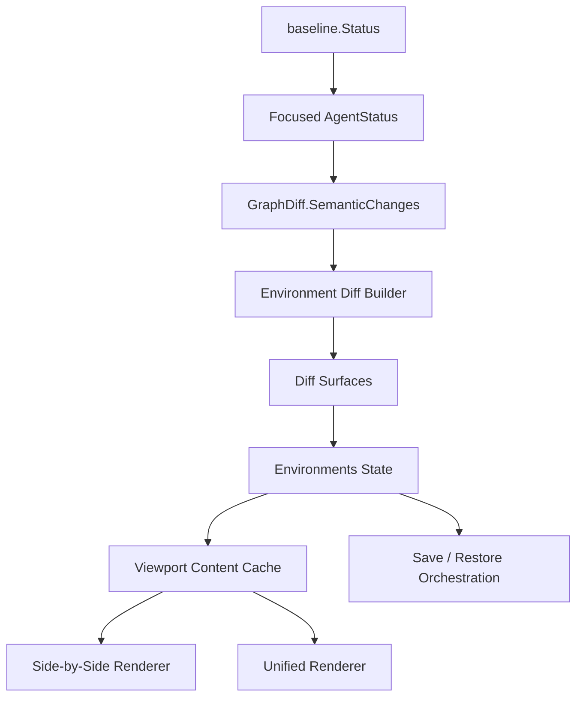

# Environments Side-by-Side Diff - Plan

## Goal Capsule

- **Objective:** Replace the Environments screen's summary-style change preview with a faithful baseline-vs-current diff workspace: agent list, changed surface list, and a git-diff-like side-by-side viewer with hunks, line numbers, context rows, and hunk navigation.
- **Product authority:** Gandalf is a TUI-first manager for user-global Codex and Claude Code setup. Environments should explain exactly what changed between the selected agent baseline and current setup before save or restore actions.
- **Open blockers:** None for planning. The implementation must work with existing `baseline.Status.AgentStatus.Diff.SemanticChanges` and should not require a new core diff engine.
- **Execution profile:** Go Bubble Tea TUI implementation with focused model/render/key tests, full repo tests, build verification, and a real terminal smoke capture.
- **Stop conditions:** Do not add an external runtime diff renderer, do not change restore/store safety semantics, do not add edit/remove/toggle providers, do not expand to project-local setup, and do not revert unrelated dirty worktree changes.
- **Tail ownership:** The plan is complete only when the Environments UI renders real structured diff rows, existing `s` save and `R` restore flows still work, and verification proves wide side-by-side plus narrow unified fallback.

---

## Product Contract

### Summary

The current Environments screen is directionally right but still behaves like a change summary. It shows the selected agent and a compact list of changed fields, then places preview strings into two columns. That does not answer the user's core question: "What exactly changed, like git diff?"

This plan turns Environments into a true setup diff workspace.

The user should see three surfaces:

- **Agents:** Codex and Claude Code baseline/drift rows.
- **Surfaces:** the focused agent's changed setup surfaces, grouped by source/object identity.
- **Diff:** the selected surface rendered as `Baseline | Current` on wide terminals, and unified diff on narrow terminals.

The diff must be more than colored summaries. It must include hunk headers, old/new line number gutters, unchanged context, removed rows, added rows, paired changed rows, blank-side padding for add-only/remove-only rows, and a visible current hunk marker.

### Problem Frame

The existing implementation has three mismatches:

- `EnvironmentChangeModel` exposes `Before []string` and `After []string`, which makes the view model a rendered preview instead of a structured diff contract.
- `environmentObjectDiffPreview` intentionally caps visible fields and appends summary text. That is useful for a compact card, but wrong for the primary diff viewer.
- `RenderEnvironments` only has a top agent list and a diff body. There is no changed-surface selection or stateful diff viewport, so keyboard behavior cannot grow cleanly.

The user also provided visual references and asked for a side-by-side diff like a real git diff. Prior art from `deff`, `revdiff`, `differ`, `diffnav`, and `difi` supports the design direction: keep typed diff rows, line gutters, hunk navigation, and a viewport-owning viewer. Gandalf should borrow those patterns without adopting their external runtime diff engines.

### Key Decisions

- **Use Gandalf semantic diffs, not shell-out rendering.** Build a TUI-local typed diff row model from `diff.SemanticChange`. Do not depend on `delta`, `git diff`, or any external process to render setup data.
- **Make surface selection first-class.** The user selects an agent, then a changed surface, then inspects that surface's diff.
- **Use one canonical diff row contract.** Side-by-side and unified renderers consume the same typed row model. They must not infer semantics from string prefixes.
- **Preserve save and restore behavior.** `s` continues saving the focused agent environment. `R` continues routing through the existing restore review flow.
- **Move Environments interaction state behind a boundary.** App owns scan/store/save/restore orchestration; an Environments component/state object owns focus, cursors, viewport offset, mode, hunk cursor, and cache.
- **Use Bubbles viewport where it carries behavior.** The repo currently uses Charm Bubble Tea/Bubbles; the diff body should have an explicit viewport model rather than ad hoc string slicing.
- **Keep action honesty.** This is an inspection and environment-control surface. It must not imply new edit/remove/toggle powers.

### Actors

- A1. **Agent power user:** Wants to know exactly what Codex or Claude Code setup changed before saving a new baseline or restoring an old one.
- A2. **Gandalf TUI:** Presents baseline status, changed surfaces, hunked diffs, and existing save/restore actions.
- A3. **Gandalf diff model:** Converts baseline semantic changes into stable TUI diff surfaces and rows.
- A4. **Gandalf restore/snapshot engine:** Continues to own save and restore effects.

### Requirements

**Environment workspace**

- R1. The Environments screen must retain per-agent baseline/drift rows for supported agents.
- R2. The selected agent must have a changed-surface list before the diff body.
- R3. Surface identity must include object kind/name and source path when available.
- R4. Empty, clean, and no-baseline states must remain explicit and not render fake diff rows.

**Diff model**

- R5. Replace the primary `Before []string`/`After []string` preview contract with typed surfaces, hunks, rows, and sides.
- R6. Each diff row must expose row kind, stable row ID, hunk index, old line number, new line number, left text, right text, left marker, right marker, and current-hunk selection metadata where relevant.
- R7. JSON object values must sort keys stably, group changed fields into hunks, and include two unchanged context fields around changes when available.
- R8. The primary viewer must not hide changed fields behind summary text such as `... +N fields`.
- R9. Added entities must render right-side `+` rows with blank left padding.
- R10. Removed entities must render left-side `-` rows with blank right padding.
- R11. Changed scalar values must render as one paired remove/add row.
- R12. Invalid JSON values must render trimmed raw bytes as one remove/add pair.
- R13. Nested objects and arrays must render compact deterministic JSON on their changed field row; no deep tree UI is in scope.

**Rendering**

- R14. Wide terminals must render a side-by-side viewer with `Baseline` and `Current` columns.
- R15. Side-by-side rendering must include hunk headers, old/new line gutters, aligned separators, context rows, removed rows, added rows, paired changed rows, and a visible current hunk marker.
- R16. Narrow terminals must render a faithful unified fallback from the same row model.
- R17. Rendering must be ANSI/display-width safe and must not overlap on 80-column terminals.

**Interaction**

- R18. `E` enters Environments as it does today.
- R19. `tab` cycles focus through Agents, Surfaces, and Diff.
- R20. `up/down` and `j/k` move the selected agent, selected surface, or diff viewport depending on focus.
- R21. `pageup/pagedown` page the diff viewport when Diff is focused.
- R22. `n/p` jump to next/previous hunk, move focus to Diff, and update the current hunk marker.
- R23. `v` toggles side-by-side/unified mode without changing selected agent/surface.
- R24. `i` returns to the Setup Console.
- R25. `s` and `R` preserve the existing save and restore review flows.

**Safety and scope**

- R27. No external runtime diff renderer may be introduced.
- R28. No restore/store format or path-confinement semantics may change.
- R29. No new edit/remove/toggle provider may be added as part of this plan.
- R30. No project-local setup scope or unsupported agent scope may be introduced.
- R31. Existing dirty worktree changes must not be reverted unless explicitly requested.

### Key Flows

- F1. **Inspect changed Codex setup**
  - **Trigger:** User opens Environments after Codex changed since baseline.
  - **Steps:** User presses `E`, selects Codex, selects a changed setup surface, and reads a side-by-side baseline/current diff.
  - **Outcome:** The user sees exact removed, added, changed, and context rows with line numbers.
  - **Covers:** R1, R2, R3, R14, R15

- F2. **Navigate hunks**
  - **Trigger:** Selected surface has multiple hunks.
  - **Steps:** User presses `n` and `p`.
  - **Outcome:** Diff viewport moves to the requested hunk and marks it visibly.
  - **Covers:** R18, R20, R21, R22

- F3. **Narrow terminal fallback**
  - **Trigger:** Terminal width is below the side-by-side threshold.
  - **Steps:** User opens Environments and selects a changed surface.
  - **Outcome:** UI stacks regions and renders a unified diff from the same typed row model.
  - **Covers:** R16, R17

- F4. **Save new baseline**
  - **Trigger:** User inspects changes and presses `s`.
  - **Steps:** Existing focused-agent save flow runs.
  - **Outcome:** A new snapshot is captured; the diff workspace refreshes from updated baseline status.
  - **Covers:** R26, R28

- F5. **Open restore review**
  - **Trigger:** User presses `R`.
  - **Steps:** Existing restore review flow opens for the focused agent.
  - **Outcome:** The same review/apply safety model remains intact.
  - **Covers:** R26, R28

### Acceptance Examples

- AE1. **Covers R5, R6.** Given a semantic change with object before/after values, when the Environments view model builds diff surfaces, then it emits typed rows with hunk metadata and line numbers rather than only `Before []string` and `After []string`.
- AE2. **Covers R7, R8.** Given a JSON object with more changed fields than the old preview limit, when the diff model builds rows, then all changed fields are represented in rows and no primary row says `... +N fields`.
- AE3. **Covers R9, R10.** Given an added or removed entity, when rendered side-by-side, then the missing side is blank padding and the changed side carries the correct marker.
- AE4. **Covers R14, R15.** Given a wide render, when ANSI is stripped, then output contains `Baseline`, `Current`, a hunk header beginning `@@`, old/new line number gutters, context rows, `-` left rows, and `+` right rows.
- AE5. **Covers R16.** Given an 80-column render, when ANSI is stripped, then output contains a unified diff and no line exceeds the available width.
- AE6. **Covers R19, R20.** Given Environments focus is Surfaces, when the user presses `j`, then selected surface changes and selected agent does not.
- AE7. **Covers R22.** Given multiple hunks, when the user presses `n`, then current hunk index changes and the renderer marks the new hunk.
- AE8. **Covers R26.** Given a selected agent with no saved snapshot, when the user presses `R`, then the existing gated no-snapshot message appears and no panic occurs.
- AE9. **Covers R27, R29.** Given the final diff, when dependencies and action code are reviewed, then no runtime diff renderer or new setup mutation provider was added.

### Success Criteria

- Environments reads as an inspection workspace, not a summary panel.
- The selected changed setup surface is clear before the diff body.
- The primary diff body is git-diff-like: hunks, line numbers, context, add/remove/change rows, and side-by-side alignment.
- Narrow terminals keep the same information in unified form.
- Existing save and restore behavior still works.
- Tests prove the old summary behavior is no longer sufficient.

### Scope Boundaries

In scope:

- Environments view model, state, renderer, adapter, key handling, tests, and focused documentation if needed.
- Structured rendering of current semantic changes for Codex and Claude Code user-global setup.
- Model/render/key verification and terminal smoke verification.

Out of scope:

- New core restore semantics.
- New snapshot/store format.
- New setup mutation providers.
- External diff renderer runtime dependencies.
- Project-local setup.
- Unsupported agent expansion.
- Deep tree expand/collapse for nested JSON values.

### Sources / Research

- `CONCEPTS.md`
- `.omo/plans/environments-side-by-side-diff.md`
- `docs/plans/2026-06-27-002-feat-setup-console-tui-plan.md`
- `docs/plans/2026-06-28-001-refactor-setup-console-bubble-components-plan.md`
- `docs/plans/2026-06-29-001-feat-codex-claude-safe-action-loop-plan.md`
- `docs/solutions/architecture-patterns/setup-console-component-state-boundary.md`
- `docs/solutions/architecture-patterns/global-setup-inventory-action-boundary.md`
- `docs/solutions/design-patterns/setup-console-compact-disclosure-rows.md`
- `internal/gandalfcore/diff/diff.go`
- `internal/tui/app.go`
- `internal/tui/model.go`
- `internal/tui/view_adapters.go`
- `internal/tui/views/environments.go`
- `internal/tui/views/environments_test.go`
- `internal/tui/tui_test.go`
- `go.mod`
- External prior art: `https://github.com/flamestro/deff`
- External prior art: `https://github.com/umputun/revdiff`
- External prior art: `https://github.com/JanSmrcka/differ`
- External prior art: `https://github.com/dlvhdr/diffnav`
- External prior art: `https://github.com/oug-t/difi`

---

## Planning Contract

### Product Contract Preservation

This plan preserves the current Gandalf product boundary: Codex and Claude Code user-global setup, baseline comparison, and safe save/restore workflows.

The implementation must not turn the Environments diff viewer into an action provider. It can inspect and navigate differences, but the only mutating flows in scope are the existing `s` save and `R` restore-review paths.

### Technical Strategy

Build the feature in four layers:

1. **Characterize the missing behavior with tests.** The current preview renderer should fail tests that expect hunks, line gutters, selected surfaces, and hunk navigation.
2. **Create a typed diff surface model.** Convert `diff.SemanticChange` into surfaces, hunks, and rows before rendering.
3. **Move Environments interaction into a state boundary.** Keep App orchestration thin and let Environments own focus/cursors/viewport/modes.
4. **Render from typed rows.** Side-by-side and unified modes should be presentation variants of the same model.



### Key Technical Decisions

- KTD1. **Use a Gandalf-owned typed diff model.** `differ` and `revdiff` show useful line/hunk models, but Gandalf input is structured setup evidence, not a git patch. The TUI should create rows directly from `diff.SemanticChange`.
- KTD2. **Group by changed surface before row rendering.** A single agent can have setup, MCP, hook, skill, plugin, permission, and instruction changes. A selected surface makes the diff inspectable.
- KTD3. **Renderer receives semantics, not prefixes.** Hunk rows, context rows, added rows, removed rows, and changed pairs must be explicit enum-like row kinds.
- KTD4. **Use viewport state for the diff body.** Current Bubbles `viewport.Model` supports explicit size/content/update behavior and is the right primitive for scrollable diff text.
- KTD5. **Cache rendered content by data and layout.** Rebuilding a side-by-side diff on every keypress is unnecessary. Cache by selected agent, selected surface, diff fingerprint, and width class.
- KTD6. **Preserve action/provider boundaries.** No new mutating setup controls are created by the diff viewer.
- KTD7. **Prefer deterministic JSON projection over textual raw diffs.** Stable key order and compact nested JSON make setup diffs repeatable and testable.

### Risks and Mitigations

- **Risk:** The model grows too large inside `internal/tui/model.go`.
  - **Mitigation:** Allow a new narrow file or package such as `internal/tui/environments/` for diff model and state, while keeping public view adapters small.
- **Risk:** Side-by-side line alignment breaks with ANSI or wide text.
  - **Mitigation:** Use existing display-width-aware helpers and add render tests that strip ANSI and check line widths.
- **Risk:** Hunk navigation conflicts with existing app-level keys.
  - **Mitigation:** Route keys through Environments state only when `ScreenEnvironments` is active; preserve `s`, `R`, and `i` explicitly.
- **Risk:** The user expects full textual file diff semantics.
  - **Mitigation:** Define the contract as a setup evidence diff. Nested values render compact JSON in this plan; deep tree expansion remains out of scope.
- **Risk:** Existing dirty changes are overwritten.
  - **Mitigation:** Check worktree before implementation and edit only files named by active units.

---

## Implementation Units

### U1. Characterize the missing side-by-side diff behavior

**Goal:** Add failing-first tests that prove the current summary preview is insufficient.

**Files likely touched:**

- `internal/tui/tui_test.go`
- `internal/tui/views/environments_test.go`
- Optional fixtures under `internal/tui/testdata/`

**Work:**

- Add model-level tests that expect typed diff surfaces, hunk rows, line numbers, and selected surface metadata.
- Add render-level tests that expect `Baseline`, `Current`, `@@`, old/new gutters, context rows, removed rows, added rows, and current hunk marker.
- Add key/state tests that describe focus cycle and hunk navigation, even if they fail before state is implemented.

**Acceptance:**

- Focused tests fail against the current implementation for substantive reasons: missing hunk model, missing line gutters, missing selected surface, or missing hunk navigation.
- Tests that only check `Baseline`, `Current`, `-`, and `+` strings are rejected as too weak.

**Covers:** R5, R6, R14, R15, R19, R22, AE1, AE4, AE7

### U2. Build the structured Environment diff model

**Goal:** Replace primary preview strings with typed surfaces, hunks, rows, and sides.

**Files likely touched:**

- `internal/tui/model.go`
- Optional new file: `internal/tui/environments/diff_model.go`
- Tests in `internal/tui/tui_test.go` or `internal/tui/environments/*_test.go`

**Work:**

- Introduce model types for diff surface, hunk, row, side, row kind, and marker.
- Convert `baseline.Status.AgentStatus.Diff.SemanticChanges` into grouped surfaces.
- Implement deterministic JSON object projection:
  - stable key sort,
  - changed fields grouped into hunks,
  - two context fields around changed fields,
  - all changed fields visible,
  - compact deterministic nested object/array rows.
- Implement scalar, invalid JSON, added entity, removed entity, and clean/no-diff cases.
- Keep any legacy `EnvironmentChangeModel.Before/After` compatibility only as temporary migration glue, then remove it in U6.

**Acceptance:**

- Tests pass for object changes, scalar changes, invalid JSON fallback, added-only entity, removed-only entity, nested object/array value, clean diff, multi-hunk object, and context rows.
- No primary model test expects summary text such as `... +N fields`.

**Covers:** R5, R6, R7, R8, R9, R10, R11, R12, R13, AE1, AE2, AE3

### U3. Add Environments component state boundary

**Goal:** Move Environments interaction state into a focused state object/component instead of growing scattered `App` fields.

**Files likely touched:**

- `internal/tui/app.go`
- Optional new files under `internal/tui/environments/`
- `internal/tui/app_test.go`

**Work:**

- Add state for selected agent cursor, selected surface cursor, focused pane, viewport offset, render mode, hunk cursor, and render cache.
- Add methods for focus cycle, agent movement, surface movement, viewport scrolling, hunk navigation, mode toggle, and data/layout invalidation.
- Keep App responsible for scan data, save, restore, and notice/action errors.
- Clamp cursors when baseline status or surface list changes.

**Acceptance:**

- Tests prove focus cycling, cursor clamping, surface selection, hunk cursor reset, current hunk movement, mode persistence, and viewport reset behavior.
- No Environments renderer parses visual strings to decide behavior.

**Covers:** R18, R19, R20, R21, R22, R23, R24, R31, AE6, AE7

### U4. Render three-region Environments workspace

**Goal:** Show Agents, Surfaces, and Diff as separate navigable regions.

**Files likely touched:**

- `internal/tui/views/environments.go`
- `internal/tui/view_adapters.go`
- `internal/tui/views/environments_test.go`

**Work:**

- Extend render inputs with environment focus, surface rows, selected surface, footer/help metadata, and diff viewer data.
- Wide layout: agents and surfaces stay visible while diff gets most width.
- Medium/narrow layout: stack regions without overlap.
- Surface rows should avoid duplicate agent prefixes and show the useful identity: marker, kind/name, source path when helpful, and change count.

**Acceptance:**

- Render tests at 80, 120, and 160 columns prove no overlap, no line overflow after ANSI stripping, visible selected agent, visible selected surface, and visible diff region.
- Clean/no-baseline/empty states remain readable.

**Covers:** R1, R2, R3, R4, R16, R17, AE5

### U5. Implement faithful side-by-side and unified diff rendering

**Goal:** Render the selected surface as a real diff viewer.

**Files likely touched:**

- `internal/tui/views/environments.go`
- Optional new file: `internal/tui/views/environment_diff.go`
- `internal/tui/views/environments_test.go`

**Work:**

- Render side-by-side rows from typed rows:
  - hunk headers span the diff body,
  - fixed old/new line gutters,
  - baseline/current headers,
  - context rows,
  - left removed rows,
  - right added rows,
  - paired changed rows,
  - blank-side padding,
  - visible current hunk marker.
- Render unified fallback from the same row model below the side-by-side width threshold or when `v` selects unified mode.
- Respect viewport clipping.

**Acceptance:**

- Wide render tests assert hunk headers, line gutters, aligned separator, source header, context row, removed row, added row, paired changed row, and current hunk marker.
- Narrow render tests assert unified output with the same semantic rows.
- Added-only and removed-only render tests prove no fake opposing row is shown.

**Covers:** R14, R15, R16, R17, AE3, AE4, AE5

### U6. Wire App keys, footer, adapters, and remove legacy preview path

**Goal:** Connect model, state, renderer, and existing save/restore flows.

**Files likely touched:**

- `internal/tui/app.go`
- `internal/tui/view_adapters.go`
- `internal/tui/model.go`
- `internal/tui/app_test.go`
- `internal/tui/tui_test.go`

**Work:**

- Route Environments keys through the new state boundary.
- Preserve `s` save and `R` restore behavior using focused agent state.
- Update contextual footer for active focus and mode.
- Remove obsolete `Before []string`/`After []string` preview rendering once typed rows are fully wired.
- Keep Snapshot and Timeline behavior unchanged.

**Acceptance:**

- App tests prove `E`, `tab`, `j/k`, arrows, `pageup/pagedown`, `n/p`, `v`, `w`, `i`, `s`, and `R`.
- `R` with no snapshot remains gated with the existing no-snapshot message.
- Focused tests and full TUI tests pass without legacy preview assertions.

**Covers:** R18, R19, R20, R21, R22, R23, R24, R25, R26, R28, AE6, AE7, AE8

### U7. Full verification, terminal smoke, and cleanup

**Goal:** Prove the feature works at unit, integration, build, and real-terminal levels.

**Files likely touched:**

- Test fixtures or helper files only if needed.
- No product code unless verification finds a bug.

**Work:**

- Run formatting and focused tests.
- Run full repository tests and build.
- Run a real terminal smoke with a fixture setup where Environments shows a changed setup surface.
- Inspect final diff for scope violations: no runtime diff renderer, no action-provider changes, no restore/store changes, no project-local scope expansion.

**Acceptance:**

- All Verification Contract checks pass.
- Terminal capture visibly contains `Baseline`, `Current`, `@@`, old/new line numbers, context rows, removed rows, added rows, current hunk marker, and footer controls.
- `git status --short` shows only intended files and pre-existing unrelated dirty files remain unreverted.

**Covers:** R27, R28, R29, R30, R31, AE9

---

## Verification Contract

### Automated Gates

Run these after implementation:

```bash
gofmt -w <changed Go files>
go test ./internal/tui/... -run 'TestEnvironmentDiff|TestRenderEnvironments|TestEnvironments' -count=1
go test ./...
go build -o bin/gandalf ./cmd/gandalf
git diff --check
```

### Required Test Coverage

- Model tests for object, scalar, invalid JSON, added-only, removed-only, nested object/array, clean/no-diff, multi-hunk, and context-row cases.
- Render tests for wide side-by-side, narrow unified, line gutters, hunk headers, current hunk marker, nil-side padding, long source paths, and CJK/display-width safety.
- App/state tests for focus cycle, cursor clamping, hunk navigation, viewport scrolling, mode toggles, save, restore, and no-snapshot restore gating.

### Real TUI Smoke

Use a real terminal or tmux session after building `bin/gandalf`.

Pass criteria:

- Environments opens with `E`.
- Agent list and changed surface list are both visible.
- Selected surface diff shows `Baseline` and `Current`.
- Diff contains a hunk header beginning `@@`.
- At least one removed row has an old line number.
- At least one added row has a new line number.
- At least one unchanged context row is visible.
- `n/p` changes the visible current hunk marker.
- `v` toggles unified/side-by-side.
- `s` and `R` remain reachable and route to existing behavior.

### Review Gates

- Confirm no external runtime diff renderer dependency was added.
- Confirm renderer does not infer row semantics from string prefixes.
- Confirm action-provider boundary remains unchanged.
- Confirm restore/store/path-confinement code is unchanged except for test helpers if any.
- Confirm no unrelated dirty worktree changes were reverted.

---

## Definition of Done

- Environments renders a changed setup surface as a hunked diff, not a summary preview.
- Wide terminals show a side-by-side baseline/current diff with line numbers and aligned rows.
- Narrow terminals show a faithful unified fallback.
- Agent, surface, and diff focus are navigable.
- Hunk navigation works and marks the current hunk.
- Existing save and restore controls still work.
- Tests cover model, renderer, key handling, and regression cases that failed before.
- Full tests, build, formatting, and diff checks pass.
- Real terminal smoke proves the requested git-diff-like behavior.
- No out-of-scope mutation, restore, store, scanner, or agent-support changes are introduced.

---

## Appendix

### Implementation Notes

- The current repo imports `github.com/charmbracelet/bubbles v1.0.0`, `github.com/charmbracelet/bubbletea v1.3.10`, and `github.com/charmbracelet/lipgloss v1.1.0`. Use APIs available in those versions.
- The old preview path is useful as a migration reference but should not remain the primary viewer contract.
- Keep style decisions consistent with existing `internal/tui/views/styles.go`: added rows use the existing clean/add style, removed rows use the existing removed style, changed/hunk rows use the existing changed/focus styles.
- Surface grouping should prefer stable identity over visual brevity: source path plus entity kind/name is better than only "Setup" when multiple surfaces change.

### PR / Commit Strategy

- One commit is preferred after verification passes.
- Suggested commit message: `feat(tui): render Environments as side-by-side diff`.
- Do not commit automatically unless the execution turn explicitly asks for it.
