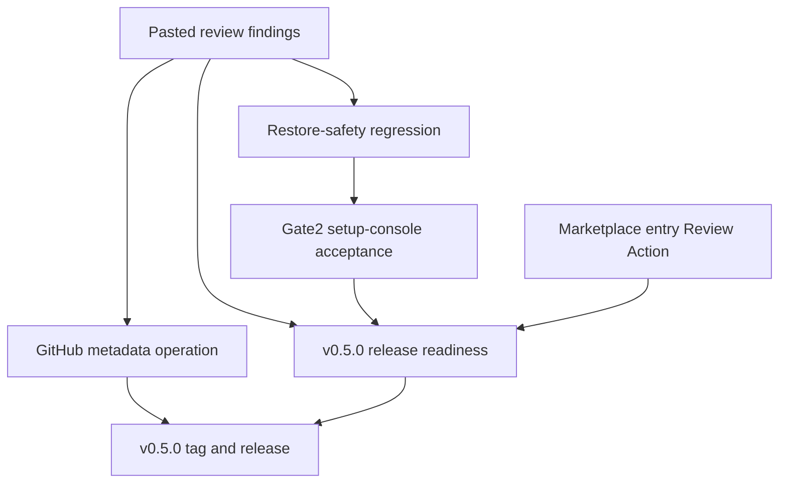
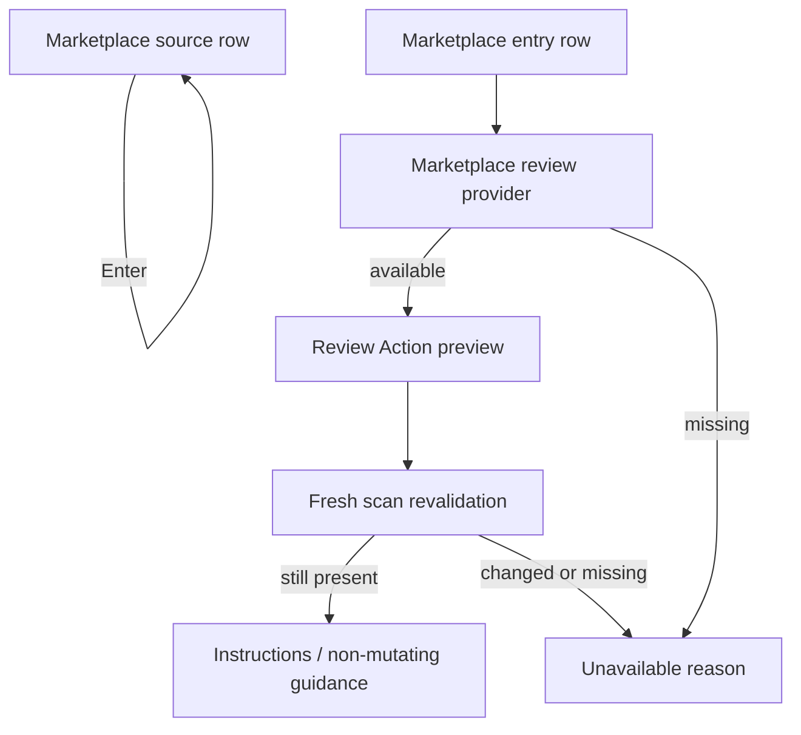

# v0.5.0 Release and Marketplace Review Action Plan

## Goal Capsule

- **Objective:** Execute the four follow-ups identified from the pasted product-state review: align GitHub About/topics, prepare v0.5.0, split Gate2 restore safety from setup-console acceptance, and add one marketplace-originated Review Action.
- **Product authority:** The current product contract defines Gandalf as a local control console for AI agent setup with installed inventory, agent-native marketplace/source browsing, Review Changes, and provider-backed actions.
- **Open blockers:** None for planning. GitHub metadata edits, tag creation, release publishing, and Homebrew verification require authenticated GitHub permissions at execution time.
- **Execution profile:** Go CLI/TUI implementation, shell acceptance scripts, docs alignment, release-ops checklist, and repo-local tests.
- **Stop conditions:** Do not add a Gandalf-owned marketplace, do not implement marketplace install/update/uninstall, do not expand current product support beyond Codex and Claude Code, and do not treat a non-mutating marketplace review as an install.
- **Tail ownership:** The plan is complete only when repo metadata is aligned, v0.5.0 release prep is verifiable, Gate2 names current product acceptance, restore safety remains covered, and one marketplace entry can start an honest Review Action.

---

## Product Contract

### Summary

Gandalf's docs and main branch now describe the right product: a local control console for AI agent setup.
The next work should turn that contract into a releaseable boundary.

The v0.5.0 release should present Gandalf as:

- a Go CLI/TUI for Codex and Claude Code user-global setup;
- a setup console with installed inventory and agent-native marketplace/source browsing;
- a reviewed action surface with truthful unavailable reasons;
- a restore-safety-backed product, not a rollback-only product.

The first marketplace-originated Review Action should be intentionally low-risk.
It should start from a marketplace entry and produce reviewed setup instructions or an equivalent non-mutating provider-backed preview, while install/update/uninstall remain unavailable until a concrete agent-native mutation provider exists.

### Problem Frame

The pasted review found that product docs improved after PR #20, but the release and code boundaries still lag:

- GitHub About still says "AI agent environment management" and topics still include `typescript`.
- The latest release is v0.4.4, so #18 compact browsing, #19 control workspace, and #20 product contract alignment are not in the released binary.
- `make gate2` still runs a script whose output describes deterministic Codex and Claude Code rollback acceptance, while current Gate2 means Unified Agent Setup Console.
- Marketplace rows remain browse/inspect only; pressing Enter on a child entry reports a missing provider instead of starting any Review Action.

The work should close those gaps without widening the product promise.
Release readiness and Gate2 naming are product-contract cleanup.
The marketplace action is a first narrow action, not a marketplace install system.

### Requirements

**Repository metadata and v0.5.0**

- R1. GitHub repository About must use "Local control console for AI agent setup."
- R2. GitHub topics must remove `typescript` and add current Go/TUI/agent setup topics that match the shipped product.
- R3. v0.5.0 release notes must include #18, #19, #20, the Gate2 split, and the marketplace-originated Review Action.
- R4. Release validation must verify the latest released binary path, Homebrew tap path, install script smoke, and release workflow token expectations.
- R5. CI and release workflow Go versions must be reconciled with `go.mod` so the release path does not depend on an accidental toolchain download mismatch.

**Gate2 split**

- R6. Restore safety must move to a clearly named regression script and make target.
- R7. Gate2 must mean setup-console acceptance in scripts, Makefile targets, CI labels, README development guidance, and architecture docs.
- R8. Setup-console Gate2 acceptance must cover installed inventory, marketplace/source browsing, unavailable action reasons, JSON MCP toggle review/apply, stale Review Changes rejection, and Codex/Claude Code baseline visibility.
- R9. Restore-safety acceptance must preserve the existing Codex config restore, synthetic skill deletion, and Claude Code settings restore checks.

**Marketplace-originated Review Action**

- R10. A marketplace entry must be able to start one available Review Action when enough source metadata exists.
- R11. The first marketplace Review Action must be non-mutating unless an implementation supplies a concrete agent-native mutation provider.
- R12. Install, update, uninstall, add-source, and remove-source actions must remain unavailable with reasons unless their provider can preview and execute a concrete effect.
- R13. Marketplace Review Action execution must revalidate the selected source/entry against fresh scan data before presenting or completing the action.
- R14. Marketplace Review Action must not execute MCP commands, hooks, plugins, agent tools, or network calls, and source-provided text must be treated as untrusted display data by stripping or escaping terminal control sequences before rendering.
- R15. The TUI must keep source-row expansion separate from entry-row Review Action behavior.

**Documentation and release truthfulness**

- R16. README, PRODUCT, PLAN, ARCHITECTURE, and release notes must agree that current support is Codex and Claude Code user-global setup.
- R17. Documentation must distinguish restore safety, Gate2 console acceptance, and marketplace-originated review from future marketplace install/update/uninstall work.
- R18. If a new project-specific term is introduced, CONCEPTS must define it rather than letting docs invent parallel vocabulary.

### Key Flows

- F1. **Repository metadata cleanup**
  - **Trigger:** v0.5.0 release preparation begins.
  - **Steps:** The maintainer verifies current GitHub metadata, applies the About/topics update through GitHub, and records the expected metadata in release prep docs.
  - **Outcome:** The public repo sidebar matches the README product contract.
  - **Covers:** R1, R2

- F2. **v0.5.0 release readiness**
  - **Trigger:** The release branch includes product alignment, Gate2 split, and first marketplace Review Action.
  - **Steps:** The release path validates tests, build, installer smoke, release config, release notes, and tag-triggered GoReleaser assumptions.
  - **Outcome:** v0.5.0 can be tagged without shipping a README/UX mismatch.
  - **Covers:** R3, R4, R5, R16

- F3. **Gate2 console acceptance**
  - **Trigger:** CI or a contributor runs `make gate2`.
  - **Steps:** The script builds or uses the Go binary, creates synthetic Codex and Claude Code user-global setup, validates setup console acceptance expectations, and fails if core console behavior regresses.
  - **Outcome:** Gate2 now protects the active product surface instead of only rollback safety.
  - **Covers:** R6, R7, R8

- F4. **Restore-safety regression**
  - **Trigger:** CI or a contributor runs restore-safety validation.
  - **Steps:** The existing rollback acceptance flow runs under the new restore-safety name and proves Codex and Claude Code restore behavior is unchanged.
  - **Outcome:** Renaming Gate2 does not weaken the trust-contract regression net.
  - **Covers:** R6, R9

- F5. **Marketplace entry Review Action**
  - **Trigger:** The user opens the Marketplace tab, expands a source, and selects a marketplace entry.
  - **Steps:** Gandalf opens a Review Action for setup instructions or non-mutating source-backed guidance, revalidates the entry before completion, and never claims an install happened.
  - **Outcome:** Marketplace browsing now leads to one honest action without creating a fake installer.
  - **Covers:** R10, R11, R12, R13, R14, R15

### Acceptance Examples

- AE1. **Covers R1, R2.** Given GitHub metadata is queried after the metadata operation, then the description is "Local control console for AI agent setup." and topics include Go/TUI/agent setup terms without `typescript`.
- AE2. **Covers R3, R4.** Given v0.5.0 release notes are reviewed before tagging, then they explicitly mention compact setup browsing, TUI control workspace, product contract alignment, Gate2 split, and marketplace Review Action.
- AE3. **Covers R5.** Given CI and release workflows are inspected, then their configured Go version matches the repo's declared Go toolchain strategy.
- AE4. **Covers R6, R9.** Given `make restore-safety` runs, then it performs the existing Codex rollback and Claude Code settings restore acceptance and reports restore-safety wording.
- AE5. **Covers R7, R8.** Given `make gate2` runs, then it runs setup-console acceptance and no longer prints rollback-only Gate2 wording.
- AE6. **Covers R8.** Given synthetic setup contains inventory rows, a marketplace source, unsupported actions, a JSON MCP server, and a stale rollback review fixture, then Gate2 acceptance fails if any of those checks disappear.
- AE7. **Covers R10, R12, R15.** Given the user selects a marketplace source row, Enter toggles expansion; given the user selects a marketplace entry row with provider metadata, Enter opens the Review Action.
- AE8. **Covers R11, R14.** Given the user completes the first marketplace Review Action, then no setup file changes, no commands execute, unsafe source text does not emit terminal controls, and the UI labels the result as reviewed instructions or non-mutating guidance.
- AE9. **Covers R13.** Given the marketplace entry disappears after the review is opened, then completion fails as stale instead of using the old row data.

### Scope Boundaries

In scope:

- GitHub About/topics cleanup as an authenticated release operation.
- v0.5.0 release notes and release-readiness validation.
- CI/release workflow alignment needed for the release path.
- Splitting restore-safety regression from Gate2 setup-console acceptance.
- One marketplace-originated Review Action with non-mutating provider-backed output.
- Docs and tests that keep the product contract truthful.

Out of scope:

- Marketplace install, update, uninstall, add-source, or remove-source mutations.
- A Gandalf-owned catalog, registry, certification system, or trust score.
- Broader current support for Cursor, OpenCode, Pi Agent, or project-local setup.
- New network calls from scan, preview, review, or acceptance scripts.
- npm distribution or desktop app restoration.

### Sources / Research

- User-pasted product-state review in the current planning session.
- `AGENTS.md`
- `CONCEPTS.md`
- `README.md`
- `PRODUCT.md`
- `PLAN.md`
- `ARCHITECTURE.md`
- `Makefile`
- `.goreleaser.yaml`
- `.github/workflows/ci.yml`
- `.github/workflows/release.yml`
- `install.sh`
- `scripts/install-smoke.sh`
- `scripts/gate2-acceptance.sh`
- `internal/gandalfcore/agents/supported.go`
- `internal/gandalfcore/scan/plugins/init.go`
- `internal/gandalfcore/setup/actions.go`
- `internal/gandalfcore/setup/inventory.go`
- `internal/gandalfcore/setup/marketplace.go`
- `internal/tui/app.go`
- `internal/tui/model.go`
- `internal/tui/format.go`
- `internal/tui/views/setup_console.go`
- `internal/gandalfcore/setup/actions_test.go`
- `internal/gandalfcore/setup/marketplace_test.go`
- `internal/tui/app_test.go`
- `internal/tui/tui_test.go`
- `docs/solutions/architecture-patterns/global-setup-inventory-action-boundary.md`
- `docs/solutions/architecture-patterns/tui-fresh-review-action-plan-boundary.md`
- `docs/solutions/architecture-patterns/setup-console-component-state-boundary.md`
- `docs/solutions/design-patterns/setup-console-compact-disclosure-rows.md`
- `docs/solutions/workflow-issues/go-verification-after-runtime-surface-removal.md`

---

## Planning Contract

### Product Contract Preservation

Product Contract unchanged from the current docs: Gandalf remains a local control console for current Codex and Claude Code user-global setup.
This plan adds release readiness, Gate2 naming alignment, and a narrow marketplace-originated Review Action without changing the active support boundary.

### Key Technical Decisions

- KTD1. **Treat release metadata as an operational artifact, not repo state.** The plan records the desired About/topics and verification checks, but the actual GitHub metadata update happens through authenticated GitHub operations after code review.
- KTD2. **Use a manual v0.5.0 release-note source.** GoReleaser's generated changelog excludes `docs:` commits, so a release-note file should carry the product-contract alignment that would otherwise be omitted.
- KTD3. **Align workflow Go versions with the declared toolchain.** `go.mod` declares Go 1.25.8 while CI and release currently request 1.24.2. Release readiness should remove that mismatch or make the auto-toolchain dependency explicit.
- KTD4. **Rename restore acceptance without weakening it.** Preserve the existing script behavior under a restore-safety name before making `gate2` mean setup-console acceptance.
- KTD5. **Keep setup-console acceptance deterministic.** Gate2 should use synthetic user-global Codex and Claude Code setup, Go tests, and CLI-friendly checks rather than trying to automate an interactive terminal session.
- KTD6. **Add a marketplace-specific review plan instead of forcing marketplace entries into inventory actions.** Marketplace sources already have distinct action kinds and row models, so the first Review Action should have a typed marketplace plan/result rather than overloading `setup.ActionPlan` meant for installed inventory rows.
- KTD7. **Make the first marketplace action non-mutating.** A source-backed setup-instructions review proves the browse-to-action loop while respecting the provider boundary. Install/update/uninstall remain unavailable until an agent-native provider can preview and execute them.
- KTD8. **Revalidate before completion.** Marketplace review rows come from scan evidence; a pending action must refresh or re-find the entry before completing so stale source data cannot produce misleading output.
- KTD9. **Keep source expansion and entry action behavior separate.** Source rows continue to expand/collapse. Entry rows initiate Review Action only when a provider makes that action available.

### High-Level Technical Design

### Implementation Sequencing

1. Stabilize release and metadata facts first so the remaining code work has a clear target.
2. Split restore safety from Gate2 before changing marketplace action behavior, so acceptance names are honest while feature work proceeds.
3. Add marketplace Review Action at the core setup layer before wiring TUI behavior.
4. Finish with docs, release notes, and release-operation verification.

---

## Implementation Units

### U1. Release Metadata and v0.5.0 Notes

- **Goal:** Capture the public metadata target and v0.5.0 release story in repo artifacts before tagging.
- **Requirements:** R1, R2, R3, R4, R16, R17
- **Dependencies:** None
- **Files:**
  - `docs/release-notes/v0.5.0.md`
  - `README.md`
  - `PRODUCT.md`
  - `PLAN.md`
  - `ARCHITECTURE.md`
  - `.goreleaser.yaml`
- **Approach:** Add a release-note source that describes #18, #19, #20, Gate2 split, and the marketplace Review Action in product language. Update docs that currently say the old Gate2 script name is retained. Update GoReleaser/Homebrew description if it still says broad management rather than local control console. Keep GitHub About/topics as an operational checklist because those values live outside the repository.
- **Patterns to follow:** `README.md` current product summary, `ARCHITECTURE.md` distribution section, and the release workflow's existing GitHub Releases/Homebrew tap model.
- **Test scenarios:**
  - Test expectation: none -- release notes and public metadata instructions are documentation/operations artifacts.
- **Verification:** The release notes describe v0.5.0 without relying only on generated changelog output, and docs no longer describe the old Gate2 script as intentionally retained.

### U2. Release Workflow and Toolchain Readiness

- **Goal:** Make the v0.5.0 release path reproducible from CI and tag-triggered GoReleaser.
- **Requirements:** R4, R5
- **Dependencies:** U1
- **Files:**
  - `go.mod`
  - `.github/workflows/ci.yml`
  - `.github/workflows/release.yml`
  - `.goreleaser.yaml`
  - `scripts/install-smoke.sh`
- **Approach:** Reconcile workflow Go setup with the Go version declared in `go.mod`. Keep GoReleaser as the tag-driven release path, and preserve the Homebrew tap token requirement. Verify installer archive naming still matches GoReleaser's `name_template`.
- **Patterns to follow:** `docs/solutions/workflow-issues/go-verification-after-runtime-surface-removal.md`, `.github/workflows/ci.yml`, `.github/workflows/release.yml`, and `scripts/install-smoke.sh`.
- **Test scenarios:**
  - Given workflow files are inspected, the configured Go version strategy does not contradict `go.mod`.
  - Given `scripts/install-smoke.sh` runs, dry-run archive names still match GoReleaser assets for darwin/linux amd64/arm64.
  - Given GoReleaser config is checked in CI, the Homebrew tap config still has homepage, description, license, install, and test values.
- **Verification:** CI remains green on Go tests, build, install smoke, and GoReleaser config check.

### U3. Restore-Safety Regression Split

- **Goal:** Preserve the existing rollback acceptance under restore-safety naming and remove rollback-only wording from Gate2.
- **Requirements:** R6, R7, R9, R17
- **Dependencies:** U1
- **Files:**
  - `scripts/restore-safety-regression.sh`
  - `scripts/gate2-acceptance.sh`
  - `Makefile`
  - `.github/workflows/ci.yml`
  - `README.md`
  - `ARCHITECTURE.md`
  - `PLAN.md`
  - `PRODUCT.md`
- **Approach:** Move the current `scripts/gate2-acceptance.sh` behavior into `scripts/restore-safety-regression.sh`. Keep the old script as a temporary compatibility wrapper only if needed for a transition, but make `make restore-safety` and CI use the new name. Rewrite output strings to say restore-safety regression. Update docs to point to the new restore-safety path.
- **Patterns to follow:** Existing `scripts/gate2-acceptance.sh` fixture flow and `docs/solutions/logic-errors/go-restore-store-trust-contract-gaps.md`.
- **Test scenarios:**
  - Given a damaged Codex config and added synthetic skill, restore-safety regression restores the config and deletes the synthetic skill.
  - Given changed Claude Code settings, restore-safety regression restores the original settings.
  - Given the script output is reviewed, it uses restore-safety wording rather than Gate2 wording.
- **Verification:** `make restore-safety` runs the preserved rollback acceptance and exits successfully.

### U4. Setup-Console Gate2 Acceptance

- **Goal:** Make `make gate2` validate the active Unified Agent Setup Console contract.
- **Requirements:** R7, R8
- **Dependencies:** U2, U3
- **Files:**
  - `scripts/gate2-console-acceptance.sh`
  - `scripts/gate2-acceptance.sh`
  - `Makefile`
  - `.github/workflows/ci.yml`
  - `internal/gandalfcore/setup/marketplace_test.go`
  - `internal/gandalfcore/setup/actions_test.go`
  - `internal/tui/app_test.go`
  - `internal/tui/tui_test.go`
- **Approach:** Make Gate2 acceptance an aggregator over deterministic console checks rather than an interactive TUI driver. It should validate synthetic setup evidence, marketplace/source rows, unavailable reasons, JSON MCP toggle review/apply behavior, stale Review Changes rejection, and Codex/Claude Code baseline status. Use targeted Go tests and any lightweight CLI setup needed to prove end-to-end fixtures.
- **Patterns to follow:** `docs/solutions/architecture-patterns/setup-console-component-state-boundary.md`, `docs/solutions/architecture-patterns/tui-fresh-review-action-plan-boundary.md`, and current TUI model tests.
- **Test scenarios:**
  - Given synthetic Codex and Claude Code setup evidence, setup-console model tests show Hooks, Plugins, Marketplace, Skills, and MCP Servers top tabs with expected counts.
  - Given marketplace source evidence, Gate2 fails if source rows or child entries disappear.
  - Given an unavailable action, Gate2 fails if the reason is absent.
  - Given a JSON-backed MCP server, Gate2 fails if toggle no longer writes the `disabled` flag through the setup action executor.
  - Given a stale rollback review, Gate2 fails if apply does not reject it.
- **Verification:** `make gate2` runs setup-console acceptance and no longer duplicates restore-safety coverage as its primary purpose.

### U5. Marketplace Review Action Core Provider

- **Goal:** Add one marketplace-originated Review Action that is available for eligible marketplace entries and produces non-mutating setup guidance.
- **Requirements:** R10, R11, R12, R13, R14, R18
- **Dependencies:** U4
- **Files:**
  - `CONCEPTS.md`
  - `internal/gandalfcore/setup/marketplace.go`
  - `internal/gandalfcore/setup/marketplace_actions.go`
  - `internal/gandalfcore/setup/marketplace_test.go`
  - `internal/gandalfcore/setup/actions_test.go`
- **Approach:** Add a marketplace action kind for review or setup instructions without marking install/update/uninstall available. Introduce a typed marketplace review plan/result that includes agent, source, entry, expected effect, non-mutating status, unavailable reason, and instruction text derived from existing metadata. Revalidation should match by stable source/entry identity against fresh marketplace data before the action completes.
- **Technical design:** Directional guidance, not implementation specification: keep the marketplace review plan separate from installed inventory `ActionPlan`; both can share naming like target, operation, config target, and unavailable reason, but marketplace plans should not need a command runner or file mutation to be "real."
- **Patterns to follow:** `docs/solutions/architecture-patterns/global-setup-inventory-action-boundary.md`, `internal/gandalfcore/setup/marketplace.go`, and `internal/gandalfcore/setup/actions.go`.
- **Test scenarios:**
  - Given a marketplace entry with source metadata, planning a review action returns an available non-mutating review plan.
  - Given an entry lacks enough metadata to produce useful instructions, planning returns unavailable with a concrete reason.
  - Given install/update/uninstall are requested, they remain unavailable without a mutation provider.
  - Given fresh marketplace data no longer contains the entry, completing the pending review returns a stale/unavailable result.
  - Given a review plan executes, no command runner is required and no filesystem mutation occurs.
  - Given source metadata contains terminal control characters, the review plan preserves only display-safe text for TUI output.
- **Verification:** Core setup tests prove available review, unavailable install/update/uninstall, stale revalidation, and no-mutation behavior.

### U6. Marketplace Review Action TUI

- **Goal:** Let a user start and complete the first marketplace Review Action from the Marketplace tab.
- **Requirements:** R10, R11, R12, R13, R14, R15
- **Dependencies:** U5
- **Files:**
  - `internal/tui/app.go`
  - `internal/tui/model.go`
  - `internal/tui/format.go`
  - `internal/tui/views/setup_console.go`
  - `internal/tui/views/setup_console_test.go`
  - `internal/tui/app_test.go`
  - `internal/tui/tui_test.go`
- **Approach:** Keep Enter on marketplace source rows as expand/collapse. Make Enter on eligible entry rows open a Review Action surface that shows the target entry, source, non-mutating status, expected output, and instructions. Completion should revalidate against current marketplace rows and render instructions or a stale/unavailable error. It should not rescan as if a setup mutation occurred unless future mutating providers require it.
- **Patterns to follow:** Existing `pendingAction` confirmation flow for installed inventory, `handleMarketplaceEnter`, `BuildSetupConsoleViewModel`, and compact disclosure row rendering.
- **Test scenarios:**
  - Given a source row is selected, Enter expands or collapses the source and does not open Review Action.
  - Given an eligible entry row is selected, Enter opens marketplace Review Action.
  - Given an ineligible entry row is selected, Enter shows its unavailable reason.
  - Given a pending marketplace review completes while the entry still exists, the UI shows generated instructions and does not report "Applied setup action."
  - Given a pending marketplace review completes after the entry disappears, the UI shows a stale review error and no success notice.
  - Given source metadata contains terminal control characters, the rendered review shows plain text and does not emit terminal controls.
  - Given the rendered Review Action is width-constrained, target, source, action status, and instructions remain visible without overlap.
- **Verification:** TUI model, app, and renderer tests prove source expansion remains separate from entry review and that non-mutating completion uses honest copy.

### U7. Final Docs, Metadata Operation, and Release Handoff

- **Goal:** Finish the four requested workstreams with release and public metadata verification.
- **Requirements:** R1, R2, R3, R4, R16, R17, R18
- **Dependencies:** U1, U2, U3, U4, U5, U6
- **Files:**
  - `README.md`
  - `PRODUCT.md`
  - `PLAN.md`
  - `ARCHITECTURE.md`
  - `docs/release-notes/v0.5.0.md`
- **Approach:** Update all docs that still describe Gate2 as rollback acceptance or marketplace action support as future-only. Apply GitHub metadata operations through the authenticated GitHub interface. Prepare v0.5.0 release with notes that explain release lag from v0.4.4 and the new behavior. After tagging, verify GitHub Release assets and Homebrew tap update.
- **Patterns to follow:** `README.md` install/release sections, `ARCHITECTURE.md` release workflow notes, and current `gh repo edit` support for description/topic updates.
- **Test scenarios:**
  - Test expectation: none -- this unit is documentation and release operation. Behavioral coverage is supplied by U2 through U6.
- **Verification:** Public GitHub metadata, latest release, release notes, installer smoke, and Homebrew formula all describe the same v0.5.0 product boundary.

---

## Verification Contract

| Gate | Applies to | Done signal |
|---|---|---|
| `go test ./...` | U2, U4, U5, U6 | All Go packages pass after script, setup, and TUI changes. |
| `./scripts/install-smoke.sh` | U2, U7 | Installer archive naming and failure cleanup still match release assets. |
| `make restore-safety` | U3 | Existing Codex and Claude Code restore-safety regression passes under the new name. |
| `make gate2` | U4, U6 | Unified Agent Setup Console acceptance passes and uses Gate2 wording. |
| GoReleaser config check in CI | U2, U7 | Release config remains valid for tag-triggered GitHub Releases and Homebrew tap output. |
| GitHub metadata query | U1, U7 | Description and topics match the target metadata after authenticated update. |
| v0.5.0 release verification | U7 | GitHub Release exists for v0.5.0, includes darwin/linux amd64/arm64 assets and checksums, and is newer than v0.4.4. |

---

## System-Wide Impact

- **Release surface:** Users installing through `install.sh` or Homebrew will finally receive the docs-aligned Setup Console UX rather than the older v0.4.4 behavior.
- **CI semantics:** Gate2 changes from restore-only acceptance to product-console acceptance, while restore safety remains separately visible.
- **TUI behavior:** Marketplace entry selection gains an action path, so tests must preserve source expansion, child entry selection, unavailable reasons, and non-mutating copy.
- **Agent-native parity:** The first marketplace action should be represented as typed setup-layer data, so future CLI or agent tools can reuse the same provider rather than scraping TUI text.

---

## Risks & Dependencies

- **GitHub permissions:** About/topics edits, tag push, release publishing, and Homebrew tap updates depend on authenticated GitHub permissions and `GORELEASER_GITHUB_TOKEN`.
- **Generated changelog omission:** GoReleaser excludes `docs:` commits, so #20 will not appear unless v0.5.0 release notes are manually supplied or the release process is adjusted.
- **Toolchain drift:** CI/release workflow Go 1.24.2 currently differs from `go.mod` Go 1.25.8; this can create avoidable release failures.
- **Action semantics drift:** A non-mutating marketplace Review Action can be mistaken for install if labels are loose. Use review/setup-instructions language and keep install unavailable.
- **Script duplication:** Splitting acceptance scripts can duplicate fixture setup. Use a small shared shell helper only if duplication becomes meaningful; avoid a large acceptance framework.

---

## Documentation / Operational Notes

- GitHub metadata target:
  - Description: `Local control console for AI agent setup.`
  - Remove topic: `typescript`
  - Candidate topics: `go`, `tui`, `cli`, `mcp`, `developer-tools`, `ai-agents`, `agent-tools`, `agent-management`, `drift-detection`, `security-audit`
- v0.5.0 release title candidate: `v0.5.0 — Local Control Console and Reviewed Actions`
- Release notes should mention current support boundaries: Codex and Claude Code user-global setup only; restore is the backing trust workflow; marketplace install/update/uninstall are still future provider work.
- If implementation discovers a repeated release or Gate2 failure mode, capture it with `ce-compound` after the fix lands.

---

## Definition of Done

- GitHub About/topics have been updated and verified against the target metadata.
- v0.5.0 release notes exist and cover #18, #19, #20, Gate2 split, and marketplace Review Action.
- CI/release workflow toolchain configuration is aligned with the repo's Go version strategy.
- `make restore-safety` exists and preserves the old rollback acceptance behavior.
- `make gate2` exists and validates Unified Agent Setup Console acceptance.
- Marketplace entry rows can start one honest, non-mutating Review Action.
- Marketplace install/update/uninstall remain unavailable without a concrete mutation provider.
- README, PRODUCT, PLAN, ARCHITECTURE, and release notes describe the same product boundary.
- Verification gates in the Verification Contract pass, except external release operations that are explicitly gated on credentials.
- Any abandoned exploratory code or temporary scripts introduced during implementation are removed before landing.
